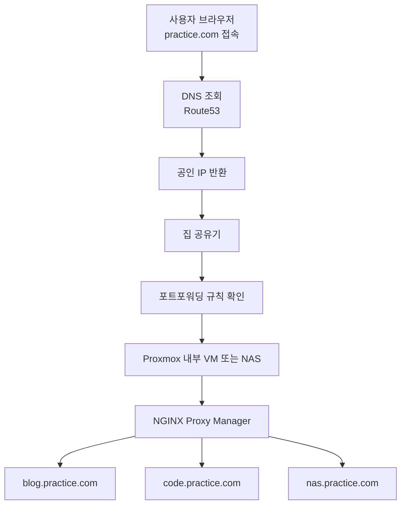
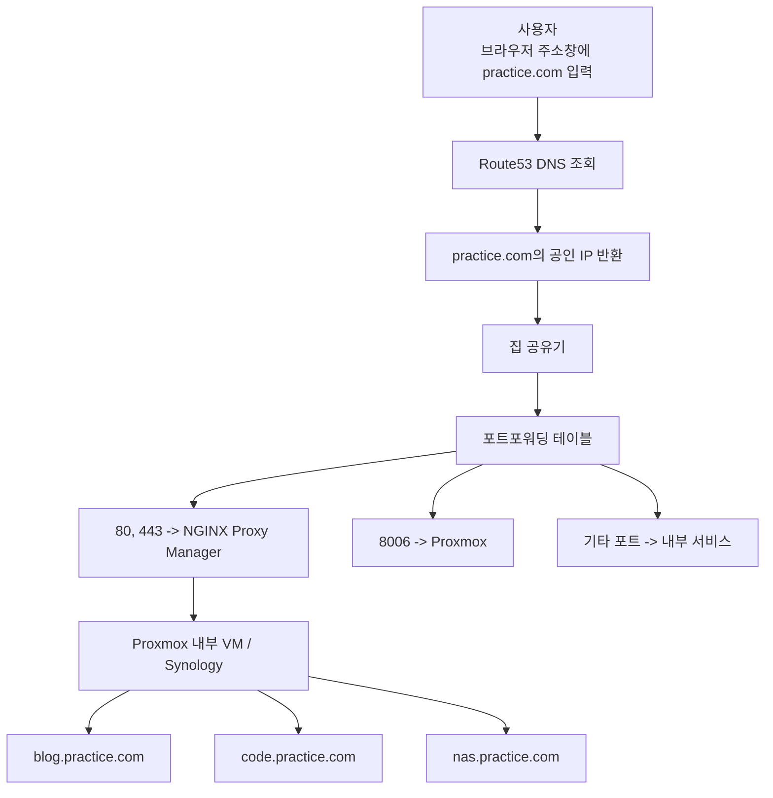

홈서버를 구축하고 도메인을 연결한 뒤 외부 접속까지 되기 시작했지만, 실제 서비스를 쓰다 보니 예상보다 빨리 한계가 드러났다.

- 브라우저에서 `Mixed Content` 문제가 발생했다.
- 서비스 간 통신 과정에서 `CORS` 문제가 생겼다.
- 일부 기능은 아예 `HTTP` 환경에서 동작하지 않았다.

특히 `code-server`처럼 보안 연결을 전제로 하는 서비스는 HTTPS 없이 쓰기 어려웠다.  
그래서 이번에는 홈서버 환경 전체에 적용할 수 있는 HTTPS 구조를 정리하고, 이를 위해 `NGINX Proxy Manager`와 와일드카드 인증서를 도입했다.

원문 글: [홈서버 활용기 (HTTPS & NGINX Proxy Manager) 1](https://velog.io/@dreamjh/%ED%99%88%EC%84%9C%EB%B2%84-%ED%99%9C%EC%9A%A9%EA%B8%B0-HTTPS-NGINX-1)

## 전체 흐름 한눈에 보기



이 구조에서 핵심은 공유기에서 외부 요청을 받은 뒤, 내부에서는 `NGINX Proxy Manager`가 도메인 단위로 라우팅을 처리하도록 만드는 것이다.  
즉, 공유기는 단순히 `80`, `443`을 전달하고 실제 서비스 분배는 프록시 서버가 담당한다.

## 문제점

홈서버 자체는 이미 구축되어 있었고, 도메인까지 붙여서 외부 접속도 가능한 상태였다.  
하지만 서비스가 늘어나면서 단순한 포트포워딩만으로는 해결되지 않는 문제가 생겼다.

- HTTP로 접속한 페이지에서 HTTPS 자원을 불러오며 `Mixed Content` 오류가 생김
- 브라우저 기준 보안 정책 때문에 `CORS` 이슈가 생김
- 인증이 필요한 일부 서비스에서 기능 제한이 발생함

결국 핵심 문제는 "외부에 공개되는 모든 주요 서비스에 HTTPS를 일관되게 적용해야 한다"는 점이었다.

## 왜 기존 방식으로는 부족했는가

일반적으로는 `certbot`이나 기존 nginx 설정을 통해 서비스별로 인증서를 발급받아 붙이는 방법을 생각하기 쉽다.  
그런데 홈서버 환경에서는 이 방법이 항상 그대로 통하지 않는다.

가장 큰 이유는 집 인터넷 회선 환경이다.

## 집에서는 80포트를 사용할 수 없다?

홈서버를 설정하면서 알게 된 점 중 하나는, 일부 통신사 또는 특정 회선 환경에서는 `80번 포트`가 외부에서 막혀 있을 수 있다는 점이었다.

이게 왜 중요하냐면, 일반적인 HTTP 기반 인증 방식은 보통 `80` 또는 `443` 포트를 활용해 도메인 소유를 검증하기 때문이다.  
즉, 외부에서 `80` 포트 접근이 막혀 있다면 `certbot` 같은 전통적인 방식이 그대로 실패할 수 있다.

그래서 필요한 건 다음과 같은 우회 전략이었다.

- 서비스별로 개별 인증서를 발급받는 방식 대신
- 도메인 전체에 적용 가능한 와일드카드 인증서를 발급받고
- DNS 기반 검증으로 발급을 진행하는 방법

## SSL 마스터 인증서 발급받기

현재 사용 중인 도메인이 `example.com`이라고 가정해 보자.

와일드카드 인증서 `*.example.com`을 발급받으면 아래와 같은 서브도메인들에 공통으로 적용할 수 있다.

```text
dev.example.com
abc.example.com
test.example.com
```

이 방식의 장점은 분명하다.

- 홈서버 내부 서비스가 여러 개여도 인증서를 각각 따로 관리할 필요가 줄어든다.
- `blog.example.com`, `code.example.com`, `nas.example.com`처럼 여러 서비스에 공통 적용이 가능하다.
- 이후 NGINX Proxy Manager에서 프록시 호스트별로 재활용하기 편하다.

이번 구성의 핵심은 "서비스별 개별 발급"이 아니라 "도메인 전체에 대해 먼저 신뢰 가능한 인증서 기반을 만드는 것"이었다.

## NGINX Proxy Manager 설치

`NGINX Proxy Manager`는 nginx 설정을 웹 GUI로 다룰 수 있게 해주는 도구다.  
명령어로 직접 설정해도 되지만, 홈서버처럼 관리 대상이 늘어나는 환경에서는 GUI가 훨씬 편하다.

와일드카드 인증서만 발급받을 수 있다면 어느 서버에서 진행해도 괜찮다.  
여기서는 홈서버에 이미 구성해 둔 `Synology` 환경을 사용했다.

### Synology 이용 방법

진행 순서는 단순하다.

1. Synology에 Docker 관리 도구를 설치한다.
2. `jc21/nginx-proxy-manager` 이미지를 내려받는다.
3. 컨테이너를 생성하면서 필요한 포트와 볼륨을 연결한다.
4. NAS의 `81` 포트로 접속해서 관리자 화면에 로그인한다.

최초 로그인 정보는 다음과 같다.

```text
email: admin@example.com
password: changeme
```

처음 접속하면 이메일과 비밀번호를 바꾸게 되고, 이후부터는 GUI에서 프록시 호스트와 SSL 인증서를 관리할 수 있다.

## SSL 와일드카드 인증서 발급받기

이제 NGINX Proxy Manager 안에서 실제 인증서를 발급받는다.

흐름은 다음과 같다.

1. 상단 메뉴에서 `SSL Certificates`로 이동한다.
2. `Add SSL Certificate`를 선택한다.
3. 도메인 이름에 와일드카드 도메인을 입력한다.
   예: `*.example.com`
4. `Use a DNS Challenge`를 체크한다.
5. `DNS Provider`를 `Route 53 (Amazon)`으로 변경한다.
6. `Credentials File Content`에 AWS Access Key와 Secret Access Key를 입력한다.
7. 저장하면 DNS 검증을 통해 와일드카드 인증서가 발급된다.

여기서 중요한 점은 HTTP 포트를 통한 검증이 아니라 `DNS Challenge`를 사용한다는 것이다.  
그래서 집 회선에서 `80` 포트가 막혀 있어도 AWS Route53을 통해 인증서 발급이 가능하다.

즉, 이 구조는 홈서버 환경에서 특히 유리하다.

- 통신사 환경에 덜 영향받는다.
- 여러 서브도메인을 하나의 인증서로 처리할 수 있다.
- NGINX Proxy Manager와 조합했을 때 관리가 단순해진다.

## 인증서 파일 위치

인증서 발급이 완료되면, 컨테이너 생성 시 연결해 둔 볼륨 디렉토리를 통해 해당 인증서 파일에 접근할 수 있다.

원문 기준으로 정리된 경로는 아래와 같다.

```text
docker/NPM/letsencrypt/archive/npm-7/
```

이 경로를 기반으로 이후 다른 서비스에 인증서를 적용하거나, 인증서 자동 갱신 흐름을 정리할 수 있다.

## 내가 정리한 네트워크 도식

손그림 기준으로 다시 정리하면 구조는 아래와 같다.



이 구조를 쓰면 외부에서는 도메인 기준으로 접속하고, 내부에서는 프록시 서버가 실제 서비스로 다시 연결해 준다.

## 결론 및 향후 계획

이번 과정을 통해 정리된 핵심은 아래와 같다.

1. 홈서버 환경에서는 `80` 포트가 막혀 있어 전통적인 인증 방식이 실패할 수 있다.
2. 이 문제는 `Route53 DNS Challenge`를 이용한 와일드카드 인증서 발급으로 우회할 수 있다.
3. `NGINX Proxy Manager`를 사용하면 GUI 기반으로 프록시와 인증서를 훨씬 쉽게 관리할 수 있다.
4. 이제 남은 일은 이 인증서를 각 서비스에 실제로 적용하고 자동 갱신까지 정리하는 것이다.

다음 단계에서는 `code-server`, NAS, 기타 웹 애플리케이션에 이 인증서를 적용해서 `Mixed Content`와 `CORS` 문제를 줄이고, 최종적으로는 인증서 갱신까지 자동화하는 방향으로 이어갈 계획이다.
