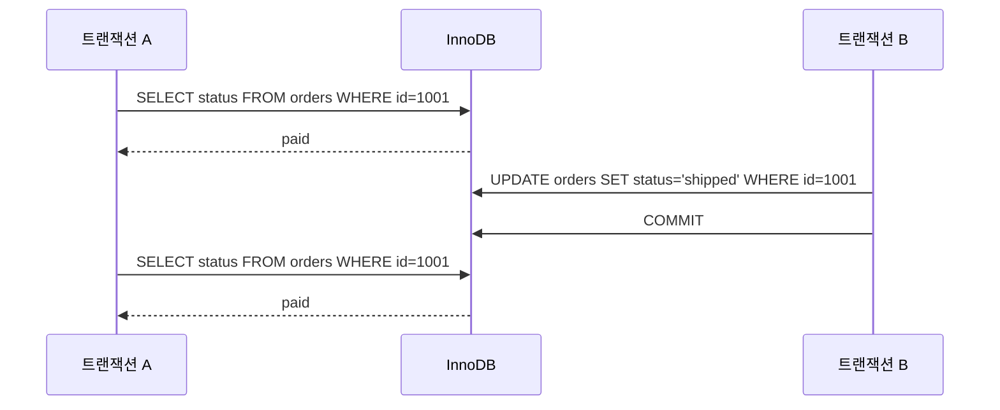
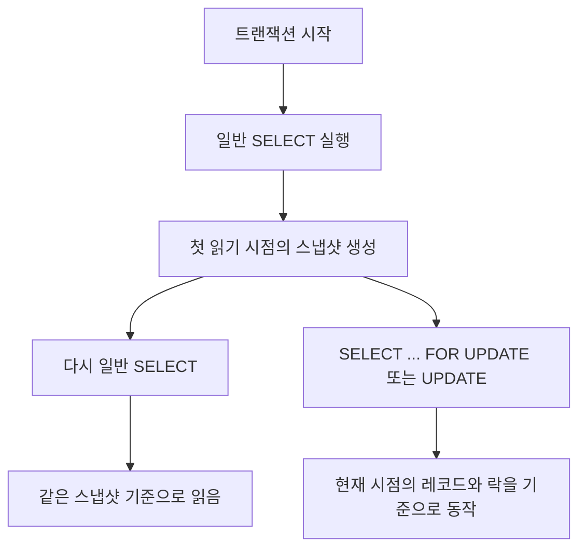
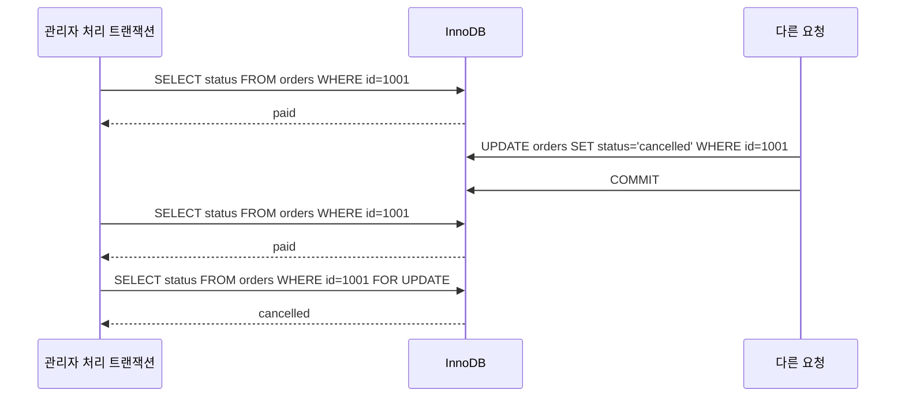

이전 글에서는 `InnoDB`, `트랜잭션`, `MVCC`, `락`, `데드락`을 전체적으로 훑어봤다.  
이번에는 그중에서도 가장 많이 헷갈리는 개념 중 하나인 `Repeatable Read`를 따로 떼어 정리해 보려고 한다.

이 개념이 어려운 이유는 단순하다.

- 분명 같은 트랜잭션 안에서 두 번 `SELECT` 했는데 결과가 같게 보인다.
- 그런데 막상 `UPDATE`나 `SELECT ... FOR UPDATE`를 쓰면 분위기가 달라진다.
- 그래서 "이 트랜잭션은 과거를 보는 건가, 현재를 보는 건가?" 같은 혼란이 생긴다.

이번 글에서는 `MySQL InnoDB` 기준으로 이 부분을 아주 쉽게 풀어보겠다.

## Repeatable Read는 왜 알아야 할까

`Repeatable Read`는 MySQL `InnoDB`의 기본 트랜잭션 격리 수준이다.

즉, 특별히 바꾸지 않았다면 많은 MySQL 서비스는 이미 이 규칙 위에서 돌아가고 있다.  
그런데 이걸 모르고 개발하면 아래 같은 일이 자주 생긴다.

- 조회했을 때는 분명 재고가 10개였는데, 수정 시점에는 값이 달라져 있다.
- 같은 트랜잭션 안에서 두 번 읽었는데 결과가 같아서 안심했지만, 실제로는 다른 요청이 이미 커밋을 끝냈다.
- 일반 `SELECT`와 잠금을 거는 조회를 섞어서 쓰다가 동작을 잘못 이해한다.

공식 문서:

- [MySQL 8.4 Reference Manual - Transaction Isolation Levels](https://dev.mysql.com/doc/refman/8.4/en/innodb-transaction-isolation-levels.html)

## 가장 쉬운 예제: 같은 주문을 두 번 조회하면?

주문 상태를 확인하는 아주 단순한 예제를 생각해 보자.

- 트랜잭션 A는 주문 `#1001`을 조회한다.
- 그 사이에 트랜잭션 B가 같은 주문 상태를 `paid`에서 `shipped`로 바꾸고 커밋한다.
- 트랜잭션 A가 다시 같은 주문을 조회한다.

입문자 입장에서는 두 가지 예상이 가능하다.

1. 두 번째 조회에서는 `shipped`가 보여야 할 것 같다.
2. 같은 트랜잭션 안이니 아까 봤던 값과 같아야 할 것 같다.

`Repeatable Read`에서 일반 `SELECT`는 보통 두 번째에 더 가까운 동작을 한다.

왜 이런 일이 생길까?  
핵심은 `Repeatable Read`가 일반 조회에서 "트랜잭션이 처음 읽기 시작한 시점의 일관된 스냅샷"을 유지하려고 하기 때문이다.

## 핵심 개념 1: consistent read

MySQL 공식 문서에서는 일반적인 `SELECT`를 `consistent nonlocking read`로 설명한다.  
쉽게 말하면, 조회할 때 매번 현재 최신 데이터만 보는 것이 아니라, 어떤 시점의 일관된 버전을 기준으로 읽는 방식이다.

공식 문서:

- [MySQL 8.4 Reference Manual - Consistent Nonlocking Reads](https://dev.mysql.com/doc/refman/8.4/en/innodb-consistent-read.html)

입문자용으로 풀면 이렇게 이해하면 된다.

- 트랜잭션 안에서 첫 번째 일반 `SELECT`가 스냅샷 기준점을 만든다.
- 그 뒤 같은 트랜잭션의 일반 `SELECT`는 그 기준점에 맞는 데이터를 읽는다.
- 그래서 중간에 다른 트랜잭션이 커밋해도, 내 일반 `SELECT` 결과는 같게 보일 수 있다.

이게 바로 `Repeatable Read`라는 이름이 붙은 이유다.  
같은 읽기를 반복했을 때 같은 결과를 재현하려는 성격이 있기 때문이다.

## 핵심 개념 2: 그런데 항상 과거만 보는 것은 아니다

여기서 많은 사람이 헷갈린다.  
`Repeatable Read`라고 해서 트랜잭션 안의 모든 동작이 무조건 같은 스냅샷만 보는 것은 아니다.

특히 아래처럼 잠금을 거는 읽기나 실제 수정은 이야기가 달라진다.

- `SELECT ... FOR UPDATE`
- `SELECT ... FOR SHARE`
- `UPDATE`
- `DELETE`

MySQL 공식 문서도 `Repeatable Read`에서 일반 비잠금 `SELECT`와 잠금이 걸리는 구문을 섞어 쓰는 것을 권장하지 않는다고 설명한다.  
그 이유는 둘이 보는 기준이 달라져서 개발자가 헷갈리기 쉽기 때문이다.

즉, 이 한 줄로 요약할 수 있다.

- 일반 `SELECT`는 스냅샷 읽기
- 잠금 읽기와 수정은 현재 데이터와 락 기준 동작

이 차이를 모르면 실무에서 정말 자주 오해가 생긴다.

## 실무에서 어디서 문제가 될까

이제 개념을 실제 상황으로 바꿔보자.

### 1. 조회 결과를 너무 믿고 바로 비즈니스 로직을 태우는 경우

예를 들어 트랜잭션 안에서 상품 재고를 먼저 조회하고, 뒤에서 결제 로직을 태운다고 해보자.

문제는 앞의 일반 `SELECT`가 스냅샷 읽기라는 점이다.  
내가 본 재고는 "내 트랜잭션 기준으로 일관된 값"일 수는 있어도, "지금 이 순간 가장 최신 값"은 아닐 수 있다.

즉, 아래 오해가 생긴다.

- 개발자 생각: 방금 조회했으니 지금 재고도 10개겠지
- 실제 상황: 다른 트랜잭션은 이미 재고를 줄이고 커밋했을 수 있음

### 2. 일반 SELECT와 FOR UPDATE를 같은 트랜잭션에서 섞는 경우

이 경우가 특히 헷갈린다.

1. 먼저 일반 `SELECT`로 데이터를 읽는다.
2. 같은 트랜잭션 안에서 `SELECT ... FOR UPDATE`를 실행한다.
3. 결과가 아까와 다르게 느껴진다.

왜냐하면 첫 번째는 스냅샷 기준, 두 번째는 현재 레코드와 락 기준으로 동작하기 때문이다.  
즉, "같은 트랜잭션인데 왜 방금 본 세상과 지금 세상이 다르지?" 같은 혼란이 생길 수 있다.

### 3. 오래 살아 있는 트랜잭션

트랜잭션이 길어질수록 더 오래된 스냅샷을 붙잡고 있게 된다.  
그러면 조회는 계속 일관돼 보여도, 실제 시스템 상태와 감각적으로 멀어질 수 있다.

운영 관점에서는 이런 긴 트랜잭션이 성능과 동시성에도 좋지 않다.

## 예제로 다시 보면 더 쉽다

이번엔 관리자 화면에서 주문 상태를 처리하는 상황을 생각해 보자.

이 흐름이 이상하게 보인다면 정상이다.  
처음 배우면 거의 다 여기서 헷갈린다.

이 예제가 말해주는 것은 아래와 같다.

1. 일반 `SELECT`는 내 스냅샷을 본다.
2. 하지만 `FOR UPDATE`는 현재 레코드와 락 기준으로 본다.
3. 그래서 같은 트랜잭션 안에서도 "읽는 방식"에 따라 보이는 세계가 달라질 수 있다.

## 그럼 Repeatable Read는 나쁜 걸까

그건 아니다.  
오히려 `Repeatable Read`는 읽기 일관성을 잘 유지해 주기 때문에 많은 상황에서 유용하다.

특히 "같은 트랜잭션 안에서 보고서를 계산한다", "중간에 값이 흔들리지 않는 읽기 결과가 필요하다" 같은 경우에는 장점이 있다.

문제는 `Repeatable Read` 자체가 아니라, 개발자가 그 성격을 오해한 채 "최신값을 봤다"고 착각하는 순간이다.

## 실무에서 기억하면 좋은 대응 포인트

### 1. 최신 상태가 중요하면 일반 SELECT만 믿지 말기

정말 지금 현재 상태를 기준으로 제어해야 한다면, 일반 `SELECT`만으로 충분한지 다시 봐야 한다.  
상황에 따라 `SELECT ... FOR UPDATE` 같은 잠금 읽기가 필요할 수 있다.

### 2. 조회 후 수정 패턴은 특히 조심하기

먼저 읽고, 그 결과를 믿고, 뒤에서 수정하는 로직은 동시성 문제에 취약하다.  
재고, 쿠폰, 좌석, 상태 전이처럼 경쟁이 생기는 영역은 더 조심해야 한다.

### 3. 트랜잭션을 짧게 유지하기

트랜잭션이 길어지면 스냅샷도 오래 유지되고, 락이나 undo 관련 비용도 커질 수 있다.  
가능하면 필요한 작업만 짧게 묶는 편이 안전하다.

### 4. 일반 SELECT와 locking read를 섞을 때는 의도를 분명히 하기

둘은 같은 읽기가 아니다.  
그래서 코드 리뷰를 할 때도 "이 조회는 스냅샷 읽기인지, 현재 상태 확인용인지"를 분명히 나눠 보는 습관이 좋다.

## 핵심만 다시 정리

1. `Repeatable Read`는 MySQL `InnoDB`의 기본 격리 수준이다.
2. 일반 `SELECT`는 같은 트랜잭션 안에서 첫 읽기 시점의 스냅샷을 기준으로 읽는다.
3. 그래서 다른 트랜잭션이 커밋해도 내 일반 `SELECT` 결과는 같게 보일 수 있다.
4. 하지만 `SELECT ... FOR UPDATE`, `UPDATE`, `DELETE` 같은 구문은 현재 데이터와 락 기준으로 동작한다.
5. 실무에서는 이 차이를 모르고 조회 후 수정 로직을 짜면 쉽게 헷갈리거나 문제가 생긴다.

## 마무리

`Repeatable Read`를 이해하는 핵심은 "같은 트랜잭션 안에서도 읽는 방식이 완전히 같지 않다"는 점을 받아들이는 것이다.

일반 `SELECT`는 일관된 읽기를 위해 스냅샷을 유지하고, 잠금 읽기나 수정은 현재 레코드와 락을 기준으로 움직인다.  
이 차이만 명확하게 잡아도 실무에서 왜 어떤 조회는 같게 보이고, 어떤 수정은 예상과 다르게 동작하는지 훨씬 잘 이해할 수 있다.

다음 글에서는 이 흐름과 자연스럽게 이어지는 `Next-Key Lock`을 따로 정리해 보려고 한다.  
왜 DB가 "행 하나"만이 아니라 "범위"까지 잠그는지 이해하면, 그다음 `Gap Lock`도 훨씬 쉽게 들어온다.

## 참고 자료

- [MySQL 8.4 Reference Manual - Transaction Isolation Levels](https://dev.mysql.com/doc/refman/8.4/en/innodb-transaction-isolation-levels.html)
- [MySQL 8.4 Reference Manual - Consistent Nonlocking Reads](https://dev.mysql.com/doc/refman/8.4/en/innodb-consistent-read.html)
- [MySQL 8.4 Reference Manual - Next-Key Locking](https://dev.mysql.com/doc/refman/8.4/en/innodb-next-key-locking.html)
