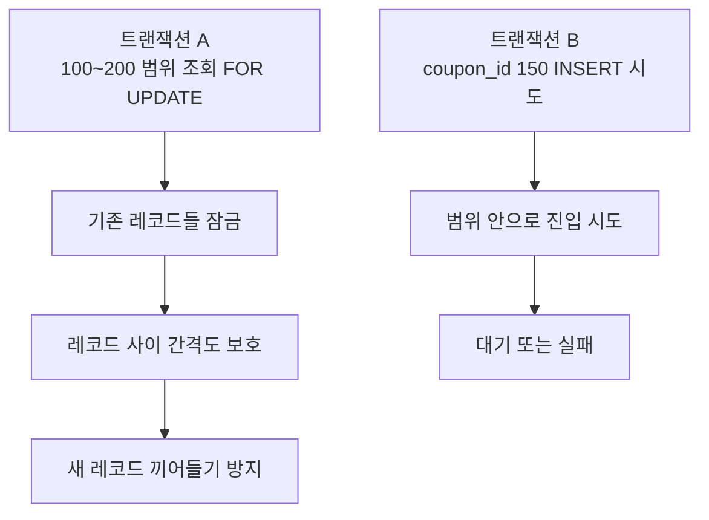
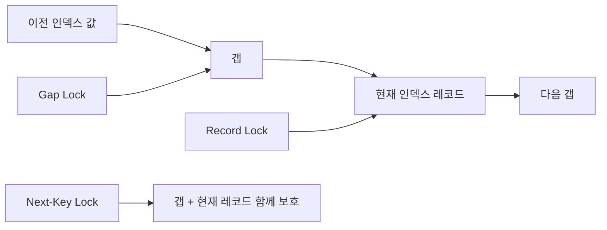
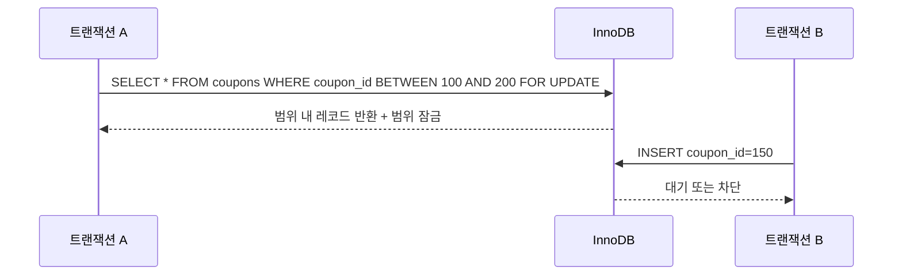
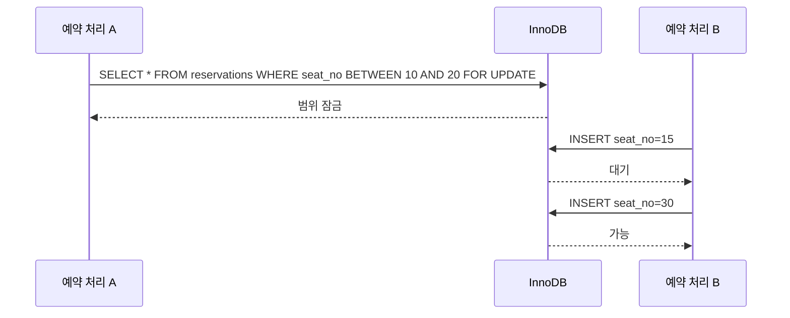

이전 글에서는 `Repeatable Read`에서 일반 `SELECT`와 `SELECT ... FOR UPDATE`가 다르게 느껴지는 이유를 정리했다.  
이번에는 그 흐름과 바로 이어지는 `Next-Key Lock`을 다뤄보려고 한다.

처음 이 개념을 접하면 이런 생각이 들 수 있다.

- 락이면 그냥 "행 하나" 잠그는 것 아닌가?
- 왜 어떤 쿼리는 내가 건드린 행보다 더 넓게 막히는 것처럼 보일까?
- 왜 범위 조건으로 조회했을 뿐인데 다른 `INSERT`까지 대기할까?

이 질문에 답하려면 `InnoDB`가 왜 "레코드만"이 아니라 "범위"까지 함께 잠그는지 이해해야 한다.

## 왜 Next-Key Lock을 알아야 할까

실무에서는 아래 같은 장면이 자주 나온다.

- `SELECT ... FOR UPDATE`를 했더니 예상보다 많은 요청이 같이 대기한다.
- 아직 존재하지 않는 값에 대한 `INSERT`도 막히는 것처럼 보인다.
- 분명 한 줄만 읽는다고 생각했는데, 실제로는 범위 전체가 영향을 받는다.

이런 현상을 이해하지 못하면 "DB가 이상하다"로 끝나기 쉽다.  
하지만 대부분은 `InnoDB`가 동시성 문제를 막기 위해 의도적으로 넓게 잠그는 동작 때문이다.

공식 문서:

- [MySQL 8.4 Reference Manual - Next-Key Locking](https://dev.mysql.com/doc/refman/8.4/en/innodb-next-key-locking.html)
- [MySQL 8.4 Reference Manual - InnoDB Locking](https://dev.mysql.com/doc/refman/8.4/en/innodb-locking.html)

## 가장 쉬운 예제: 범위 조회를 하는 동안 새 데이터가 끼어들면?

쿠폰 발급 테이블이 있다고 해보자.

- `coupon_id`가 `100` 이상 `200` 이하인 미사용 쿠폰을 조회해서 처리하려고 한다.
- 이때 다른 트랜잭션이 중간 값인 `150`짜리 새 쿠폰을 끼워 넣을 수 있다면 어떻게 될까?

그럼 첫 번째 트랜잭션은 "내가 본 범위"가 중간에 달라지는 이상한 상황을 만나게 된다.  
이런 문제를 막기 위해 `InnoDB`는 범위 조회에서 레코드만이 아니라 그 사이 간격까지 신경 쓴다.

즉, `Next-Key Lock`은 "이미 있는 행 하나만 지키는 락"이 아니라,  
"내가 보고 있는 범위 안에 새로운 행이 끼어드는 것까지 막는 락"에 가깝다.

## 먼저 구분할 것: record lock, gap lock, next-key lock

이 세 가지를 헷갈리지 않는 것이 중요하다.

### 1. Record Lock

가장 단순한 형태다.  
이미 존재하는 특정 인덱스 레코드 하나를 잠근다고 생각하면 된다.

### 2. Gap Lock

레코드 그 자체가 아니라, 레코드와 레코드 사이의 "빈 공간"을 잠근다.  
즉, 그 사이에 새로운 값이 들어오지 못하게 하는 역할에 가깝다.

### 3. Next-Key Lock

`record lock + gap lock`을 합쳐 놓은 개념으로 이해하면 된다.  
즉, 특정 레코드와 그 앞의 갭을 함께 보호하는 방식이다.

공식 문서 기준으로 `Next-Key Lock`은 `Repeatable Read`에서 팬텀 문제를 막기 위해 사용되는 핵심 메커니즘 중 하나다.

## 왜 굳이 범위까지 잠글까

핵심 이유는 `팬텀(phantom)`처럼 보이는 상황을 줄이기 위해서다.

예를 들어 어떤 트랜잭션이 "조건을 만족하는 행들"을 읽고 처리하고 있는데,  
그 사이에 다른 트랜잭션이 그 범위 안으로 새로운 행을 끼워 넣어 버리면, 같은 조건을 다시 봤을 때 결과 집합이 달라질 수 있다.

`InnoDB`는 이런 상황을 막기 위해 범위 조건에서 단순 행 락보다 더 넓은 보호를 건다.

이걸 이해하면 "왜 행 하나만 잠그지 않지?"라는 의문이 어느 정도 풀린다.  
DB 입장에서는 단순히 현재 레코드만 지키는 것으로는 부족할 수 있기 때문이다.

## Repeatable Read와는 어떻게 연결될까

이전 글에서 `Repeatable Read`는 일반 `SELECT`에서 스냅샷 읽기를 유지한다고 정리했다.  
그런데 잠금 읽기인 `SELECT ... FOR UPDATE`는 단순히 과거 스냅샷만 보는 것이 아니라, 현재 레코드와 락을 기준으로 동작한다.

이때 범위 조건이 들어오면 `InnoDB`는 단순 record lock보다 더 강한 방식으로 접근할 수 있다.  
그 대표적인 형태가 바로 `Next-Key Lock`이다.

즉, 흐름은 이렇게 연결된다.

1. `Repeatable Read`는 읽기 일관성을 중요하게 본다.
2. 범위 기반 잠금 읽기에서는 팬텀 같은 문제를 막아야 한다.
3. 그래서 `InnoDB`는 레코드만이 아니라 갭까지 함께 잠그는 방식을 사용한다.

## 실무에서는 어디서 문제가 될까

개념이 이해돼도, 실무에서는 보통 "왜 이렇게까지 넓게 막히지?"라는 체감으로 먼저 다가온다.

### 1. 범위 조회 후 처리하는 로직

예를 들어 아래 같은 로직이 있다고 해보자.

- 특정 상태의 주문을 범위 조건으로 읽는다.
- 바로 이어서 수정하거나 처리 상태를 바꾼다.
- 동시 실행이 들어오지 않도록 `FOR UPDATE`를 붙인다.

이때 개발자는 보통 "읽힌 행들만 잠기겠지"라고 생각하기 쉽다.  
하지만 실제로는 인덱스 범위와 갭까지 영향을 주면서 예상보다 넓은 대기가 생길 수 있다.

### 2. 아직 없는 값에 대한 INSERT가 막히는 경우

이건 처음 보면 특히 이상하다.

- 나는 기존 데이터를 잠근다고 생각했다.
- 그런데 다른 요청이 새로운 값을 `INSERT`하려고 하자 대기한다.

이유는 그 새 값이 "잠긴 범위 안의 갭"으로 들어오려 하기 때문이다.  
즉, 아직 레코드가 없더라도 범위 보호 때문에 영향을 받을 수 있다.

### 3. 인덱스 조건이 넓거나 애매한 경우

적절한 인덱스를 잘 타지 못하거나, 조건이 넓게 잡히면 락 범위도 넓게 느껴질 수 있다.  
결국 쿼리 모양과 인덱스 설계가 락 경합에도 직접 영향을 준다.

## 예제로 다시 보면 더 쉽다

예약 테이블에서 특정 시간대 좌석을 잡는 상황을 생각해 보자.

이 예제가 말해주는 것은 단순하다.

1. 잠금은 "읽은 행"만이 아니라 "범위"를 보호할 수 있다.
2. 그래서 범위 안으로 들어오는 새 데이터는 대기할 수 있다.
3. 범위 밖 데이터는 상대적으로 영향이 적다.

## 실무에서 기억하면 좋은 대응 포인트

### 1. 범위 조건 쿼리를 가볍게 보지 않기

`FOR UPDATE`가 붙은 범위 조건은 생각보다 큰 영향을 줄 수 있다.  
특히 트래픽이 많은 서비스에서는 "이 쿼리가 얼마나 넓은 범위를 잠글까?"를 꼭 같이 봐야 한다.

### 2. 인덱스 기준으로 락이 잡힌다는 점 기억하기

`InnoDB`의 락은 보통 인덱스와 밀접하게 연결된다.  
즉, 같은 비즈니스 로직이라도 어떤 인덱스를 타느냐에 따라 체감 락 범위가 달라질 수 있다.

### 3. 트랜잭션을 짧게 유지하기

락 범위가 넓을수록 오래 쥐고 있으면 다른 요청이 줄줄이 밀릴 수 있다.  
그래서 범위 잠금이 있는 쿼리는 더 짧게 끝내는 편이 좋다.

### 4. 정말 범위 보호가 필요한지 먼저 생각하기

모든 경우에 강한 잠금 읽기가 필요한 것은 아니다.  
비즈니스 요구사항상 "정말 팬텀까지 막아야 하는지", 아니면 다른 방식으로 처리할 수 있는지를 먼저 판단하는 것이 중요하다.

## 핵심만 다시 정리

1. `Next-Key Lock`은 레코드와 그 주변 갭을 함께 보호하는 락으로 이해할 수 있다.
2. `InnoDB`는 범위 조건의 잠금 읽기에서 팬텀처럼 보이는 문제를 줄이기 위해 이를 사용한다.
3. 그래서 `SELECT ... FOR UPDATE`가 단순히 읽은 행만이 아니라 범위 전체에 영향을 줄 수 있다.
4. 이 때문에 아직 없는 값의 `INSERT`도 대기하는 것처럼 보일 수 있다.
5. 실무에서는 범위 조건, 인덱스, 긴 트랜잭션이 겹치면 예상보다 큰 락 경합으로 이어질 수 있다.

## 마무리

`Next-Key Lock`을 이해하면 DB가 왜 때때로 "너무 과하게 잠그는 것처럼" 보이는지 설명할 수 있게 된다.

핵심은 `InnoDB`가 괜히 넓게 막는 것이 아니라, 범위 안으로 새로운 값이 끼어드는 문제까지 함께 막으려 한다는 점이다.  
즉, 행 하나의 보호가 아니라 "조건 결과 집합의 안정성"까지 신경 쓰는 동작이라고 보면 이해가 쉽다.

다음 글에서는 여기서 더 좁혀서 `Gap Lock`만 따로 떼어 정리해 보려고 한다.  
이번 편이 "왜 범위까지 잠그는가"였다면, 다음 편은 "그중에서도 갭이 정확히 무엇을 막는가"에 더 가까울 것이다.

## 참고 자료

- [MySQL 8.4 Reference Manual - Next-Key Locking](https://dev.mysql.com/doc/refman/8.4/en/innodb-next-key-locking.html)
- [MySQL 8.4 Reference Manual - InnoDB Locking](https://dev.mysql.com/doc/refman/8.4/en/innodb-locking.html)
- [MySQL 8.4 Reference Manual - Transaction Isolation Levels](https://dev.mysql.com/doc/refman/8.4/en/innodb-transaction-isolation-levels.html)
