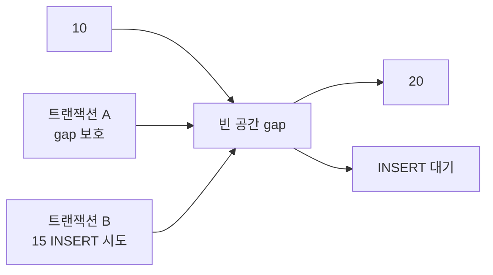
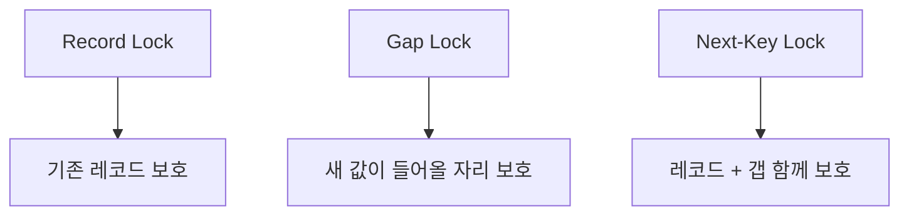
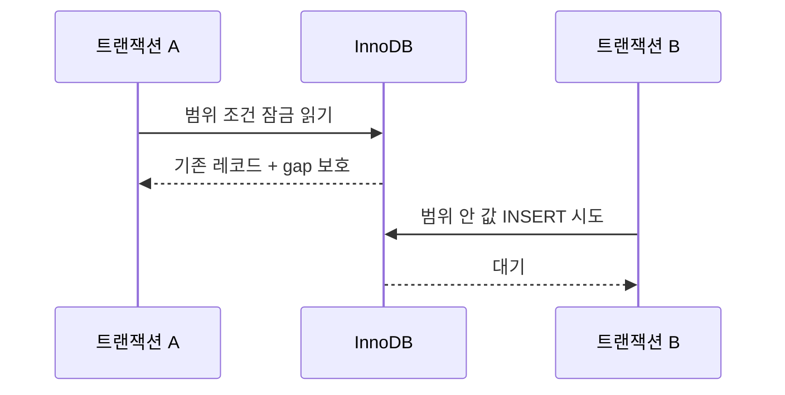
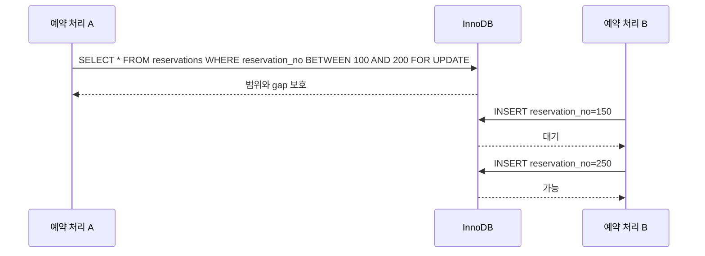

이전 글에서는 `Next-Key Lock`을 다루면서, `InnoDB`가 왜 행 하나가 아니라 범위까지 함께 잠글 수 있는지 정리했다.  
이번에는 그 안에서도 특히 많이 헷갈리는 `Gap Lock`만 따로 떼어 보려고 한다.

처음 배우면 보통 여기서 한 번 멈춘다.

- 아니, 없는 값인데 왜 잠그지?
- 아직 레코드도 없는데 왜 `INSERT`가 대기하지?
- 나는 기존 데이터만 보고 있다고 생각했는데 왜 새 데이터가 못 들어오지?

이 질문에 답하려면 `InnoDB`가 "이미 있는 레코드"뿐 아니라 "새 레코드가 들어올 수 있는 자리"도 보호한다는 감각이 필요하다.

## 왜 Gap Lock을 알아야 할까

실무에서는 아래 같은 장면이 꽤 자주 나온다.

- 어떤 범위 조건으로 `SELECT ... FOR UPDATE`를 걸었더니, 새 `INSERT`가 대기한다.
- 기존 데이터 하나도 안 건드린다고 생각했는데, 다른 요청이 끼어들지 못한다.
- 분명 행 락만 이해하고 코드를 짰는데, 실제로는 빈 공간까지 영향을 받는다.

이걸 모르면 장애 상황에서 원인 파악이 훨씬 어려워진다.  
특히 "왜 아직 없는 값이 막히지?"라는 지점에서 감이 끊기기 쉽다.

공식 문서:

- [MySQL 8.4 Reference Manual - InnoDB Locking](https://dev.mysql.com/doc/refman/8.4/en/innodb-locking.html)
- [MySQL 8.4 Reference Manual - Next-Key Locking](https://dev.mysql.com/doc/refman/8.4/en/innodb-next-key-locking.html)

## 가장 쉬운 예제: 주문 번호 10과 20 사이에 새 값이 들어오면?

주문 번호가 인덱스로 정렬되어 있다고 해보자.

- 이미 `10`, `20`, `30`이 존재한다.
- 트랜잭션 A가 `10`과 `20` 사이 구간을 보호하고 싶다.
- 이때 트랜잭션 B가 `15`를 `INSERT`하려고 하면 어떻게 될까?

문제는 `15`라는 레코드가 아직 없다는 점이다.  
즉, "레코드 락"만으로는 막을 대상이 아예 없다.

그래서 `InnoDB`는 레코드 사이의 빈 공간, 즉 `gap` 자체를 잠글 수 있다.



이게 바로 `Gap Lock`의 핵심 감각이다.  
이미 있는 값이 아니라, "새 값이 들어올 수 있는 자리"를 보호하는 락이라고 보면 된다.

## gap은 정확히 무엇일까

`gap`은 레코드와 레코드 사이의 빈 구간이라고 생각하면 된다.

예를 들어 인덱스 값이 아래처럼 정렬되어 있다면,

```text
10   20   30
```

아래 구간들이 모두 gap처럼 볼 수 있다.

- `10`과 `20` 사이
- `20`과 `30` 사이
- 어떤 경우에는 맨 앞이나 맨 뒤 바깥쪽 구간

즉, `Gap Lock`은 "현재 존재하는 행"보다 "새로운 행이 어디로 끼어들 수 있는가"를 통제하는 쪽에 더 가깝다.

## Next-Key Lock과는 어떤 관계일까

이전 글에서 정리했듯, `Next-Key Lock`은 보통 `record lock + gap lock`의 조합처럼 이해하면 된다.  
즉, 특정 레코드와 그 앞의 갭을 함께 보호하는 방식이다.

그렇다면 `Gap Lock`은 그중에서도 "갭 부분"만 떼어낸 감각에 가깝다.



이번 편에서 기억할 핵심은 이것이다.

- `Record Lock`은 이미 있는 행을 지킨다.
- `Gap Lock`은 아직 없는 행이 들어올 자리를 지킨다.
- `Next-Key Lock`은 둘을 합쳐 더 넓게 보호한다.

## 왜 굳이 없는 값까지 막아야 할까

이유는 결국 범위 안정성과 팬텀 문제 때문이다.

예를 들어 어떤 트랜잭션이 "조건에 맞는 데이터 집합"을 읽고 처리하고 있는데,  
그 사이에 다른 트랜잭션이 새로운 값을 그 범위 안으로 넣어 버리면 결과 집합이 달라질 수 있다.

DB 입장에서는 이것도 일종의 동시성 문제다.  
그래서 경우에 따라서는 새 레코드 진입 자체를 막아야 한다.



즉, `Gap Lock`은 "없는 값을 괜히 막는 기능"이 아니라,  
"내가 보고 있는 범위에 새로운 값이 끼어들지 못하게 해서 결과 집합을 안정적으로 유지하는 장치"에 가깝다.

## 실무에서는 어디서 문제가 될까

이제 개념을 실무 감각으로 바꿔보자.

### 1. 아직 없는 값의 INSERT가 막히는 경우

가장 대표적인 장면이다.

- 어떤 요청은 범위를 잠그고 처리 중이다.
- 다른 요청은 그 범위 안의 새 값을 넣으려 한다.
- 그런데 기존 행 충돌이 없어 보여도 대기한다.

처음 보면 이해가 안 되지만, 실제로는 "그 값이 들어갈 gap"이 잠겨 있어서 그렇다.

### 2. 범위 조건이 넓을수록 영향이 커지는 경우

조건이 넓으면 잠기는 gap도 많아질 수 있다.  
그러면 한 트랜잭션이 꽤 넓은 구간의 `INSERT` 흐름을 묶어 버리는 것처럼 느껴질 수 있다.

### 3. 인덱스를 잘 못 타는 경우

`InnoDB` 락은 인덱스와 강하게 연결된다.  
그래서 어떤 인덱스를 타느냐, 범위 조건이 얼마나 정교하냐에 따라 체감 락 범위가 달라질 수 있다.

즉, 같은 비즈니스 로직이어도 쿼리 모양과 인덱스 설계 때문에 `Gap Lock` 영향이 훨씬 크게 보일 수 있다.

## 예제로 다시 보면 더 쉽다

예약 번호가 순서대로 증가하는 시스템을 생각해 보자.



이 예제가 말해주는 것은 단순하다.

1. `150`은 잠긴 gap 안으로 들어오려 하므로 막힐 수 있다.
2. `250`은 범위 밖이라 상대적으로 자유롭다.
3. 즉, `Gap Lock`은 레코드 자체보다 "삽입 위치"에 더 민감하다.

## 실무에서 기억하면 좋은 대응 포인트

### 1. INSERT가 막힌다고 해서 항상 같은 키 충돌은 아니기

중복 키 충돌이 없어도 `Gap Lock` 때문에 대기할 수 있다.  
즉, "에러가 없는데 왜 insert가 안 들어가지?" 싶다면 범위 잠금을 먼저 의심해 볼 필요가 있다.

### 2. 범위 조건 쿼리를 더 신중하게 보기

`FOR UPDATE`나 강한 잠금 읽기를 범위 조건에 붙이면, 실제 영향 범위는 생각보다 넓을 수 있다.  
그래서 읽는 레코드 수뿐 아니라 "막히는 삽입 구간"도 같이 생각해야 한다.

### 3. 인덱스 설계를 같이 보기

락 문제는 쿼리만의 문제가 아니라 인덱스 문제이기도 하다.  
적절한 인덱스를 타도록 만드는 것만으로도 체감 락 범위를 줄이는 데 도움이 될 수 있다.

### 4. 트랜잭션을 짧게 유지하기

gap을 오래 잡고 있으면 그 구간으로 들어오려는 `INSERT`가 줄줄이 밀릴 수 있다.  
그래서 범위 잠금이 섞인 로직은 특히 더 짧게 끝내는 편이 좋다.

## 핵심만 다시 정리

1. `Gap Lock`은 기존 레코드가 아니라 레코드 사이 빈 공간을 보호하는 락이다.
2. 그래서 아직 존재하지 않는 값의 `INSERT`도 대기할 수 있다.
3. `InnoDB`는 범위 안정성과 팬텀 방지를 위해 이런 방식을 사용한다.
4. 실무에서는 범위 조건, 인덱스, 긴 트랜잭션이 겹치면 `Gap Lock` 영향이 크게 느껴질 수 있다.
5. "왜 없는 값이 막히지?"라는 상황을 만나면 `Gap Lock`을 의심해 볼 가치가 있다.

## 마무리

`Gap Lock`은 처음 들으면 가장 직관에 어긋나는 락 중 하나다.  
하지만 "없는 값이 들어올 자리까지 보호한다"는 관점으로 보면 꽤 자연스럽게 이해된다.

즉, DB는 현재 데이터만 지키는 것이 아니라, 필요한 경우에는 "앞으로 생길 수 있는 데이터의 진입"까지 통제한다.  
이 감각을 잡아두면 `INSERT` 대기나 범위 잠금 문제를 훨씬 덜 당황하고 볼 수 있다.

다음 글에서는 이 흐름을 실무 문제로 더 직접 연결해서 `Lost Update`를 다뤄볼 생각이다.  
거기서는 "왜 업데이트가 사라지는가"와 "어떻게 막을 것인가"를 더 구체적으로 보게 될 것이다.

## 참고 자료

- [MySQL 8.4 Reference Manual - InnoDB Locking](https://dev.mysql.com/doc/refman/8.4/en/innodb-locking.html)
- [MySQL 8.4 Reference Manual - Next-Key Locking](https://dev.mysql.com/doc/refman/8.4/en/innodb-next-key-locking.html)
- [MySQL 8.4 Reference Manual - Transaction Isolation Levels](https://dev.mysql.com/doc/refman/8.4/en/innodb-transaction-isolation-levels.html)
