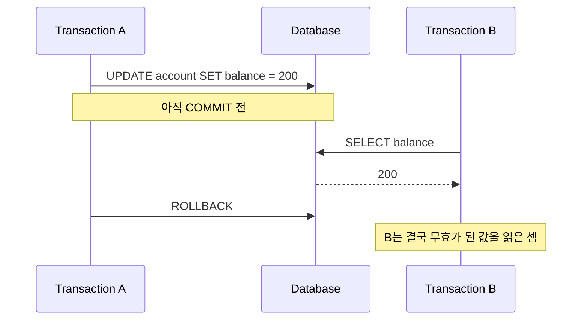
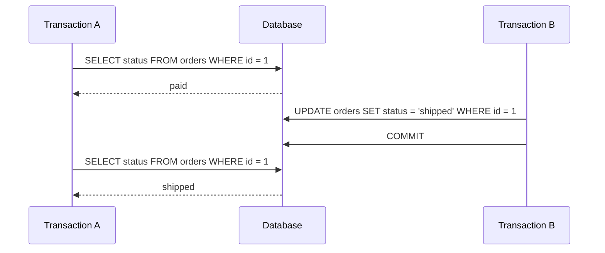
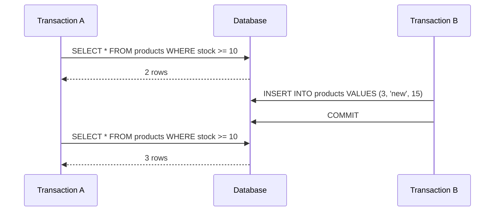
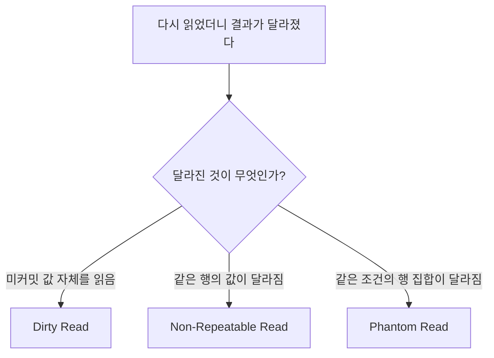

앞선 글에서 [[04-Repeatable Read란 무엇인가 - MySQL에서 같은 SELECT가 같은 결과를 보는 이유]]를 정리하면서, 같은 트랜잭션 안에서도 읽기 결과가 왜 흔들리거나 유지되는지 감각을 먼저 잡았다.

그다음에 자연스럽게 따라오는 질문이 있다.

`그럼 Dirty Read, Non-Repeatable Read, Phantom Read는 서로 뭐가 다른가?`

면접이나 기술 문서에서 이 세 가지가 항상 같이 나오다 보니, 겉으로는 다 비슷한 '조회 결과가 흔들리는 문제'처럼 느껴진다. 하지만 실제로는 포인트가 조금씩 다르다.

- `Dirty Read`는 **아직 커밋되지 않은 값을 읽었는가**가 핵심이고
- `Non-Repeatable Read`는 **같은 행을 다시 읽었더니 값이 달라졌는가**가 핵심이며
- `Phantom Read`는 **같은 조건으로 다시 조회했더니 결과 집합 자체가 달라졌는가**가 핵심이다.

이번 글에서는 이 차이를 한 번에 헷갈리지 않게 정리해 보겠다. 특히 `MySQL InnoDB`와 `PostgreSQL` 문서 기준으로 어디까지를 일반론으로 말할 수 있고, 어디부터는 제품 구현 차이를 봐야 하는지도 같이 묶어보겠다.

![[dirty-nonrepeatable-phantom-overview.svg]]

## 먼저 한 줄로 요약하면

- `Dirty Read`: 남의 **미커밋 데이터**를 읽는 문제
- `Non-Repeatable Read`: 같은 **행(row)** 을 다시 읽었더니 값이 달라지는 문제
- `Phantom Read`: 같은 **조건(condition)** 으로 다시 읽었더니 행 집합이 달라지는 문제

이 세 개를 한 줄로 외우기보다, **값 하나가 바뀐 것인지 / 결과 집합이 바뀐 것인지 / 아예 미확정 값을 읽은 것인지**로 구분하면 훨씬 오래 남는다.

## 1. 왜 이 세 가지를 같이 배우게 될까

SQL 표준은 트랜잭션 격리 수준을 설명할 때, 각 수준에서 어떤 이상 현상(anomaly)을 허용하는지로 차이를 설명한다. 그래서 `Read Uncommitted`, `Read Committed`, `Repeatable Read`, `Serializable`을 배울 때 이 세 가지가 항상 같이 등장한다.

대표적으로 정리하면 아래 감각이다.

| 현상 | 핵심 질문 | 전형적인 원인 |
| --- | --- | --- |
| Dirty Read | 커밋도 안 된 값을 읽었나? | 다른 트랜잭션의 미커밋 변경을 조회 |
| Non-Repeatable Read | 같은 행을 다시 읽었더니 값이 달라졌나? | 다른 트랜잭션이 해당 행을 수정/삭제 후 커밋 |
| Phantom Read | 같은 조건으로 다시 조회했더니 행 수나 대상이 달라졌나? | 다른 트랜잭션이 행을 삽입/삭제하거나 조건을 만족하도록 변경 후 커밋 |

여기서 `Lost Update`와의 차이도 같이 잡아두면 좋다.

- `Dirty Read`, `Non-Repeatable Read`, `Phantom Read`는 **읽기 관점의 이상 현상**에 가깝고
- `Lost Update`는 **쓰기 충돌로 인해 앞선 변경이 사라지는 문제**에 가깝다.

즉, 앞선 글이 `쓰기가 왜 안전하지 않을 수 있는가`였다면, 이번 글은 `읽기가 어떤 식으로 흔들릴 수 있는가`를 정리하는 단계라고 보면 된다.

## 2. Dirty Read: 아직 확정되지 않은 값을 읽는 문제

`Dirty Read`는 가장 직관적이다.

한 트랜잭션이 값을 바꿨지만 아직 `COMMIT`하지 않았는데, 다른 트랜잭션이 그 값을 읽어 버리는 상황이다. 문제는 그 변경이 나중에 `ROLLBACK`될 수도 있다는 점이다. 그러면 두 번째 트랜잭션은 실제로는 존재하지 않았던 값을 읽은 셈이 된다.



이상 현상 중에서 가장 위험하게 느껴지는 이유도 여기에 있다. `바뀔 수 있는 값`이 아니라, **아직 존재가 확정되지 않은 값**을 읽기 때문이다.

### Dirty Read를 가장 쉽게 이해하는 질문

`내가 읽은 값이 나중에 롤백되면 어떻게 되는가?`

이 질문에 답이 막히면 Dirty Read가 발생한 것이다.

### 보통 어디서 허용되나

일반적인 설명으로는 `Read Uncommitted`에서 가능하고, `Read Committed` 이상에서는 막힌다고 이해하면 된다.

MySQL 문서도 `READ UNCOMMITTED`를 `dirty read`가 가능한 수준으로 설명하고, PostgreSQL 문서는 `Read Uncommitted`를 사실상 `Read Committed`처럼 다룬다고 설명한다. 즉, 제품마다 구현 차이는 있지만 `Dirty Read는 매우 낮은 격리 수준에서나 허용되는 문제`라는 큰 틀은 같다.

## 3. Non-Repeatable Read: 같은 행을 다시 읽었더니 값이 달라지는 문제

이번에는 커밋되지 않은 값을 읽는 것은 아니라고 해보자. 처음 조회한 값은 분명 정상이고, 중간에 다른 트랜잭션이 그 행을 수정한 뒤 커밋한다. 그다음 내가 같은 행을 다시 읽었더니 값이 달라진다. 이게 `Non-Repeatable Read`다.

예를 들어 주문 상태가 처음에는 `paid`였는데, 다른 세션이 `shipped`로 바꾸고 커밋했다면 같은 트랜잭션 안의 두 번째 조회에서 결과가 달라질 수 있다.



핵심은 `같은 행`을 다시 읽었다는 점이다. 조회 조건 자체는 바뀌지 않았고, 대상도 같은 레코드다. 그런데 결과 값이 달라진다.

### Dirty Read와의 차이

둘 다 '읽은 결과가 흔들렸다'는 점은 같지만, 질문이 다르다.

- `Dirty Read`: **읽은 값이 미커밋 상태였는가**
- `Non-Repeatable Read`: **읽은 값은 커밋된 값이었지만, 같은 행을 두 번 읽는 사이 바뀌었는가**

즉, Dirty Read는 `확정 전 데이터`, Non-Repeatable Read는 `확정 후 데이터이긴 하지만 재조회 시 값 변화`에 초점이 있다.

### 보통 어디서 허용되나

일반론으로는 `Read Committed`에서 가능하고, `Repeatable Read` 이상에서는 방지된다고 배운다. PostgreSQL 문서도 이 분류를 표로 설명한다.

다만 실제 제품에서는 `일반 SELECT`, `SELECT ... FOR UPDATE`, `UPDATE`가 각각 어떤 시점의 스냅샷을 보는지까지 들어가면 체감이 조금 달라진다. 그래서 실무에서는 단순 암기보다, **내가 지금 plain SELECT를 하는지, 잠금 읽기를 하는지**를 구분하는 편이 더 중요하다.

## 4. Phantom Read: 같은 조건으로 다시 읽었더니 행 집합이 달라지는 문제

`Phantom Read`는 이름이 어렵지만, 포인트는 오히려 간단하다.

이번에는 같은 `행 하나`가 바뀌는 것이 아니라, 같은 `검색 조건`에 걸리는 행 집합이 달라진다. 예를 들어 처음에는 `stock >= 10` 조건에 맞는 상품이 2개였는데, 다른 트랜잭션이 새 상품을 넣거나 기존 상품을 수정해서 조건에 맞는 행을 하나 더 만들면 두 번째 조회에서는 3개가 보일 수 있다.



여기서 중요한 점은 `같은 행이 바뀌었다`보다 `같은 조건의 결과 집합이 바뀌었다`는 것이다.

그래서 `Non-Repeatable Read`와 구분할 때는 이렇게 보면 편하다.

- `Non-Repeatable Read`: **같은 row**의 값이 달라짐
- `Phantom Read`: **같은 WHERE 조건 결과**의 row 집합이 달라짐

### 꼭 INSERT만 팬텀인가

실무에서는 흔히 INSERT 예시로 배우지만, 꼭 새 행 추가만 팬텀을 만드는 것은 아니다.

- 다른 트랜잭션이 행을 `DELETE`해서 결과 집합에서 사라지게 만들 수도 있고
- 어떤 행의 값을 바꿔서 `WHERE` 조건에 새로 들어오게 만들 수도 있다.

즉, 핵심은 `행 집합 변화`다.

## 5. 가장 헷갈리는 포인트: Non-Repeatable Read와 Phantom Read는 어디서 갈리나

처음 배울 때 제일 자주 나오는 질문이 이것이다.

`같은 SELECT를 두 번 했더니 결과가 달라졌는데, 그게 Non-Repeatable Read인가 Phantom Read인가?`

정답은 **무엇이 달라졌는지**를 보면 된다.

### 같은 행을 찍어 읽었는데 값이 달라졌다

```sql
SELECT balance FROM account WHERE id = 1;
SELECT balance FROM account WHERE id = 1;
```

이 두 결과가 다르면 보통 `Non-Repeatable Read`로 본다.

### 같은 조건 범위를 읽었는데 행 수나 구성 자체가 달라졌다

```sql
SELECT * FROM account WHERE balance >= 1000;
SELECT * FROM account WHERE balance >= 1000;
```

이 두 결과 사이에 행이 새로 나타나거나 사라졌다면 `Phantom Read`로 본다.

아래처럼 기억하면 구분이 쉽다.



## 6. 격리 수준 표는 외우되, 제품 구현 차이는 따로 봐야 한다

보통 교과서식 표는 이렇게 정리된다.

| 격리 수준 | Dirty Read | Non-Repeatable Read | Phantom Read |
| --- | --- | --- | --- |
| Read Uncommitted | 가능 | 가능 | 가능 |
| Read Committed | 방지 | 가능 | 가능 |
| Repeatable Read | 방지 | 방지 | 가능 |
| Serializable | 방지 | 방지 | 방지 |

이 표 자체는 SQL 표준 설명과 입문 개념 정리에 유용하다. 다만 실무에서는 여기서 한 걸음 더 나가야 한다.

### MySQL InnoDB에서는

MySQL 문서는 `Repeatable Read`를 기본 격리 수준으로 설명하고, 일반 `SELECT`가 첫 읽기 시점 스냅샷을 유지한다고 설명한다. 또 잠금 읽기와 수정 구문은 최신 상태와 락을 기준으로 움직인다고 말한다.

그리고 범위 조건을 잠그는 `gap lock`, `next-key lock` 때문에, MySQL InnoDB에서는 입문서의 단순 표보다 `Phantom Read`가 덜 드러나거나 특정 패턴에서 별도로 방지되는 것처럼 느껴질 수 있다.

즉, `Repeatable Read면 팬텀이 무조건 그대로 발생한다`고 단정하기보다, **MySQL은 MVCC와 range lock 계열 메커니즘이 함께 작동한다**고 이해하는 편이 정확하다.

이 부분은 이미 [[04-Repeatable Read란 무엇인가 - MySQL에서 같은 SELECT가 같은 결과를 보는 이유]], [[08-Next-Key Lock이란 무엇인가 - MySQL이 행 하나가 아니라 범위까지 잠그는 이유]], [[07-Gap Lock이란 무엇인가 - MySQL이 아직 없는 값까지 잠그는 이유]]에서 이어서 본 흐름과 연결된다.

### PostgreSQL에서는

PostgreSQL 문서는 격리 수준 표를 명확하게 제시하면서, `Repeatable Read` 구현이 SQL 표준의 최소 보장보다 강해서 팬텀 읽기까지 허용하지 않는다고 설명한다. 대신 `serialization anomaly` 가능성은 별도로 본다.

즉, 같은 `Repeatable Read`라는 이름이라도 제품 구현에 따라 실제 보장 강도는 다를 수 있다.

이 차이를 모르면 면접 답변은 맞는데 실무 해석은 어긋나는 상황이 생긴다.

## 7. 그래서 실무에서는 어떻게 설명하는 편이 안전한가

실무에서는 아래 순서로 설명하면 보통 덜 틀린다.

### 1) 먼저 표준 개념으로 정의한다

- Dirty Read = 미커밋 값 읽기
- Non-Repeatable Read = 같은 행 재조회 시 값 변화
- Phantom Read = 같은 조건 재조회 시 행 집합 변화

여기까지는 공통 언어다.

### 2) 그다음 DB 제품 구현을 분리해서 말한다

- MySQL InnoDB는 `MVCC`, `Repeatable Read`, `gap lock`, `next-key lock` 영향이 크다.
- PostgreSQL은 `Read Committed`, `Repeatable Read`, `Serializable`의 의미가 문서상 꽤 명확하고, 표준보다 강한 보장을 제공하는 부분이 있다.

### 3) 마지막으로 SQL 패턴을 함께 본다

같은 격리 수준이라도 아래에 따라 체감이 달라진다.

- 일반 `SELECT`인지
- `SELECT ... FOR UPDATE`인지
- 범위 조건인지
- 단일 PK 조회인지
- 단순 읽기인지, 읽고 나서 곧바로 갱신하는 패턴인지

즉, 격리 수준 이름만 외우는 것으로는 부족하고, **실제 쿼리 패턴과 DB 구현을 같이 봐야 한다**.

## 8. Lost Update 글과 같이 보면 더 잘 보이는 차이

바로 앞 글의 `Lost Update`와 비교하면 정리가 더 선명해진다.

| 개념 | 무엇이 문제인가 | 관점 |
| --- | --- | --- |
| Dirty Read | 미커밋 값을 읽음 | 읽기 이상 |
| Non-Repeatable Read | 같은 행 값이 다시 읽을 때 달라짐 | 읽기 이상 |
| Phantom Read | 같은 조건 결과 집합이 달라짐 | 읽기 이상 |
| Lost Update | 앞선 쓰기가 나중 쓰기에 덮여 사라짐 | 쓰기 충돌 |

즉,

- 이번 글은 `읽는 동안 세상이 어떻게 흔들릴 수 있는가`
- Lost Update 글은 `쓰는 동안 남의 변경을 어떻게 잃어버릴 수 있는가`

를 설명하는 짝이라고 보면 된다.

## 9. 핵심만 다시 정리

마지막으로 아주 짧게 다시 묶으면 이렇다.

1. `Dirty Read`는 다른 트랜잭션의 **미커밋 데이터**를 읽는 문제다.
2. `Non-Repeatable Read`는 같은 **행**을 두 번 읽었는데 값이 달라지는 문제다.
3. `Phantom Read`는 같은 **조건**으로 두 번 읽었는데 결과 **행 집합**이 달라지는 문제다.
4. 입문 표는 유용하지만, 실제 동작은 `MySQL`, `PostgreSQL` 같은 제품 구현 차이를 함께 봐야 한다.
5. 읽기 이상 현상과 `Lost Update` 같은 쓰기 충돌은 구분해서 이해해야 한다.

## 마무리

`Dirty Read`, `Non-Repeatable Read`, `Phantom Read`는 이름만 보면 비슷하지만, 실무에서 중요한 차이는 꽤 분명하다.

- `Dirty Read`는 **확정되지 않은 값을 읽었는가**
- `Non-Repeatable Read`는 **같은 행 값이 달라졌는가**
- `Phantom Read`는 **같은 조건 결과 집합이 달라졌는가**

이 세 질문만 정확히 분리해도 격리 수준 설명이 훨씬 덜 꼬인다.

그리고 여기서 한 단계 더 나아가면, 결국 질문은 이것으로 이어진다.

`내가 지금 보는 것은 같은 행의 변화인가, 같은 조건의 집합 변화인가, 아니면 애초에 읽으면 안 되는 미확정 값인가?`

이 질문에 바로 답할 수 있으면, 트랜잭션 격리 수준의 가장 헷갈리는 구간은 이미 넘어온 셈이다.

## 함께 읽기
- 시리즈 전체 보기: [[index]]
- 이전 글: [[04-Repeatable Read란 무엇인가 - MySQL에서 같은 SELECT가 같은 결과를 보는 이유]]
- 다음 글: [[06-Lost Update란 무엇인가 - 트랜잭션이 있어도 데이터가 덮어써지는 이유]]
- 입문글 다시 보기: [[01-왜 DB를 알아야 할까 - MySQL InnoDB, 트랜잭션, MVCC, Lock 쉽게 이해하기]]

## 참고 자료

- [MySQL 8.4 Reference Manual - Transaction Isolation Levels](https://dev.mysql.com/doc/refman/8.4/en/innodb-transaction-isolation-levels.html)
- [PostgreSQL Documentation - Transaction Isolation](https://www.postgresql.org/docs/current/transaction-iso.html)
- [HS dev log - Dirty Read / Non-Repeatable Read / Phantom Read](https://innovation123.tistory.com/166)
- [Velog - 트랜잭션 격리 수준 실습: Dirty Read, Non-Repeatable Read, Phantom Read 재현](https://velog.io/@yonghyuk/%ED%8A%B8%EB%9E%9C%EC%9E%AD%EC%85%98-%EA%B2%A9%EB%A6%AC-%EC%88%98%EC%A4%80-%EC%8B%A4%EC%8A%B5-Dirty-Read-Non-Repeatable-Read-Phantom-Read-%EC%9E%AC%ED%98%84)
- [hudi.blog - 데이터베이스 트랜잭션 격리 수준과 격리 수준에 따른 문제점](https://hudi.blog/transaction-isolation-level/)
- [Naver Blog - 더티 리드(Dirty Read), 비동기적 갱신(Non-repeatable Read), 팬텀 리드(Phantom Read)](https://m.blog.naver.com/djlee118/223811855738)
