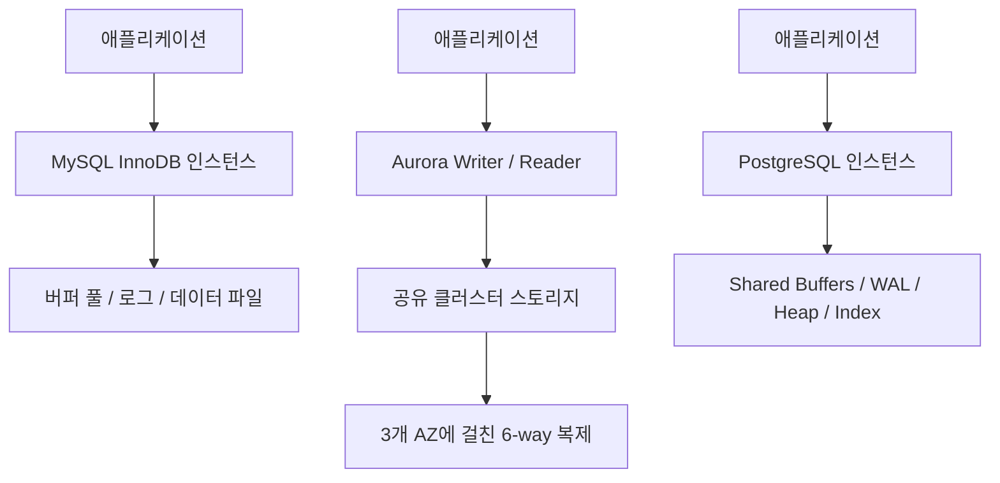
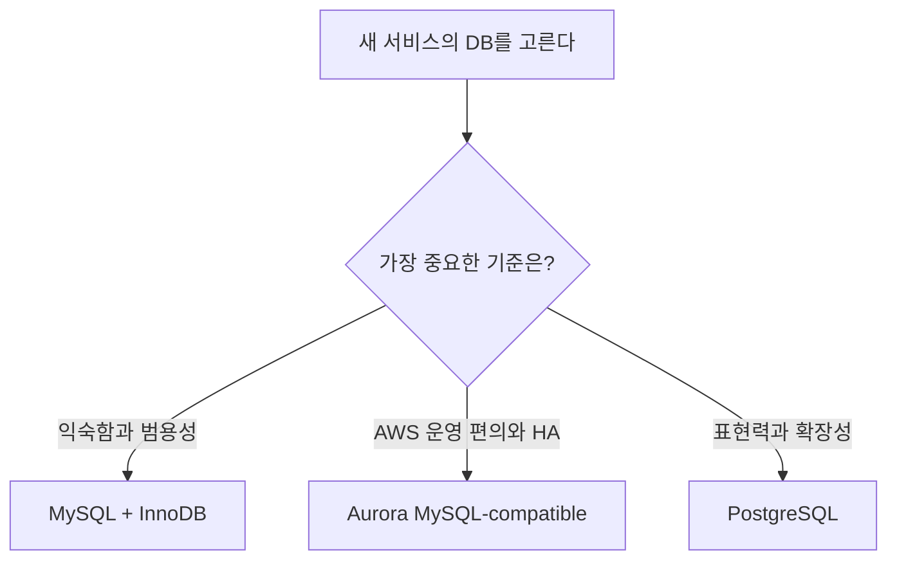

지금까지는 `InnoDB`, `Repeatable Read`, `Next-Key Lock`, `Gap Lock`처럼 "MySQL InnoDB 내부에서 무슨 일이 일어나는가"를 중심으로 정리해 왔다.  
그런데 여기까지 공부하고 나면 자연스럽게 다음 질문이 생긴다.

`그럼 MySQL, Aurora MySQL, PostgreSQL은 도대체 무엇이 다를까?`

이 질문은 단순히 "어느 게 더 좋냐"의 문제가 아니다.  
세 제품은 비슷한 SQL을 사용하더라도 태어난 배경이 다르고, 운영을 전제한 환경이 다르고, 내부에서 동시성과 저장소를 다루는 방식도 다르다.

이번 글에서는 아래 관점으로 비교해 보겠다.

- 어떤 배경에서 탄생했는가
- 어떤 구조를 기본 전제로 삼는가
- 트랜잭션, `MVCC`, 락은 어떻게 다르게 체감되는가
- 인덱스와 쿼리 최적화 관점에서 무엇이 다른가
- 복제와 운영 관점에서 무엇이 달라지는가
- 그래서 사용자 입장에서는 언제 무엇을 고르는 것이 자연스러운가

비교 대상은 아래 셋이다.

- `MySQL + InnoDB`
- `Amazon Aurora MySQL-compatible`
- `PostgreSQL`

## 먼저 한 줄로 요약하면

처음부터 긴 설명으로 들어가기 전에, 가장 짧게 요약하면 이렇다.

| 제품 | 아주 짧은 성격 요약 |
| --- | --- |
| `MySQL + InnoDB` | 범용적이고 익숙한 관계형 DB, 웹 서비스에서 널리 쓰이는 실용형 선택지 |
| `Aurora MySQL-compatible` | MySQL 호환성을 유지하면서 클라우드 운영성과 고가용성에 강하게 최적화한 AWS 엔진 |
| `PostgreSQL` | 표준 친화성과 확장성, 고급 기능이 강한 범용 관계형 DB |

하지만 이 한 줄 요약만 보면 중요한 차이를 거의 놓치게 된다.  
이제부터는 왜 그런 성격이 생겼는지 차근차근 보자.

## 1. 탄생 배경부터 다르다

### MySQL: 웹 시대의 실용적 오픈소스 데이터베이스

MySQL 공식 소개에 따르면 MySQL은 `1995년`부터 이어져 온 오픈소스 관계형 데이터베이스다.  
웹 애플리케이션과 함께 빠르게 보급됐고, 가볍고 실용적인 운영 경험 덕분에 널리 쓰였다.

공식 자료:

- [MySQL 공식 소개 페이지](https://www.mysql.com/about/)
- [MySQL 30주년 공식 블로그](https://blogs.oracle.com/mysql/post/mysql-turns-30)

여기서부터는 공식 역사 소개를 바탕으로 한 해석이지만, MySQL의 뿌리에는 "복잡한 이론보다 실제 서비스에서 빨리 써먹을 수 있는 관계형 DB"라는 성격이 강하게 보인다.  
그리고 이후 `InnoDB`가 기본 스토리지 엔진이 되면서, 단순히 빠른 웹 DB를 넘어서 트랜잭션과 일관성을 갖춘 범용 DB로 자리 잡았다.

### Aurora MySQL: MySQL 위에 얹은 관리형 서비스가 아니라, 클라우드용으로 다시 설계한 엔진

AWS는 `2014년 11월 12일` Aurora를 공개하면서, 상용 DB의 성능과 가용성을 오픈소스 DB의 단순성과 비용 구조에 가깝게 가져가고 싶었다고 설명했다.  
공개 당시 AWS는 Aurora를 "클라우드에 최적화한 관계형 데이터베이스"라고 소개했다.

공식 자료:

- [AWS News Blog - Introducing Amazon Aurora](https://aws.amazon.com/blogs/aws/highly-scalable-mysql-compat-rds-db-engine/)
- [Aurora User Guide - Overview](https://docs.aws.amazon.com/AmazonRDS/latest/AuroraUserGuide/CHAP_AuroraOverview.html)

즉, Aurora의 출발점은 "MySQL을 AWS에서 편하게 돌리자"보다 더 크다.  
핵심은 **MySQL 호환성을 유지하면서도, 스토리지와 복제를 클라우드 전제 구조로 다시 설계하자**는 쪽에 가깝다.

### PostgreSQL: 연구 프로젝트에서 출발한, 확장성과 정합성 지향의 커뮤니티 DB

PostgreSQL 공식 역사 문서에 따르면 PostgreSQL의 뿌리는 `1986년` 시작된 Berkeley의 `POSTGRES` 프로젝트까지 거슬러 올라간다.  
이후 오픈소스 커뮤니티 주도로 발전하면서, 현재의 PostgreSQL이 되었다.

공식 자료:

- [PostgreSQL History](https://www.postgresql.org/docs/current/history.html)
- [PostgreSQL About](https://www.postgresql.org/about/)

여기서도 해석을 덧붙이면, PostgreSQL은 처음부터 상대적으로 "더 일반적이고, 더 엄밀하고, 더 확장 가능한 관계형 시스템" 쪽에 가깝다.  
그래서 단순 CRUD를 넘어서 복잡한 쿼리, 확장 기능, 데이터 타입, 인덱스 전략, 표준 친화성에서 강점을 보이는 경우가 많다.

### 그래서 사용자 입장에서는?

- `MySQL`은 "익숙하고 실용적이다"라는 느낌이 강하다.
- `Aurora MySQL`은 "MySQL처럼 쓰지만 운영 감각은 AWS가 많이 가져간다"에 가깝다.
- `PostgreSQL`은 "기능과 표현력이 더 넓고, 설계 철학도 좀 더 범용적이고 엄밀하다"는 느낌을 준다.

즉, 시작부터 세 제품은 같은 문제를 똑같이 풀려고 태어난 것이 아니다.

## 2. 스토리지 구조가 다르다

DB를 비교할 때 가장 중요한 차이 중 하나는 스토리지 구조다.  
겉으로는 모두 SQL을 받아도, 실제로 데이터를 저장하고 복제하는 방식이 다르면 운영 감각이 크게 달라진다.

### MySQL + InnoDB

`InnoDB`는 서버 프로세스 안에서 `Buffer Pool`, `Redo Log`, `Undo` 관련 구조, 인덱스와 데이터 페이지를 함께 다루는 전통적인 구조를 가진다.  
클러스터형 스토리지를 기본 전제로 하는 것이 아니라, **DB 인스턴스와 스토리지가 비교적 더 강하게 붙어 있는 모델**로 이해하는 편이 직관적이다.

공식 자료:

- [MySQL 8.4 - InnoDB Architecture](https://dev.mysql.com/doc/refman/8.4/en/innodb-architecture.html)

### Aurora MySQL-compatible

Aurora는 여기서 가장 큰 차이를 만든다.  
AWS 문서에 따르면 Aurora는 **DB 인스턴스와 클러스터 볼륨을 분리**하고, 기본 데이터는 `3개 Availability Zone`에 걸쳐 `6-way` 복제된 클러스터 스토리지에 저장한다.

공식 자료:

- [Aurora high availability and replication](https://docs.aws.amazon.com/AmazonRDS/latest/AuroraUserGuide/Concepts.AuroraHighAvailability.html)

즉, Aurora는 단순히 "MySQL 서버 한 대 + EBS" 같은 그림으로 이해하면 안 된다.  
쓰기 노드와 읽기 노드가 같은 스토리지를 공유하고, 복제와 장애 대응도 이 구조 위에서 이뤄진다.

### PostgreSQL

PostgreSQL은 `WAL(Write-Ahead Log)`과 힙 테이블, 인덱스, 공유 버퍼, 체크포인트, 백그라운드 프로세스 중심 구조를 가진다.  
Aurora처럼 기본적으로 스토리지-컴퓨트를 분리한 클라우드 네이티브 엔진은 아니지만, 전통적인 서버 DB 중에서는 내부 메커니즘이 매우 체계적으로 문서화되어 있다.

공식 자료:

- [PostgreSQL - WAL Introduction](https://www.postgresql.org/docs/current/wal-intro.html)
- [PostgreSQL - Routine Vacuuming](https://www.postgresql.org/docs/current/routine-vacuuming.html)

### 그래서 사용자 입장에서는?

- `MySQL`은 상대적으로 "DB 서버 한 대를 잘 운영한다"는 감각이 강하다.
- `Aurora`는 "DB 인스턴스보다 스토리지 시스템까지 포함한 서비스"를 쓰는 느낌이 강하다.
- `PostgreSQL`은 전통적 서버 DB이지만, 내부 구성과 유지보수 개념(`WAL`, `VACUUM`, `autovacuum`)을 더 분명히 이해해야 한다.

즉, 운영자의 머릿속 아키텍처 그림이 처음부터 달라진다.

## 3. 트랜잭션과 MVCC도 같은 듯 다르다

지금까지 시리즈에서 계속 봤듯, 관계형 DB에서 핵심은 결국 트랜잭션과 동시성이다.

### MySQL InnoDB의 MVCC

MySQL 공식 문서는 `InnoDB`가 `MVCC`를 통해 nonlocking consistent read를 제공한다고 설명한다.  
이전 글에서 본 것처럼, `InnoDB`는 숨겨진 트랜잭션 정보와 undo 기반 버전 관리를 이용해 읽기와 쓰기의 충돌을 줄인다.

공식 자료:

- [MySQL 8.4 - InnoDB Multi-Versioning](https://dev.mysql.com/doc/refman/8.4/en/innodb-multi-versioning.html)
- [MySQL 8.4 - Consistent Nonlocking Reads](https://dev.mysql.com/doc/refman/8.4/en/innodb-consistent-read.html)

기본 격리 수준은 `Repeatable Read`다.

공식 자료:

- [MySQL 8.4 - Transaction Isolation Levels](https://dev.mysql.com/doc/refman/8.4/en/innodb-transaction-isolation-levels.html)

### Aurora MySQL-compatible의 트랜잭션 감각

Aurora MySQL-compatible은 SQL과 트랜잭션 체감에서 상당 부분 `MySQL InnoDB`와 유사하다.  
애플리케이션 코드 입장에서는 드라이버, SQL 문법, 많은 락/MVCC 감각을 그대로 가져갈 수 있는 경우가 많다.

하지만 운영 관점에서는 전혀 같지 않다.  
Aurora는 스토리지 복제, 장애 복구, 리더 확장, 백업 모델이 MySQL Community Edition을 직접 운영할 때와 다른 시스템 위에 있다.

또한 `2026년 3월 10일` 기준 AWS Aurora MySQL Release Notes에는 `Aurora MySQL 3.12.0`이 `MySQL 8.0.44`와 호환된다고 적혀 있지만, AWS는 별도 비교 문서에서 커뮤니티 MySQL과의 기능 차이도 계속 문서화하고 있다.  
즉, **호환은 같음이 아니라, 호환은 호환**으로 이해하는 것이 맞다.

공식 자료:

- [Aurora MySQL release notes](https://docs.aws.amazon.com/AmazonRDS/latest/AuroraMySQLReleaseNotes/AuroraMySQL.Updates.3120.html)
- [Comparison between Aurora MySQL and MySQL](https://docs.aws.amazon.com/AmazonRDS/latest/AuroraUserGuide/AuroraMySQL.Compare-80-v3.html)

### PostgreSQL의 MVCC

PostgreSQL 공식 문서는 `MVCC`를 PostgreSQL의 핵심 동시성 모델로 설명한다.  
PostgreSQL은 데이터 행 버전을 직접 관리하고, 오래된 버전 정리를 위해 `VACUUM`이 중요한 역할을 한다.

공식 자료:

- [PostgreSQL - MVCC Introduction](https://www.postgresql.org/docs/current/mvcc-intro.html)
- [PostgreSQL - Routine Vacuuming](https://www.postgresql.org/docs/current/routine-vacuuming.html)

여기서 중요한 차이 하나가 있다.  
PostgreSQL의 기본 격리 수준은 `Read Committed`다.  
반면 MySQL InnoDB의 기본은 `Repeatable Read`다.

공식 자료:

- [PostgreSQL - Transaction Isolation](https://www.postgresql.org/docs/current/transaction-iso.html)

그리고 PostgreSQL 문서는 `Repeatable Read`가 PostgreSQL에서는 팬텀 리드도 허용하지 않는다고 설명한다.  
즉, 이름은 같아도 제품마다 구현 감각이 완전히 동일하지 않다.

### 트랜잭션과 MVCC 비교표

| 항목 | MySQL + InnoDB | Aurora MySQL-compatible | PostgreSQL |
| --- | --- | --- | --- |
| 기본 격리 수준 | `Repeatable Read` | MySQL 호환, 보통 `Repeatable Read` 감각 유지 | `Read Committed` |
| MVCC 감각 | undo 기반 일관된 읽기 | SQL 레벨은 MySQL과 유사, 운영 구조는 별도 | 행 버전 중심 MVCC |
| 오래된 버전 정리 | undo/내부 버전 관리 | MySQL 호환 감각 유지 | `VACUUM`, `autovacuum`가 중요 |
| 사용자 체감 | 락과 스냅샷 차이를 자주 의식 | 개발은 MySQL처럼, 운영은 Aurora 방식 | 격리 수준과 `VACUUM` 이해가 중요 |

## 4. 락 모델은 더 다르게 느껴진다

사용자가 실무에서 가장 강하게 체감하는 차이는 보통 락에서 나온다.

### MySQL InnoDB: record lock, gap lock, next-key lock

MySQL InnoDB는 인덱스 레코드 기반 락을 매우 중요하게 다룬다.  
지금까지 시리즈에서 본 `record lock`, `gap lock`, `next-key lock`도 이 흐름 안에 있다.

즉, MySQL 쪽에서는 아래 같은 감각이 자주 등장한다.

- 범위 조건인데 왜 insert가 막히지?
- 왜 읽은 행보다 더 넓게 잠기지?
- 왜 인덱스 타는 방식이 락 범위까지 바꾸지?

이건 MySQL InnoDB를 이해할 때 매우 중요한 특징이다.

### Aurora MySQL-compatible: SQL 레벨 락 감각은 비슷하지만, 운영 레벨 대응은 다르다

Aurora MySQL-compatible은 MySQL 호환 엔진이므로, 애플리케이션이 보는 기본 락 감각은 상당 부분 비슷하다.  
즉, `SELECT ... FOR UPDATE`, `gap lock`, `next-key lock` 같은 생각법이 여전히 중요하다.

하지만 문제가 났을 때 바라보는 운영 도구와 장애 대응 방식은 AWS 서비스 문맥으로 넘어간다.  
즉, 락 현상 자체는 MySQL처럼 이해하되, 장애 감시와 복구는 Aurora 문서와 메트릭 기준으로 보는 일이 많다.

### PostgreSQL: 같은 MVCC라도 락 사고방식이 다르다

PostgreSQL은 explicit locking, row-level locking, table-level locking을 문서화하고 있지만,  
MySQL InnoDB처럼 `gap lock`과 `next-key lock`을 중심으로 사고하는 제품은 아니다.

공식 자료:

- [PostgreSQL - Explicit Locking](https://www.postgresql.org/docs/current/explicit-locking.html)

또 PostgreSQL은 `Read Committed`, `Repeatable Read`, `Serializable` 각각의 의미가 MySQL과 다르게 체감될 수 있다.  
특히 `Serializable`은 단순히 가장 강한 락 모드가 아니라, 직렬화 가능한 실행을 보장하려는 별도 접근을 갖는다.

### 그래서 사용자 입장에서는?

- `MySQL/Aurora MySQL`은 락 문제를 볼 때 인덱스 범위, `gap`, `next-key` 감각이 중요하다.
- `PostgreSQL`은 같은 동시성 문제라도 다른 문맥으로 접근하는 경우가 많다.
- 즉, MySQL에서 익숙한 "왜 gap lock이 걸렸지?"라는 질문이 PostgreSQL에서는 핵심 질문이 아닐 수 있다.

이 차이는 서비스 이관이나 문제 분석에서 꽤 크게 체감된다.

### 락 모델 비교표

| 항목 | MySQL + InnoDB | Aurora MySQL-compatible | PostgreSQL |
| --- | --- | --- | --- |
| 실무에서 많이 체감하는 락 | `record lock`, `gap lock`, `next-key lock` | 대체로 MySQL과 유사 | row/table lock 중심 사고 |
| 범위 조건에서의 체감 | `INSERT`까지 막히는 경우가 많음 | MySQL과 유사 | 같은 문제를 더 다른 방식으로 해석 |
| 이관 시 헷갈리는 포인트 | 인덱스 범위와 락 범위가 같이 움직임 | SQL은 비슷하지만 운영 도구는 다름 | MySQL 락 감각을 그대로 가져오면 오해하기 쉬움 |

## 5. 인덱스 철학과 쿼리 최적화 포인트도 다르다

### MySQL InnoDB

MySQL 공식 문서에 따르면 `InnoDB`는 `clustered index`를 사용한다.  
테이블 데이터는 기본 키를 기준으로 함께 저장되고, secondary index는 기본 키 값을 함께 가진다.

공식 자료:

- [MySQL 8.4 - Clustered and Secondary Indexes](https://dev.mysql.com/doc/refman/8.4/en/innodb-index-types.html)

이 말은 실무에서 아래로 이어진다.

- 기본 키 설계가 저장 구조와 성능에 직접 영향을 준다.
- secondary index를 봐도 결국 기본 키 접근 비용까지 연결된다.
- PK가 너무 크면 secondary index 비용도 커질 수 있다.

### Aurora MySQL-compatible

Aurora MySQL-compatible은 SQL 엔진과 인덱스 감각에서 MySQL과 매우 가깝다.  
즉, 애플리케이션 개발자는 대부분 MySQL의 인덱스 설계 감각을 그대로 가져간다.

하지만 운영자는 "이 인덱스가 스토리지 비용, 복제, 읽기 확장에 어떤 영향을 줄까"도 함께 보게 된다.  
특히 Aurora에서는 단순 쿼리 속도뿐 아니라 리더 활용 방식과 비용 구조까지 같이 봐야 할 때가 많다.

### PostgreSQL

PostgreSQL의 차별점 중 하나는 인덱스 타입과 표현력이다.  
공식 문서 기준으로 PostgreSQL은 `B-tree`, `Hash`, `GiST`, `SP-GiST`, `GIN`, `BRIN` 같은 여러 인덱스 타입을 제공한다.

공식 자료:

- [PostgreSQL - Index Types](https://www.postgresql.org/docs/current/indexes-types.html)

이 외에도 PostgreSQL은 expression index, partial index, 다양한 데이터 타입과 연계된 인덱싱 전략에서 강점이 있다.  
그래서 아래 같은 상황에서 PostgreSQL이 훨씬 매력적으로 느껴질 수 있다.

- JSON/문서형 데이터와 관계형 데이터를 함께 다룰 때
- 전문 검색이나 복잡한 검색 조건을 다룰 때
- 단순 PK/secondary index를 넘어선 인덱스 표현력이 필요할 때

### 그래서 사용자 입장에서는?

- `MySQL/Aurora MySQL`은 인덱스 설계가 비교적 단순하고 직관적이지만, 그만큼 기본 키와 범용 B-tree 중심 사고가 강하다.
- `PostgreSQL`은 더 많은 인덱스 선택지를 주지만, 그만큼 설계 자유도와 학습량이 함께 올라간다.

즉, PostgreSQL은 "더 많은 무기"를 주고, MySQL은 "더 익숙한 무기"를 주는 경우가 많다.

## 6. 복제, 고가용성, 운영성에서 Aurora가 가장 많이 갈린다

### MySQL Community를 직접 운영할 때

MySQL은 전통적으로 복제와 장애 조치 구성을 운영자가 직접 많이 설계하는 편이다.  
물론 매니지드 MySQL을 쓰면 난이도가 낮아지지만, 엔진 자체 철학은 여전히 "DB 서버를 운영한다"에 가깝다.

### Aurora MySQL-compatible

Aurora는 이 영역이 핵심 강점이다.  
AWS 문서에 따르면 Aurora는 기본 데이터 복제와 장애 대응을 클러스터 스토리지 차원에서 제공하고, Aurora Replica도 공유 스토리지를 활용한다.

공식 자료:

- [Aurora high availability and replication](https://docs.aws.amazon.com/AmazonRDS/latest/AuroraUserGuide/Concepts.AuroraHighAvailability.html)
- [Aurora Replicas](https://docs.aws.amazon.com/AmazonRDS/latest/AuroraUserGuide/Aurora.Replication.html)

즉, Aurora는 "DB 엔진"이라기보다 "DB 엔진 + 고가용성 스토리지 시스템 + AWS 운영 경험"을 함께 사는 느낌에 가깝다.

### PostgreSQL

PostgreSQL은 스트리밍 복제, logical replication 등 강력한 복제 기능을 제공하지만,  
Aurora처럼 제품 자체가 처음부터 스토리지-서비스 일체형 클라우드 엔진인 것은 아니다.

공식 자료:

- [PostgreSQL - Warm Standby and Streaming Replication](https://www.postgresql.org/docs/current/warm-standby.html)
- [PostgreSQL - Logical Replication](https://www.postgresql.org/docs/current/logical-replication.html)

즉, PostgreSQL은 기능이 강력하지만, 어떤 운영 경험을 만들지는 배포 환경과 도구 체인에 더 많이 의존한다.

### 그래서 사용자 입장에서는?

- `MySQL`은 가장 범용적이지만 운영 설계 책임이 더 남는다.
- `Aurora MySQL`은 AWS 안에서는 운영 편의와 HA 경험이 가장 강력하게 체감된다.
- `PostgreSQL`은 기능적으로 강력하지만, 운영 경험은 어떤 배포 방식을 택하느냐에 따라 차이가 크다.

즉, **Aurora는 기술 차이만이 아니라 "운영 모델 자체"가 다르다**는 점이 중요하다.

### 운영 관점 비교표

| 항목 | MySQL + InnoDB | Aurora MySQL-compatible | PostgreSQL |
| --- | --- | --- | --- |
| 복제/HA 기본 감각 | 운영자가 더 많이 설계 | 서비스 차원에서 강하게 내장 | 배포 방식에 따라 차이 큼 |
| 읽기 확장 체감 | 전통적인 replica 감각 | 공유 스토리지 기반 reader 감각 | 설정과 도구 체인에 따라 다양 |
| 운영자가 자주 보는 것 | 인스턴스 상태, 복제 상태, 쿼리/인덱스 | AWS 메트릭, failover, reader/writer 구조 | `WAL`, replication, `VACUUM`, 튜닝 도구 |

## 7. 결국 무엇을 선택해야 할까

이제 가장 실용적인 질문으로 가보자.

### MySQL + InnoDB가 자연스러운 경우

- 팀이 이미 MySQL에 익숙하다.
- 서비스 구조가 전형적인 웹 애플리케이션 CRUD 중심이다.
- 운영 환경이 AWS로 완전히 잠기지 않아야 한다.
- 복잡한 확장 기능보다 예측 가능하고 익숙한 운영이 중요하다.

### Aurora MySQL-compatible이 자연스러운 경우

- 애플리케이션은 MySQL 생태계를 유지하고 싶다.
- 하지만 복제, 장애 조치, 백업, 읽기 확장을 AWS 쪽에 최대한 맡기고 싶다.
- 서비스가 AWS 중심이고, 고가용성과 관리 편의가 매우 중요하다.
- "엔진 선택"보다 "운영 모델 선택"이 더 큰 고민이다.

### PostgreSQL이 자연스러운 경우

- 단순 CRUD를 넘어 더 복잡한 쿼리, 더 넓은 데이터 표현력, 더 다양한 인덱스 전략이 필요하다.
- SQL 표준 친화성, 함수/확장, 고급 기능을 더 적극적으로 활용하고 싶다.
- 장기적으로 데이터 모델과 쿼리 복잡도가 커질 가능성이 높다.

## 8. 핵심만 다시 정리

1. `MySQL`은 실용적이고 익숙한 범용 관계형 DB다.
2. `Aurora MySQL-compatible`은 MySQL 호환성을 유지하지만, 스토리지와 HA 구조는 별개의 AWS 엔진에 가깝다.
3. `PostgreSQL`은 역사적으로 더 확장성과 엄밀성에 무게를 둔 범용 관계형 DB다.
4. `MySQL/Aurora MySQL`은 `InnoDB` 락 모델과 인덱스 범위 감각이 매우 중요하다.
5. `PostgreSQL`은 MVCC, 격리 수준, 인덱스 종류, 확장 전략에서 더 넓은 선택지를 제공한다.
6. 실무 선택은 "무엇이 더 우월한가"보다 "어떤 운영 모델과 개발 경험을 원하는가"에 더 가깝다.

## 마무리

`InnoDB`를 공부한 뒤 이 비교를 보면, 이제 DB 제품 차이를 단순 브랜드 차이로 보기 어렵다.  
세 제품은 모두 관계형 DB이지만, 어디에 최적화되어 있는지와 운영자가 어떤 부담을 지는지가 확실히 다르다.

만약 지금 단계에서 가장 중요한 결론 하나만 뽑는다면 이렇다.

- `MySQL`은 익숙하고 실용적이다.
- `Aurora MySQL`은 MySQL처럼 개발하면서 AWS식 운영 모델을 산다.
- `PostgreSQL`은 더 넓은 기능과 표현력을 주는 대신, 더 많은 개념과 선택지를 함께 가져온다.

다음 글에서는 이 흐름을 이어서 `Lost Update`처럼 실제 동시성 문제 하나를 중심으로, "DB를 바꿔도 여전히 중요한 문제"를 더 직접적으로 다뤄볼 수 있을 것 같다.

## 참고 자료

- [MySQL 공식 소개 페이지](https://www.mysql.com/about/)
- [MySQL 30주년 공식 블로그](https://blogs.oracle.com/mysql/post/mysql-turns-30)
- [MySQL 8.4 - InnoDB Architecture](https://dev.mysql.com/doc/refman/8.4/en/innodb-architecture.html)
- [MySQL 8.4 - InnoDB Multi-Versioning](https://dev.mysql.com/doc/refman/8.4/en/innodb-multi-versioning.html)
- [MySQL 8.4 - Consistent Nonlocking Reads](https://dev.mysql.com/doc/refman/8.4/en/innodb-consistent-read.html)
- [MySQL 8.4 - Transaction Isolation Levels](https://dev.mysql.com/doc/refman/8.4/en/innodb-transaction-isolation-levels.html)
- [MySQL 8.4 - Clustered and Secondary Indexes](https://dev.mysql.com/doc/refman/8.4/en/innodb-index-types.html)
- [AWS News Blog - Introducing Amazon Aurora](https://aws.amazon.com/blogs/aws/highly-scalable-mysql-compat-rds-db-engine/)
- [Aurora User Guide - Overview](https://docs.aws.amazon.com/AmazonRDS/latest/AuroraUserGuide/CHAP_AuroraOverview.html)
- [Aurora high availability and replication](https://docs.aws.amazon.com/AmazonRDS/latest/AuroraUserGuide/Concepts.AuroraHighAvailability.html)
- [Aurora Replicas](https://docs.aws.amazon.com/AmazonRDS/latest/AuroraUserGuide/Aurora.Replication.html)
- [Aurora MySQL release notes](https://docs.aws.amazon.com/AmazonRDS/latest/AuroraMySQLReleaseNotes/AuroraMySQL.Updates.3120.html)
- [Comparison between Aurora MySQL and MySQL](https://docs.aws.amazon.com/AmazonRDS/latest/AuroraUserGuide/AuroraMySQL.Compare-80-v3.html)
- [PostgreSQL History](https://www.postgresql.org/docs/current/history.html)
- [PostgreSQL About](https://www.postgresql.org/about/)
- [PostgreSQL - MVCC Introduction](https://www.postgresql.org/docs/current/mvcc-intro.html)
- [PostgreSQL - Transaction Isolation](https://www.postgresql.org/docs/current/transaction-iso.html)
- [PostgreSQL - Explicit Locking](https://www.postgresql.org/docs/current/explicit-locking.html)
- [PostgreSQL - Index Types](https://www.postgresql.org/docs/current/indexes-types.html)
- [PostgreSQL - WAL Introduction](https://www.postgresql.org/docs/current/wal-intro.html)
- [PostgreSQL - Routine Vacuuming](https://www.postgresql.org/docs/current/routine-vacuuming.html)
- [PostgreSQL - Warm Standby and Streaming Replication](https://www.postgresql.org/docs/current/warm-standby.html)
- [PostgreSQL - Logical Replication](https://www.postgresql.org/docs/current/logical-replication.html)
