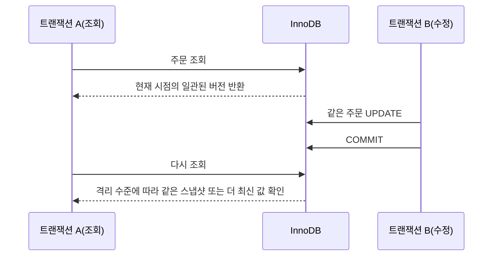
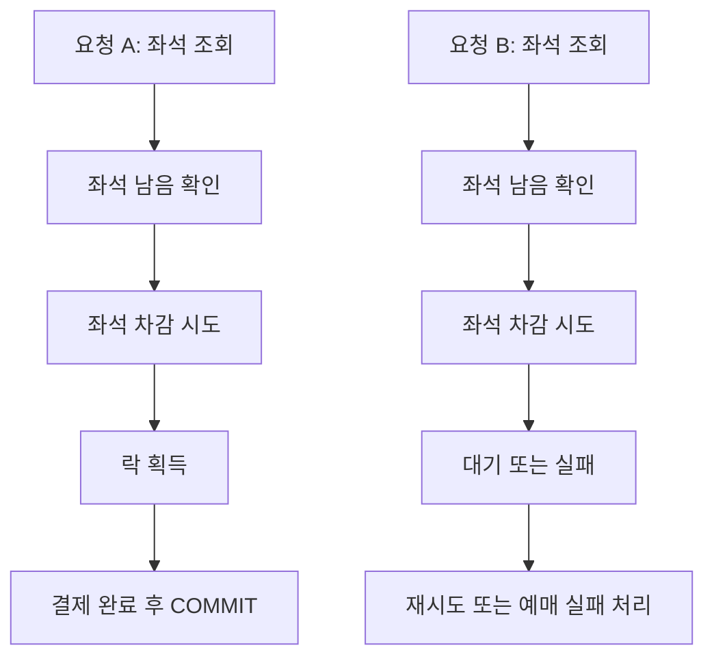
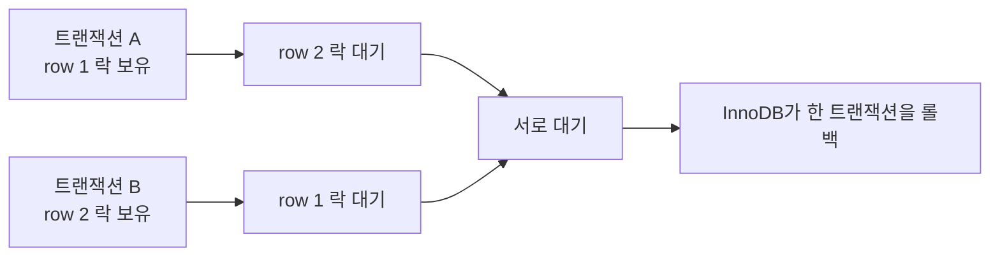

백엔드 개발을 하다 보면 프레임워크보다 더 오래 남는 질문이 있다.

`왜 어떤 쿼리는 잘 동작하는데, 동시에 요청이 몰리면 갑자기 꼬일까?`

평소에는 멀쩡하던 기능이 트래픽이 몰리는 순간 느려지거나, 데이터가 꼬이거나, 심하면 데드락까지 발생하는 이유는 대부분 DB 내부 동작을 충분히 이해하지 못했기 때문이다.  
이번 글에서는 오늘 들은 DB 강의 내용을 바탕으로, 입문자 기준에서 꼭 알아야 하는 핵심만 추려서 정리해 보려고 한다.

특히 `MySQL`의 기본 스토리지 엔진인 `InnoDB`를 기준으로 아래 내용을 쉽게 묶어보겠다.

- 왜 DB 지식이 실무에서 중요한가
- `트랜잭션`은 왜 필요한가
- `MVCC`는 읽기를 어떻게 편하게 만들어 주는가
- `락`과 `데드락`은 왜 생기는가
- 장애를 만나면 무엇부터 의심해야 하는가

## 왜 DB를 공부해야 할까

실무에서는 결국 "쿼리 한 줄"이 성능과 장애를 크게 좌우하는 경우가 많다.

- 인덱스를 잘못 타면 조회가 급격히 느려질 수 있다.
- 동시에 같은 데이터를 수정하면 예상하지 못한 충돌이 생길 수 있다.
- 애플리케이션 코드가 멀쩡해 보여도, DB에서 락이 길게 잡히면 전체 요청이 밀릴 수 있다.

즉, DB는 단순 저장소가 아니라 서비스의 동시성과 일관성을 실제로 보장하는 핵심 계층이다.  
프레임워크는 바꿀 수 있어도, 데이터가 꼬이면 서비스는 바로 문제가 난다.

## 먼저 알아둘 것: InnoDB가 기본이다

MySQL 공식 문서 기준으로 `InnoDB`는 MySQL의 기본 스토리지 엔진이다.  
그리고 `트랜잭션`, `row-level locking`, `foreign key`, `MVCC` 같은 핵심 기능도 대부분 이 엔진을 중심으로 이해하면 된다.

공식 문서:

- [MySQL 8.4 Reference Manual - The InnoDB Storage Engine](https://dev.mysql.com/doc/refman/8.4/en/innodb-storage-engine.html)
- [MySQL 8.4 Reference Manual - InnoDB Introduction](https://dev.mysql.com/doc/refman/8.4/en/innodb-introduction.html)

아래 이미지는 MySQL 공식 문서에 있는 `InnoDB` 아키텍처 그림이다.


이미지 출처: [MySQL 공식 문서 - InnoDB Architecture](https://dev.mysql.com/doc/refman/8.4/en/innodb-architecture.html)

입문자 기준에서는 이 그림을 전부 외울 필요는 없다.  
다만 아래 3가지만 기억하면 충분하다.

1. 실제 데이터는 결국 디스크에 저장된다.
2. 자주 쓰는 데이터는 메모리(`Buffer Pool`)에서 최대한 빠르게 처리하려고 한다.
3. 동시에 많은 요청이 들어와도 데이터가 깨지지 않도록 `트랜잭션`, `로그`, `락` 같은 장치가 함께 움직인다.

## 트랜잭션은 왜 필요할까

가장 쉬운 예시는 계좌 이체다.

철수 계좌에서 5만 원을 빼고, 영희 계좌에 5만 원을 넣는다고 해보자.

```sql
START TRANSACTION;

UPDATE account SET balance = balance - 50000 WHERE user_id = '철수';
UPDATE account SET balance = balance + 50000 WHERE user_id = '영희';

COMMIT;
```

여기서 중간에 서버가 죽거나 첫 번째 쿼리만 실행되고 두 번째 쿼리가 실패하면 어떻게 될까?  
돈은 철수 계좌에서는 빠졌는데 영희 계좌에는 안 들어가는 이상한 상태가 된다.

이런 문제를 막기 위해 `트랜잭션`을 쓴다.

## ACID는 이렇게 이해하면 쉽다

트랜잭션을 설명할 때 항상 같이 나오는 키워드가 `ACID`다.

- `Atomicity`: 모두 성공하거나 모두 실패해야 한다.
- `Consistency`: 트랜잭션 전후에 데이터 규칙이 깨지면 안 된다.
- `Isolation`: 동시에 실행되는 작업끼리 서로 너무 심하게 간섭하면 안 된다.
- `Durability`: 커밋이 끝난 결과는 장애가 나도 유지되어야 한다.

말은 어려워 보이지만, 실무 감각으로 바꾸면 이렇다.

- 중간 상태가 남으면 안 되고
- 이상한 데이터가 생기면 안 되고
- 동시에 처리돼도 최소한의 질서는 있어야 하고
- 커밋한 결과는 믿을 수 있어야 한다

공식 문서:

- [MySQL 8.4 Reference Manual - InnoDB and the ACID Model](https://dev.mysql.com/doc/refman/8.4/en/mysql-acid.html)

## MVCC는 왜 읽기를 편하게 만들까

DB가 어려워지는 지점은 "읽기"와 "쓰기"가 동시에 일어날 때다.

예를 들어 어떤 주문 데이터를 누군가는 수정하고 있고, 다른 누군가는 동시에 조회하고 있다고 해보자.  
이때 읽는 사람까지 전부 막아버리면 서비스는 금방 느려진다.

`InnoDB`는 이를 줄이기 위해 `MVCC(Multi-Version Concurrency Control)`를 사용한다.  
쉽게 말해, 데이터를 하나만 보는 것이 아니라 "시점별 버전"처럼 다뤄서 읽기와 쓰기가 덜 부딪히게 만드는 방식이다.

공식 문서:

- [MySQL 8.4 Reference Manual - InnoDB Multi-Versioning](https://dev.mysql.com/doc/refman/8.4/en/innodb-multi-versioning.html)
- [MySQL 8.4 Reference Manual - Consistent Nonlocking Reads](https://dev.mysql.com/doc/refman/8.4/en/innodb-consistent-read.html)

### 예시: 내가 읽는 동안 다른 사람이 수정하면?



입문자 입장에서는 이렇게만 이해해도 좋다.

- `MVCC`는 읽는 작업을 매번 락으로 막지 않게 도와준다.
- 그래서 조회가 많은 서비스에서 특히 중요하다.
- 다만 "항상 최신 데이터를 본다"와는 조금 다를 수 있다.

즉, 읽기가 편해졌다고 해서 모든 동시성 문제가 사라지는 것은 아니다.  
읽기와 수정이 섞이는 순간에는 여전히 `락`과 `격리 수준`을 함께 봐야 한다.

## 락은 왜 필요할까

이번엔 좌석 예매를 생각해 보자.

좌석이 1개 남아 있는데, 두 사람이 거의 동시에 결제를 시도한다면 DB는 둘 다 성공시키면 안 된다.  
이때 필요한 것이 `락(lock)`이다.

공식 문서:

- [MySQL 8.4 Reference Manual - InnoDB Locking](https://dev.mysql.com/doc/refman/8.4/en/innodb-locking.html)
- [MySQL 8.4 Reference Manual - Transaction Isolation Levels](https://dev.mysql.com/doc/refman/8.4/en/innodb-transaction-isolation-levels.html)

### 예시: 좌석 1개를 동시에 예매하는 경우



여기서 핵심은 단순하다.

- 조회는 둘 다 성공할 수 있다.
- 하지만 실제 수정 시점에는 하나만 먼저 처리되어야 한다.
- 그래서 DB는 어떤 시점에는 락을 잡고 순서를 강제한다.

입문 단계에서는 락을 "동시에 같은 데이터를 바꾸지 못하게 막는 안전장치" 정도로 이해하면 충분하다.

## 데드락은 왜 생길까

락이 있다고 해서 항상 안전하게 끝나는 것은 아니다.  
오히려 락을 서로 반대로 잡으면 `데드락(deadlock)`이 생길 수 있다.

예를 들어 이런 상황이다.

1. 트랜잭션 A가 `row 1` 락을 잡는다.
2. 트랜잭션 B가 `row 2` 락을 잡는다.
3. 트랜잭션 A가 `row 2`도 필요해서 기다린다.
4. 트랜잭션 B가 `row 1`도 필요해서 기다린다.

서로 상대방이 놓아주길 기다리기만 하니 진행이 멈춘다.



다행히 `InnoDB`는 데드락을 감지하면 둘 중 하나를 종료시켜 상황을 풀어준다.  
하지만 애플리케이션 입장에서는 에러가 발생하므로, 그냥 "DB가 알아서 해결해 준다"로 끝내면 안 된다.

공식 문서:

- [MySQL 8.4 Reference Manual - Deadlocks in InnoDB](https://dev.mysql.com/doc/refman/8.4/en/innodb-deadlocks.html)

## 실무에서 특히 조심할 포인트

오늘 강의에서 가장 인상 깊었던 부분은 "문제가 생겼을 때 무엇을 의심해야 하는지 알아야 한다"는 점이었다.  
DB를 공부하는 이유도 결국 여기에 있다.

아래 체크리스트는 입문자 기준으로 특히 자주 부딪히는 문제들이다.

### 1. 느린 쿼리는 정말 쿼리 자체가 문제일까

- 인덱스를 못 타고 있을 수 있다.
- 예상보다 훨씬 많은 범위를 읽고 있을 수 있다.
- 앞단 코드는 짧아도 DB에서는 큰 비용이 들 수 있다.

### 2. 조회는 잘 되는데 수정에서만 꼬이지 않는가

- `MVCC` 덕분에 읽기는 잘 되더라도
- 실제 `UPDATE`, `INSERT`, `DELETE` 시점에는 락 경합이 발생할 수 있다.

### 3. 동시에 요청이 몰릴 때만 에러가 나지 않는가

- 평소에는 숨어 있던 동시성 문제가
- 피크 타임에만 드러나는 경우가 많다.

### 4. 트랜잭션이 너무 길지 않은가

- 트랜잭션이 길수록 락을 오래 쥘 가능성이 커진다.
- 락이 길어지면 다른 요청이 줄줄이 밀릴 수 있다.

## 입문자 기준 핵심만 다시 정리

이 글에서 꼭 기억할 내용만 다시 뽑으면 아래와 같다.

1. `InnoDB`는 MySQL에서 가장 기본이 되는 엔진이고, 트랜잭션과 동시성 이해의 중심이다.
2. `트랜잭션`은 여러 작업을 하나처럼 묶어서 데이터가 어정쩡한 상태로 남지 않게 해준다.
3. `MVCC`는 읽기 성능과 동시성을 돕지만, 모든 충돌을 없애 주는 마법은 아니다.
4. `락`은 데이터를 안전하게 지키기 위해 필요하지만, 잘못 다루면 대기와 병목이 생긴다.
5. `데드락`은 실무에서 실제로 자주 마주치는 문제이고, 재시도 전략과 쿼리 구조 개선이 중요하다.

## 마무리

결국 DB 공부는 문법을 더 외우기 위한 공부가 아니라, 장애가 났을 때 "무엇을 먼저 의심해야 하는지"를 알기 위한 공부에 가깝다.

평소에는 단순한 CRUD처럼 보이는 기능도, 요청이 동시에 몰리면 `트랜잭션`, `MVCC`, `락`, `격리 수준`이 전부 실전 문제가 된다.  
그래서 백엔드 개발자라면 최소한 "왜 이런 일이 발생하는지"를 설명할 수 있을 정도까지는 DB 내부 동작을 이해하고 있는 것이 큰 도움이 된다.

이번 글은 입문용으로 최대한 쉽게 정리한 버전이고, 다음에는 `Repeatable Read`, `Next-Key Lock`, `Gap Lock`, `Lost Update` 같은 개념까지 예제로 더 깊게 정리해 봐도 재미있을 것 같다.

## 참고 자료

- [MySQL 8.4 Reference Manual - The InnoDB Storage Engine](https://dev.mysql.com/doc/refman/8.4/en/innodb-storage-engine.html)
- [MySQL 8.4 Reference Manual - InnoDB Architecture](https://dev.mysql.com/doc/refman/8.4/en/innodb-architecture.html)
- [MySQL 8.4 Reference Manual - InnoDB and the ACID Model](https://dev.mysql.com/doc/refman/8.4/en/mysql-acid.html)
- [MySQL 8.4 Reference Manual - InnoDB Multi-Versioning](https://dev.mysql.com/doc/refman/8.4/en/innodb-multi-versioning.html)
- [MySQL 8.4 Reference Manual - Consistent Nonlocking Reads](https://dev.mysql.com/doc/refman/8.4/en/innodb-consistent-read.html)
- [MySQL 8.4 Reference Manual - InnoDB Locking](https://dev.mysql.com/doc/refman/8.4/en/innodb-locking.html)
- [MySQL 8.4 Reference Manual - Transaction Isolation Levels](https://dev.mysql.com/doc/refman/8.4/en/innodb-transaction-isolation-levels.html)
- [MySQL 8.4 Reference Manual - Deadlocks in InnoDB](https://dev.mysql.com/doc/refman/8.4/en/innodb-deadlocks.html)
