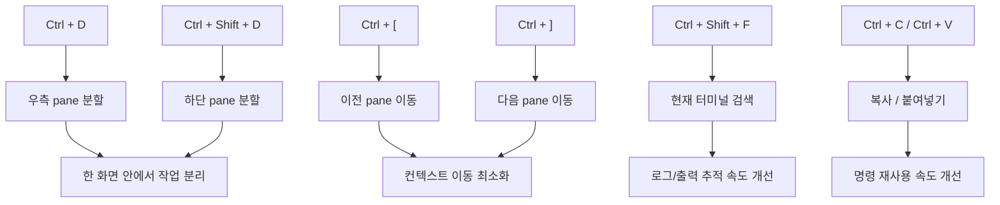

맥북과 Windows 노트북을 같이 쓰다 보면, 어느 쪽이 더 낫다는 식의 비교는 금방 무의미해진다. 둘 다 장단점이 분명하고, 결국 중요한 것은 내가 어떤 맥락에서 어떤 도구를 쓰고 있는가다.

그럼에도 개발자의 손에 익는 기본값은 분명 차이가 있다. 특히 터미널은 그 차이가 더 크게 느껴진다. macOS에서는 `iTerm`이나 기본 Terminal.app을 쓰면서 자연스럽게 익히게 되는 pane 분할, pane 이동, 검색 같은 흐름이 있는데, Windows Terminal을 처음 열면 그 감각이 그대로 이어지지는 않는다.

그래서 이번에 한 일은 단순했다.

`Windows Terminal을 macOS처럼 보이게 만든 것`이 아니라,  
`내 손이 기억하는 iTerm 스타일 작업 흐름을 Windows Terminal에도 이식한 것`.

이 글은 그 구현 후기다.

## 1. 왜 굳이 키 매핑부터 건드렸는가

내가 불편하게 느낀 건 기능 부족 자체가 아니었다.  
Windows Terminal도 pane 분할, focus 이동, 검색, 복사/붙여넣기 같은 핵심 기능은 이미 잘 갖추고 있다.

문제는 **기능의 유무보다 손의 기억**이었다.

- macOS에서는 터미널 pane을 나누고
- 옆 pane으로 넘어가고
- 필요한 문자열을 찾고
- 다시 붙여넣는 흐름이 거의 반사적으로 나온다

그런데 Windows에 오면 같은 일을 하면서도 한 번씩 생각하게 된다.

- 이건 무슨 키였지?
- pane 이동은 어디로 들어가 있었지?
- split 방향은 내가 익숙한 기준과 같나?

이 한 박자의 멈춤이 생각보다 자주 쌓였다.


비교가 아니라 통일의 문제였다.  
두 OS를 같이 쓸수록 "더 좋은 기본값"보다 "같은 몸의 기억으로 움직일 수 있는가"가 더 중요해졌다.

## 2. 적용 전후의 감각

`iTerm`에서 내가 가장 자주 쓰던 흐름은 대체로 아래와 같았다.

1. 작업을 둘로 쪼갠다
2. 옆 pane으로 바로 이동한다
3. 현재 화면 안에서 문자열을 찾는다
4. 필요한 명령을 복사해서 다른 pane에 붙여넣는다

이번에 Windows Terminal에서도 이 흐름이 최대한 비슷하게 느껴지도록 키를 다시 잡았다.


출처: [iTerm2 Features - Split Panes](https://iterm2.com/features.html)


출처: [Microsoft Learn - Windows Terminal panes](https://learn.microsoft.com/en-us/windows/terminal/panes)


출처: [Microsoft Learn - Windows Terminal panes](https://learn.microsoft.com/en-us/windows/terminal/panes)

화면만 보면 두 프로그램은 다르다.  
하지만 작업 흐름은 꽤 비슷하게 맞출 수 있다. 내 목표는 정확히 그 지점이었다.

## 3. 실제로 적용한 키 매핑

현재 내 Windows Terminal `settings.json`에 들어 있는 키 매핑은 아래와 같다.

| 목적 | Windows Terminal 액션 | 적용한 키 | 메모 |
| --- | --- | --- | --- |
| 우측 pane 분할 | `User.SplitPaneRight` | `Ctrl + D` | iTerm에서 split을 자주 쓰던 감각을 가장 먼저 맞춘 키 |
| 하단 pane 분할 | `User.SplitPaneDown` | `Ctrl + Shift + D` | 방향만 달리한 대응 키 |
| pane 복제 | `Terminal.DuplicatePaneAuto` | `Alt + Shift + D` | 현재 작업 컨텍스트를 유지한 채 복제 |
| 이전 pane 이동 | `Terminal.MoveFocusPreviousInOrder` | `Ctrl + [` | 좌우보다 "이전/다음 흐름" 기준으로 잡음 |
| 다음 pane 이동 | `Terminal.MoveFocusNextInOrder` | `Ctrl + ]` | 탐색 리듬을 맞추기 좋았음 |
| 검색 | `Terminal.FindText` | `Ctrl + Shift + F` | 에디터와 비슷한 감각으로 통일 |
| 복사 | `Terminal.CopyToClipboard` | `Ctrl + C` | 명시적으로 고정 |
| 붙여넣기 | `Terminal.PasteFromClipboard` | `Ctrl + V` | 명시적으로 고정 |

핵심은 "완전히 똑같은 키"보다 **작업 리듬이 비슷해지는가**였다.

## 4. 확인한 실제 설정 파일

이번 글을 쓰기 전에 실제 로컬 Windows Terminal 설정 파일을 다시 확인했다.

- 경로: `C:\Users\wlwhs\AppData\Local\Packages\Microsoft.WindowsTerminal_8wekyb3d8bbwe\LocalState\settings.json`
- 파싱 결과: `ConvertFrom-Json` 기준 문제 없음
- 커스텀 액션: 우측/하단 split을 별도 `id`로 정의한 뒤 `keybindings`에서 연결

실제로 적용된 핵심 부분만 정리하면 아래와 같다.

```json
{
  "actions": [
    {
      "command": {
        "action": "splitPane",
        "split": "right",
        "splitMode": "duplicate"
      },
      "id": "User.SplitPaneRight"
    },
    {
      "command": {
        "action": "splitPane",
        "split": "down",
        "splitMode": "duplicate"
      },
      "id": "User.SplitPaneDown"
    }
  ],
  "keybindings": [
    {
      "id": "User.SplitPaneDown",
      "keys": "ctrl+shift+d"
    },
    {
      "id": "Terminal.CopyToClipboard",
      "keys": "ctrl+c"
    },
    {
      "id": "Terminal.PasteFromClipboard",
      "keys": "ctrl+v"
    },
    {
      "id": "Terminal.FindText",
      "keys": "ctrl+shift+f"
    },
    {
      "id": "Terminal.DuplicatePaneAuto",
      "keys": "alt+shift+d"
    },
    {
      "id": "User.SplitPaneRight",
      "keys": "ctrl+d"
    },
    {
      "id": "Terminal.MoveFocusPreviousInOrder",
      "keys": "ctrl+["
    },
    {
      "id": "Terminal.MoveFocusNextInOrder",
      "keys": "ctrl+]"
    }
  ]
}
```

이 구조가 깔끔했던 이유는 두 가지다.

1. split 동작을 먼저 `actions`에서 이름 붙여 정의할 수 있다
2. `keybindings`에서는 그 이름을 다시 연결하기만 하면 된다

즉, 나중에 키를 바꾸더라도 동작 정의와 키 연결을 분리해 관리할 수 있다.

## 5. 내가 원하는 동작 흐름은 이런 식이었다



그리고 이 흐름은 Windows Terminal 설정 UI에서도 어느 정도 바로 대응된다.

![[windows-terminal-settings-ui.svg]]

이미지는 실제 UI 스크린샷 대신, 이번 글에서 다루는 keybinding 중심 구조를 이해하기 쉽게 정리한 요약 일러스트다.  
참고한 공식 문서는 [Microsoft Learn - Windows Terminal settings](https://learn.microsoft.com/en-us/windows/terminal/customize-settings/startup) 이다.

결국 중요한 건 예쁜 설정 파일이 아니라, **분할, 이동, 검색이 같은 리듬으로 이어지는가**였다.

## 6. 구현 확인 메모

이번 설정을 확인하면서 느낀 점은, 의도 자체는 꽤 잘 맞아 있다는 것이다.

### 6-1. 잘 맞는 부분

- `splitPane`를 right/down으로 분리해 둔 점
- focus 이동을 별도 키로 고정해 pane 작업을 빠르게 만든 점
- 검색을 `Ctrl + Shift + F`로 맞춰 에디터와의 감각 차이를 줄인 점
- 복사/붙여넣기를 명시적으로 선언해 헷갈림을 줄인 점

특히 pane 작업이 잦은 개발 흐름에서는 `Ctrl + D`, `Ctrl + Shift + D`, `Ctrl + [`, `Ctrl + ]` 조합이 꽤 빠르게 손에 붙는다.

### 6-2. 남는 트레이드오프

다만 `Ctrl + D`는 셸에 따라 EOF나 종료 의미로 쓰이는 경우가 있다.  
즉, Windows Terminal이 먼저 이 키를 잡도록 설계한 지금의 방식은 "pane 분할을 더 자주 쓴다"는 내 습관에는 맞지만, Linux/WSL 셸에서 `Ctrl + D`를 자주 쓰는 사람에게는 다르게 느껴질 수 있다.

그래서 이 설정은 정답이라기보다 **내 작업 패턴에 맞춘 선택**이다.

만약 아래에 더 가깝다면 다른 키가 나을 수 있다.

- Bash/WSL에서 EOF 입력을 자주 쓴다
- `Ctrl + C`를 인터럽트로 쓰는 빈도가 복사보다 압도적으로 높다
- pane 이동을 순서 기반보다 방향 기반으로 선호한다

나는 반대로 "분할과 이동"이 훨씬 자주 일어나기 때문에 이 쪽이 더 맞았다.

## 7. 적용하고 나서 체감한 변화

적용 후 가장 크게 줄어든 건 기능 부족이 아니라 **전환 비용**이었다.

- macOS에서 하던 방식대로 pane을 나누고
- 바로 다음 pane으로 넘어가고
- 필요한 로그를 찾고
- 명령을 붙여넣는 흐름이

Windows에서도 거의 같은 템포로 이어졌다.

생각보다 이런 종류의 통일은 집중력에 직접 영향을 준다.  
운영체제가 바뀔 때마다 "지금은 무슨 키였지?"를 떠올리는 순간이 줄어들면, 실제로는 작은 설정 하나가 꽤 큰 피로를 없애준다.

그래서 이번 작업은 "Windows Terminal을 iTerm처럼 보이게 꾸민 것"보다,  
"내가 익숙한 개발 습관을 Windows에서도 그대로 이어가게 만든 것"에 더 가깝다.

## 8. 다음에 더 손볼 수 있는 부분

지금은 pane 분할과 이동 중심으로 맞췄지만, 다음 단계에서는 아래도 충분히 건드려볼 수 있다.

- 새 탭/탭 이동 키를 더 macOS 감각에 맞추기
- 프로필별로 WSL, PowerShell, Git Bash 동작을 다르게 잡기
- command palette와 빠른 검색 흐름 정리하기
- copy 모드와 selection 동작을 더 세밀하게 조정하기

특히 Windows Terminal은 공식 문서 기준으로 액션 시스템이 잘 정리돼 있어서, 한 번 방향만 잡으면 생각보다 깊게 커스터마이징할 수 있다.

## 마무리

맥과 윈도를 같이 쓰는 사람에게 필요한 건 종종 비교가 아니라 번역이다.  
내 손이 익힌 작업 흐름을 다른 운영체제에서도 최대한 비슷하게 이어지게 만드는 것.

이번 Windows Terminal 키 매핑은 바로 그 번역 작업에 가까웠다.

macOS 쪽 개발 환경이 더 익숙하게 느껴졌던 이유를 곰곰이 생각해 보면, 결국은 작은 기본값들과 자주 쓰는 동작의 연결이 더 잘 정리돼 있었기 때문이다. 그래서 이번에는 그 감각을 Windows 쪽으로 조금 옮겨왔다.

완전히 똑같아질 필요는 없다.  
하지만 적어도 내 손이 멈추지 않을 정도로는 맞출 수 있다.

## 참고 자료

- [Microsoft Learn - Actions in Windows Terminal](https://learn.microsoft.com/en-us/windows/terminal/customize-settings/actions)
- [Microsoft Learn - Panes in Windows Terminal](https://learn.microsoft.com/en-us/windows/terminal/panes)
- [Microsoft Learn - Windows Terminal settings](https://learn.microsoft.com/en-us/windows/terminal/customize-settings/startup)
- [iTerm2 Features](https://iterm2.com/features.html)
