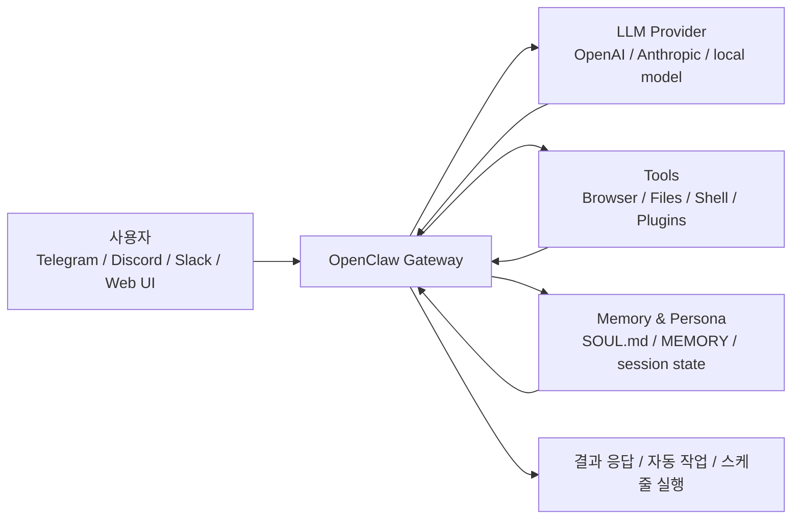

요즘 OpenClaw를 처음 본 사람들은 대체로 같은 반응을 한다.

`이거 그냥 ChatGPT를 메신저에 붙여 놓은 거 아냐?`

겉으로만 보면 그렇게 보일 수 있다.  
그런데 OpenClaw의 포인트는 단순히 "대답을 잘하는 AI"가 아니라, **내 환경에서 계속 살아 있으면서 실제로 뭔가를 하게 만드는 개인 AI 에이전트**에 더 가깝다는 데 있다.

![[openclaw-logo-text.png]]

OpenClaw 공식 사이트의 첫 문장도 꽤 직설적이다.  
`The AI that actually does things.`  
그리고 바로 이어서 `이메일 정리`, `캘린더 관리`, `항공편 체크인` 같은 예시를 내세운다. 즉, 처음부터 “채팅 잘하는 모델”보다 “일을 처리하는 실행 계층”으로 자신을 소개한다.  
출처: [OpenClaw 공식 사이트](https://openclaw.ai/)

# 1. OpenClaw를 한 문장으로 설명하면

내가 이미 쓰는 메시징 앱이나 브라우저, 로컬 파일, 셸 명령과 연결해서 **답변이 아니라 실행까지 이어지게 만든 self-hosted AI assistant**라고 보면 가장 가깝다.

공식 GitHub 저장소 소개도 같은 맥락이다.

- `Your own personal AI assistant. Any OS. Any Platform. The lobster way.`
- 이미 쓰는 채널에서 대화하고
- 내 기기에서 돌아가고
- 파일 읽기/쓰기, 브라우저 조작, 셸 실행까지 할 수 있다

즉, OpenClaw의 핵심은 모델 하나가 아니라 **모델 + 채널 + 도구 + 메모리 + 실행 환경**을 하나의 조합으로 묶었다는 데 있다.  
출처: [OpenClaw GitHub](https://github.com/openclaw/openclaw)

# 2. 왜 이렇게 갑자기 많이 언급됐을까

이유는 생각보다 단순하다.

기존 챗봇은 보통 이 흐름에 머문다.

`질문 → 답변`

OpenClaw는 여기에 한 단계를 더 붙인다.

`질문 → 계획 → 도구 사용 → 실행 → 결과 보고`

한국 커뮤니티 글들을 보면 OpenClaw를 설명할 때 반복해서 나오는 표현이 있다.

- "실제로 일하는 AI"
- "질문하면 대답하는 게 아니라 알아서 처리하는 AI"
- "내 컴퓨터에 상주하면서 작동하는 에이전트"

이 표현들이 인기를 끈 이유도 분명하다.  
사람들이 요즘 원하는 건 더 긴 답변이 아니라, **반복 작업을 대신 수행해 주는 시스템**이기 때문이다.

공식 사이트도 이 기대를 정확히 건드린다.

- 내 기기에서 실행
- WhatsApp, Telegram, Discord, Slack, Signal, iMessage 같은 채팅 앱과 연결
- Persistent memory
- Browser control
- Full system access

즉, “답변 성능”보다 “행동 범위”를 전면에 내세운다.  
출처: [OpenClaw 공식 사이트](https://openclaw.ai/)

한국어권 블로그 반응도 비슷하다.  
`OpenClaw 완벽 가이드`, `초보자 가이드`, `텔레그램 실전 사용기` 같은 글들이 짧은 시기 안에 빠르게 쌓였고, Velog 태그 페이지에도 `OpenClaw` 태그 글이 별도로 잡히기 시작했다. 이건 적어도 한국 개발자 커뮤니티에서도 “설치해 보고 싶은 대상”으로 인식되기 시작했다는 뜻에 가깝다.  
출처: [Velog OpenClaw 태그](https://velog.io/tags/OpenClaw), [Velog 오픈클로 태그](https://velog.io/tags/%EC%98%A4%ED%94%88%ED%81%B4%EB%A1%9C)

# 3. 그래서 ChatGPT나 Claude랑 뭐가 다른가

여기서 중요한 건 "어느 모델이 더 똑똑하냐"가 아니다.

OpenClaw는 모델 경쟁 제품이라기보다, **모델을 실제 환경에 연결하는 운영 계층**에 더 가깝다.

간단히 비교하면 이렇다.

| 구분 | 일반 챗봇 | OpenClaw |
|---|---|---|
| 기본 역할 | 질문에 답한다 | 질문을 받고 실제 작업까지 이어간다 |
| 실행 위치 | 보통 서비스 안 | 사용자의 기기/서버 |
| 인터페이스 | 웹/앱 채팅창 | WhatsApp, Telegram, Discord, Slack, 브라우저 UI 등 |
| 상태 유지 | 대화 세션 중심 | Gateway, memory, 파일, 스케줄 기반으로 지속됨 |
| 도구 접근 | 제한적 | 브라우저, 파일, 셸, 채널, 플러그인 확장 |

Reddit 입문 글 중 하나는 OpenClaw를 “just chatting”이 아니라 “actually DOES stuff”라고 요약한다. 표현은 다소 가볍지만, 입문자에게는 오히려 이 한 줄이 제일 정확하다.  
출처: [What is OpenClaw and What Does It Do](https://www.reddit.com/r/openclawsetup/comments/1r4um0i/what_is_openclaw_and_what_does_it_do/)

조금 더 현실적으로 말하면 이렇다.

- ChatGPT는 보통 `어떻게 할지 설명`한다.
- OpenClaw는 설정에 따라 `직접 해볼 수 있다`.

그래서 사람들이 OpenClaw를 신기하게 보는 지점도 여기다.  
“똑똑한 채팅 앱”이라서가 아니라, **메신저 안에 사는 작은 운영체제처럼 보이기 시작했기 때문**이다.

# 4. OpenClaw는 대충 어떻게 돌아가나

OpenClaw를 이해할 때 가장 중요한 키워드는 `Gateway`다.

공식 문서의 Getting Started도 설치 후 순서를 아주 단순하게 잡는다.

1. 설치
2. `openclaw onboard --install-daemon`
3. `openclaw gateway status`
4. `openclaw dashboard`

즉, 설치가 끝나면 결국 **Gateway를 띄우고, Control UI나 연결된 채널을 통해 붙는 구조**다.  
출처: [OpenClaw Docs - Getting Started](https://docs.openclaw.ai/start/getting-started)

높은 수준에서 보면 구조는 이렇게 이해하면 된다.

커뮤니티 후기 중 설명이 깔끔했던 글은 OpenClaw를 “persistent system with four layers”라고 요약했다. 그 글에서도 Gateway, Control UI, Heartbeat, 그리고 `SOUL.md` 같은 파일 구조를 핵심으로 본다.  
출처: [Two weeks later with OpenClaw and this is what I’ve learned](https://www.reddit.com/r/openclaw/comments/1rf0vz6/two_weeks_later_with_openclaw_and_this_is_what/)

이 구조를 이해하면 왜 OpenClaw가 단순 챗봇과 다르게 느껴지는지도 같이 보인다.

- 채널이 붙어 있고
- 백그라운드 서비스처럼 돌아가고
- 메모리를 쌓고
- 정기 작업도 수행할 수 있기 때문이다

# 5. 흥미롭지만, 모두에게 바로 추천할 수는 없는 이유

여기서 균형감이 필요하다.

OpenClaw는 분명 흥미롭다.  
하지만 “신기하다”와 “지금 당장 메인 업무 환경에 올려도 된다”는 전혀 다른 얘기다.

이 점은 한국어권 커뮤니티 글에서도 반복해서 나온다.

- 보안 이슈
- 비용 문제
- 운영 난이도
- 권한을 너무 많이 주었을 때의 위험

예를 들어, 보수적인 톤의 글들은 아직은 프로덕션에 바로 얹기보다 관찰과 격리가 먼저라고 말한다.  
Reddit 쪽에서도 “자격 증명 저장, 과도한 권한, 공인 인터넷 노출” 같은 리스크를 지적하는 글이 적지 않다.  
출처: [OpenClaw, 지금 도입하면 안 되는 5가지 이유](https://girldevstudy.tistory.com/166), [Why do you use OpenClaw?](https://www.reddit.com/r/openclaw/comments/1rcisy3/why_do_you_use_openclaw/)

즉, OpenClaw는 이런 사람에게 더 잘 맞는다.

- 직접 설정하고 운영하는 걸 감당할 수 있는 사람
- 로컬/서버 환경을 만질 수 있는 사람
- AI를 “도구”가 아니라 “지속 실행되는 시스템”으로 다루고 싶은 사람

반대로 이런 사람에게는 아직 피곤할 수 있다.

- 설치하자마자 완제품처럼 쓰고 싶은 사람
- 보안/비용/로그 관리에 시간을 쓰고 싶지 않은 사람
- 메인 업무 계정을 곧바로 연결하려는 사람

# 6. 내가 보는 OpenClaw의 핵심

OpenClaw를 한마디로 요약하면 이렇다.

**AI 모델 그 자체보다, AI가 실제로 일할 수 있게 만드는 실행 환경**.

그래서 OpenClaw의 가치는 “모델이 더 똑똑하다”보다

- 이미 쓰는 채팅 앱 안으로 들어오고
- 내 기기에서 돌아가고
- 기억을 쌓고
- 실제 작업을 이어간다

는 쪽에서 나온다.

그리고 바로 그 점 때문에 사람들은 OpenClaw를 단순 유행으로만 보지 않는다.  
한편으로는 “개인 AI 비서의 첫 실전형 모습”처럼 보고, 다른 한편으로는 “권한이 큰 만큼 리스크도 큰 도구”라고 동시에 본다.

이 양면성이 OpenClaw를 흥미롭게 만드는 지점이다.

# 7. 다음 글에서는 설치로 들어간다

여기까지가 “그래서 OpenClaw가 뭔데?”에 대한 짧은 정리였다.

다음 글에서는 개념 설명을 멈추고, 실제로 **Ubuntu에 OpenClaw를 설치하고 온보딩과 첫 실행 확인까지 가는 흐름**으로 바로 들어간다.

- 다음 글: [[01-Ubuntu에 OpenClaw 설치하기 - 설치부터 온보딩, 첫 실행 확인까지]]

# 참고한 자료

필수 참고:

- [OpenClaw 공식 사이트](https://openclaw.ai/)
- [나무위키 - OpenClaw](https://namu.wiki/w/OpenClaw)

공식 자료:

- [OpenClaw Docs - Getting Started](https://docs.openclaw.ai/start/getting-started)
- [OpenClaw GitHub Repository](https://github.com/openclaw/openclaw)

커뮤니티 참고:

- [Velog OpenClaw 태그](https://velog.io/tags/OpenClaw)
- [Velog 오픈클로 태그](https://velog.io/tags/%EC%98%A4%ED%94%88%ED%81%B4%EB%A1%9C)
- [텔레그램으로 AI 비서 부리기 — 오픈클로(OpenClaw) 실전 사용기](https://debugginglegend.tistory.com/6)
- [OpenClaw, 지금 도입하면 안 되는 5가지 이유](https://girldevstudy.tistory.com/166)
- [OpenClaw 오픈클로 초보자 가이드](https://telks.tistory.com/entry/OpenClaw-%EC%98%A4%ED%94%88%ED%81%B4%EB%A1%9C-%EC%B4%88%EB%B3%B4%EC%9E%90-%EA%B0%80%EC%9D%B4%EB%93%9C)
- [OpenClaw 완벽 가이드: 2026년 가장 핫한 AI 에이전트, 설치부터 활용까지](https://talknthings.tistory.com/1)
- [OpenClaw 가이드: 개인 AI 비서 설치부터 활용까지](https://jeremyrecord.tistory.com/424)
- [오픈클로(OpenClaw)로 할 수 있는 것들 10가지 정리](https://blog.oneplan.co.kr/openclaw-10-things-you-can-do/)
- [What is OpenClaw and What Does It Do](https://www.reddit.com/r/openclawsetup/comments/1r4um0i/what_is_openclaw_and_what_does_it_do/)
- [Welcome to r/OpenClaw](https://www.reddit.com/r/openclaw/comments/1qv80w6/welcome_to_ropenclaw_introduce_yourself_and_read/)
- [Two weeks later with OpenClaw and this is what I’ve learned](https://www.reddit.com/r/openclaw/comments/1rf0vz6/two_weeks_later_with_openclaw_and_this_is_what/)
- [Why do you use OpenClaw?](https://www.reddit.com/r/openclaw/comments/1rcisy3/why_do_you_use_openclaw/)
