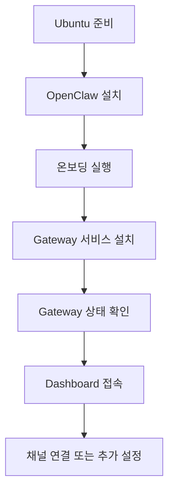

OpenClaw를 처음 접하면 제일 먼저 드는 생각이 있다.

`그래서 이걸 내 Ubuntu 서버에 어떻게 올리면 되지?`

공식 문서가 잘 정리되어 있기는 하지만, 실제로 손을 대보면 설치 방법이 몇 갈래로 보이고, `onboard`, `gateway`, `dashboard`, `daemon` 같은 용어가 한 번에 들어와서 약간 헷갈린다.

이번 글은 그런 혼란을 줄이기 위해, **Ubuntu 기준으로 OpenClaw를 설치하고 처음 브라우저에서 붙는 순간까지**를 한 번에 따라갈 수 있게 정리한 실전 설치 기록이다.

![[openclaw-logo-text.png]]

2026년 3월 12일 기준으로 공식 문서가 가장 일관되게 권장하는 경로는 다음 흐름이다.



# 1. OpenClaw를 Ubuntu에 올리는 이유

OpenClaw는 단순히 터미널에서 한 번 실행하고 끝내는 도구라기보다, **Gateway를 계속 띄워 두고 웹 UI나 메시징 채널을 통해 붙어 쓰는 구조**에 가깝다.

그래서 잠깐 체험하는 용도라면 노트북 로컬 설치도 괜찮지만,

- 오래 켜 둘 수 있고
- SSH로 관리하기 쉽고
- 브라우저 UI를 원격으로 붙일 수 있는

Ubuntu 서버나 Ubuntu PC가 잘 어울린다.

특히 공식 Linux 문서도 VPS 기준 빠른 경로를 별도로 안내하고 있고, Gateway를 서비스로 설치하는 흐름을 기본 시나리오로 설명한다.

# 2. 설치 전에 준비할 것

이 글에서는 **Ubuntu LTS에 처음 설치하는 흐름**을 기준으로 한다.

필수로 확인할 것은 많지 않다.

- Ubuntu 서버 또는 Ubuntu 데스크톱
- 인터넷 연결
- `curl`
- `curl`
- Node.js 22 이상 여부

다만 여기서 하나는 분명히 구분해두는 편이 좋다.

- `curl -fsSL https://openclaw.ai/install.sh | bash`
  이 방식은 공식 installer script 경로이고, Node가 없으면 설치 스크립트가 감지해서 같이 처리할 수 있다.
- `npm install -g openclaw@latest`
  이 방식은 Node와 npm이 이미 설치되어 있을 때만 가능한 수동 설치 경로다.

즉, **Node 설치까지 같이 기대할 수 있는 쪽은 installer script이고, `npm install -g`는 그 자체로 Node를 설치해주지 않는다.**

그래도 지금 환경이 어떤지 확인해 두면 설치 과정에서 덜 헷갈린다.

```bash
node --version
npm --version
curl --version
```

만약 `curl`이 없다면 먼저 설치한다.

```bash
sudo apt update
sudo apt install -y curl
```

# 3. 가장 무난한 설치 방법은 공식 installer script

OpenClaw는 여러 설치 방법을 제공한다.

- 공식 installer script
- `npm install -g openclaw@latest` (`Node 22+`와 `npm`이 이미 있을 때)
- source build

이 중에서 **처음 설치하는 입장에서는 공식 installer script가 가장 안전하다.**

이유는 단순하다.

- Node가 없을 때 감지해서 설치까지 이어질 수 있다.
- OpenClaw 설치 후 바로 온보딩 흐름으로 이어진다.
- 공식 문서도 이 경로를 기본 추천으로 둔다.

반대로 `npm install -g openclaw@latest`는 이미 Node/npm 환경을 직접 관리 중인 사람에게 맞는 경로다.

Ubuntu에서 바로 실행할 명령어는 이것이다.

```bash
curl -fsSL https://openclaw.ai/install.sh | bash
```

설치가 끝나면 보통 이어서 온보딩 마법사를 타게 된다.  
만약 온보딩이 자동으로 이어지지 않았거나 다시 실행하고 싶다면 아래 명령어를 직접 입력하면 된다.

```bash
openclaw onboard --install-daemon
```

# 4. 온보딩에서 무엇을 하게 되나

`openclaw onboard --install-daemon`는 단순한 첫 실행 명령이 아니다.

이 단계에서 OpenClaw는 대략 아래를 한 번에 처리한다.

- 인증 관련 설정
- Gateway 기본 설정
- 선택적인 채널 연결
- 서비스 설치

처음이라면 **QuickStart** 쪽으로 시작하는 편이 낫다.

처음부터 Telegram, WhatsApp, Discord를 전부 붙이기보다,

1. OpenClaw가 실행되는지 확인하고
2. Dashboard가 열리는지 확인한 다음
3. 그 뒤에 채널을 붙이는 편이 훨씬 덜 복잡하다.

즉, 첫 목표는 크지 않게 잡는 게 좋다.

`지금 당장 메시징 연동까지 완성하는 것`이 아니라,  
`Ubuntu에 OpenClaw Gateway를 정상적으로 띄우고 브라우저 UI에 접속하는 것`까지가 첫 단계다.

# 5. 설치가 끝났다면 Gateway 상태부터 본다

온보딩에서 `--install-daemon`을 썼다면, 공식 문서 기준으로는 Gateway 서비스가 이미 설치되어 실행 중이어야 한다.

확인은 아래처럼 한다.

```bash
openclaw gateway status
```

문제가 있나 더 깊게 보고 싶다면:

```bash
openclaw doctor
```

이 단계가 중요한 이유는 단순하다.

설치가 끝났다고 해서 곧바로 Dashboard부터 열어 버리면,  
실제로는 Gateway가 안 떠 있는데 브라우저 쪽만 먼저 확인하게 될 수 있다.

순서는 보통 이렇게 가져가면 된다.

1. `openclaw gateway status`
2. 이상하면 `openclaw doctor`
3. 그 다음 `openclaw dashboard`

# 6. Dashboard는 이렇게 붙는다

로컬 Ubuntu PC에서 직접 쓰는 경우라면 가장 간단하다.

```bash
openclaw dashboard
```

또는 브라우저에서 직접:

```text
http://127.0.0.1:18789/
```

그런데 Ubuntu 서버를 원격 VPS로 쓰는 경우에는 여기서 한 번 막히기 쉽다.

`서버에서 OpenClaw는 잘 뜨는데, 내 노트북 브라우저에서는 왜 안 열리지?`

이럴 때는 **SSH 터널**이 기본 패턴이다.  
공식 Linux 문서도 VPS 빠른 경로에서 이 방식을 안내한다.

노트북에서 아래처럼 터널을 연다.

```bash
ssh -N -L 18789:127.0.0.1:18789 <user>@<host>
```

그 다음 노트북 브라우저에서:

```text
http://127.0.0.1:18789/
```

로 접속한다.

정리하면,

- 서버에서는 Gateway가 `127.0.0.1:18789`로 뜨고
- 내 로컬 브라우저는 SSH 터널을 통해 그 포트에 붙는 구조다.

이 흐름을 모르고 서버 공인 IP에 바로 포트를 열어 버리면,  
보안도 불필요하게 넓어지고 설정도 오히려 더 복잡해진다.

# 7. Ubuntu 설치에서 자주 막히는 지점

실제 설치 후기와 커뮤니티 글들을 훑어보면, 설치 자체보다 **설치 후 첫 접속 확인**에서 많이 막힌다.

## 7-1. `openclaw: command not found`

가장 흔한 케이스다.

이 경우는 설치가 아예 실패했다기보다, **global npm binary 경로가 PATH에 안 잡혀 있는 경우**가 많다.

먼저 확인:

```bash
node --version
npm --version
npm prefix -g
echo "$PATH"
```

Linux에서는 보통 `$(npm prefix -g)/bin`이 PATH에 있어야 한다.

필요하면 `~/.bashrc`나 `~/.zshrc`에 추가한다.

```bash
export PATH="$(npm prefix -g)/bin:$PATH"
```

적용 후 새 터미널을 열거나:

```bash
source ~/.bashrc
```

를 실행한다.

## 7-2. Node 버전이 낮다

공식 문서 기준 요구 버전은 **Node 22 이상**이다.

확인은 간단하다.

```bash
node --version
```

버전이 낮거나 아예 Node가 없다면 공식 installer script로 가는 쪽이 오히려 편하다.  
처음부터 수동 npm 설치로 들어가기보다, installer가 Node 감지와 설치를 처리하게 두는 편이 덜 꼬인다.

## 7-3. Dashboard가 안 열리는데 설치는 끝난 것 같다

이 경우는 아래 둘 중 하나인 경우가 많다.

- Gateway가 실제로 안 떠 있다.
- 원격 서버인데 SSH 터널 없이 접속하려고 했다.

먼저:

```bash
openclaw gateway status
openclaw doctor
```

그다음 VPS라면:

```bash
ssh -N -L 18789:127.0.0.1:18789 <user>@<host>
```

를 다시 확인한다.

## 7-4. 노트북에서는 되는데 계속 켜 두는 용도로는 불안하다

이건 버그라기보다 배치의 문제에 가깝다.

커뮤니티에서도 반복해서 나오는 얘기인데, OpenClaw를 **로컬 노트북**에 두면

- 슬립 모드
- 뚜껑 닫힘
- 네트워크 변경

같은 이유로 세션이 자주 끊긴다.

`24시간 켜 둘 생각이라면 Ubuntu 서버/VPS가 더 낫다`는 이유가 바로 여기 있다.

# 8. 첫 설치 후 바로 해볼 것

설치가 끝나고 Dashboard까지 확인됐다면, 그다음은 너무 넓게 가지 않는 편이 좋다.

내 기준 추천 순서는 이렇다.

1. Dashboard에서 기본 대화가 되는지 확인
2. `openclaw doctor`로 환경 점검
3. 그다음 Telegram이나 Discord 같은 채널 하나만 연결
4. 마지막에 업데이트 흐름 확인

업데이트는 공식 문서 기준으로 installer script를 다시 실행하는 방식이 기본 경로다.

```bash
curl -fsSL https://openclaw.ai/install.sh | bash
```

온보딩을 다시 타고 싶지 않다면 `--no-onboard` 옵션을 함께 쓰는 흐름도 문서에 정리돼 있다.

# 9. 내가 추천하는 첫 설치 전략

처음 OpenClaw를 Ubuntu에 올릴 때는 욕심을 줄이는 편이 좋다.

가장 무난한 순서는 이렇다.

```bash
curl -fsSL https://openclaw.ai/install.sh | bash
openclaw onboard --install-daemon
openclaw gateway status
openclaw dashboard
```

그리고 VPS라면 여기에 SSH 터널만 하나 더 붙이면 된다.

```bash
ssh -N -L 18789:127.0.0.1:18789 <user>@<host>
```

이 흐름만 이해하면 적어도

- 설치는 됐는데 명령어가 안 잡히는 문제
- 서비스는 깔렸는데 UI가 안 열리는 문제
- 로컬/원격 접속 개념이 섞여서 생기는 혼란

은 크게 줄일 수 있다.

첫 글에서는 여기까지만 잡아도 충분하다.  
다음 글에서는 이어서 **Telegram이나 Discord 같은 채널을 실제로 붙이는 과정**까지 정리해 볼 수 있다.

# 참고한 자료

- [OpenClaw GitHub Repository](https://github.com/openclaw/openclaw)
- [OpenClaw Docs - Getting Started](https://docs.openclaw.ai/start/getting-started)
- [OpenClaw Docs - Linux App](https://docs.openclaw.ai/platforms/linux)
- [OpenClaw Docs - Install](https://docs.openclaw.ai/install)
- [OpenClaw Docs - Onboarding Wizard (CLI)](https://docs.openclaw.ai/start/wizard)
- [OpenClaw Docs - Installer Internals](https://docs.openclaw.ai/install/installer)
- [OpenClaw Docs - Updating](https://docs.openclaw.ai/install/updating)

커뮤니티 참고:

- [OpenClaw: 24시간 나를 도와주는 AI 비서 만들기](https://pak2251.tistory.com/entry/Clawdbot-24%EC%8B%9C%EA%B0%84-%EB%82%98%EB%A5%BC-%EB%8F%84%EC%99%80%EC%A3%BC%EB%8A%94-AI-%EB%B9%84%EC%84%9C-%EB%A7%8C%EB%93%A4%EA%B8%B0)
- [OpenClaw Setup for Absolute Beginners](https://www.reddit.com/r/myclaw/comments/1qxj04k/openclaw_setup_for_absolute_beginners_include_a/)
- [Updated Setup install guide 2/17/26 openclaw](https://www.reddit.com/r/openclawsetup/comments/1r78ecn/updated_setup_install_guide_21726_openclaw/)
