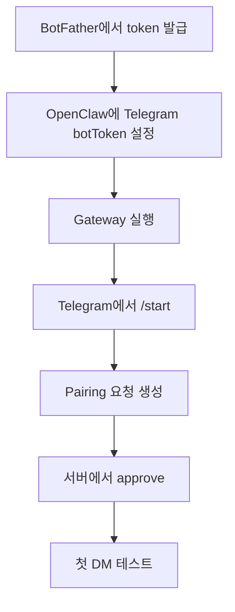

OpenClaw를 Ubuntu에 설치하고 나면 다음으로 제일 해볼 만한 건 Telegram 연결이다.

이유는 단순하다.

- 내가 이미 쓰는 메신저에서 바로 명령할 수 있고
- 외부에서 스마트폰으로 붙기 쉽고
- 다른 채널보다 입문 장벽이 낮다

즉, Dashboard에서 개념만 확인하는 것보다 **“내 Telegram에서 OpenClaw에게 실제로 말을 걸어보는 순간”** 체감이 훨씬 크다.

![[telegram-logo.png]]

커뮤니티 글들을 훑어봐도 Telegram이 첫 채널로 가장 자주 추천된다.  
설정이 비교적 단순하고, BotFather 기반 흐름이 익숙하며, 원격 제어 체감이 바로 오기 때문이다.  
출처: [텔레그램으로 AI 비서 부리기 — 오픈클로(OpenClaw) 실전 사용기](https://debugginglegend.tistory.com/6), [OpenClaw 오픈클로 초보자 가이드](https://telks.tistory.com/entry/OpenClaw-%EC%98%A4%ED%94%88%ED%81%B4%EB%A1%9C-%EC%B4%88%EB%B3%B4%EC%9E%90-%EA%B0%80%EC%9D%B4%EB%93%9C)

이번 글은 `01-Ubuntu 설치`를 마친 상태에서,

1. BotFather로 봇을 만들고
2. OpenClaw에 Telegram 채널을 연결하고
3. Pairing을 승인한 뒤
4. 첫 DM 테스트까지

가는 흐름을 **사진 중심**으로 정리한다.

![[openclaw-og-image.png]]

# 1. 왜 Telegram부터 붙이는가

OpenClaw 공식 사이트도 Telegram을 가장 앞줄에 놓는다.  
“이미 쓰는 채팅 앱에서 작동한다”는 컨셉을 보여 주기 가장 쉬운 채널이기 때문이다.

실제로 Telegram을 먼저 붙이면 OpenClaw가 갑자기 “설치된 프로그램”에서 “말 걸 수 있는 개인 AI 비서”로 바뀐다.

이 차이가 크다.

- 서버에 SSH로 들어갈 필요 없이
- 휴대폰에서 바로 말을 걸 수 있고
- Pairing으로 접근을 통제할 수 있고
- 봇이 결과를 메시지로 되돌려준다

즉, OpenClaw의 매력을 가장 빨리 체감하는 채널이 Telegram이다.

![[openclaw-logo-text.png]]

# 2. 시작 전에 준비할 것

이 글은 아래 상태를 전제로 한다.

- Ubuntu에 OpenClaw 설치 완료
- `openclaw onboard --install-daemon` 또는 그에 준하는 초기 설정 완료
- Telegram 계정 보유

추가 준비물은 크게 두 가지다.

1. BotFather에서 발급받을 **Bot Token**
2. OpenClaw Gateway가 정상 동작하는 환경

먼저 서버 쪽 상태부터 확인한다.

```bash
openclaw gateway status
openclaw doctor
```

Telegram 연결 전에 이 두 명령이 지나가야 뒤에서 덜 막힌다.

# 3. BotFather에서 봇 만들기

Telegram 쪽 작업은 전부 `@BotFather`에서 시작한다.

흐름은 단순하다.

1. Telegram에서 `@BotFather` 검색
2. `/newbot` 입력
3. 봇 이름 입력
4. 봇 username 입력
5. 발급된 **token** 복사

여기서 token이 가장 중요하다.  
이 값이 OpenClaw가 Telegram Bot API에 붙을 때 쓰는 비밀키다.

아래처럼 먼저 `@BotFather`를 찾고, 새 봇 생성 흐름으로 들어가면 된다.

![[openclaw-telegram-botfather-search.png]]

그리고 최종적으로는 이런 형태의 token을 받게 된다.

![[openclaw-telegram-token-issue.png]]

커뮤니티 후기들을 보면 여기서 제일 흔한 실수는 두 가지다.

- token을 일부만 복사
- username이 아니라 token 값을 넣어야 하는데 헷갈림

헷갈리지 않으려면 이렇게 기억하면 된다.

- `@my_bot_name` 같은 건 봇의 계정 이름
- `123456:ABC...`처럼 생긴 값이 실제 연결에 쓰는 token

출처: [OpenClaw Docs - Telegram](https://docs.openclaw.ai/channels/telegram), [텔레그램 연동 삽질기](https://rin-blog.tistory.com/entry/OpenClaw-%ED%85%94%EB%A0%88%EA%B7%B8%EB%9E%A8-%EB%B4%87-%EC%97%B0%EB%8F%99-%EC%82%BD%EC%A7%88%EA%B8%B0-Webhook%EC%97%90-%EB%A7%89%ED%9E%88%EA%B3%A0-Pairing%EC%97%90-%EB%A7%89%ED%9E%88%EA%B3%A0-%EA%B2%B0%EA%B5%AD-restart%EB%A1%9C-%EC%82%B4%EB%A6%B0-%ED%95%98%EB%A3%A8)

# 4. OpenClaw 쪽에서 Telegram 연결하는 가장 쉬운 방법

입문자 기준으로는 **온보딩 또는 설정 갱신을 다시 태워서 Telegram을 붙이는 쪽**이 가장 쉽다.

공식 문서상 Telegram은 별도의 웹 로그인 커맨드를 쓰는 채널이 아니다.  
핵심은 `botToken`을 OpenClaw 쪽 설정에 넣고, Gateway를 띄운 다음, Pairing 승인으로 접근을 여는 흐름이다.

문서에서 보이는 최소 형태는 대략 이런 식이다.

```yaml
channels:
  telegram:
    enabled: true
    botToken: "123:abc"
    dmPolicy: "pairing"
```

핵심은 세 가지다.

- `enabled: true`
- `botToken`
- `dmPolicy: "pairing"`

실제 설정 화면 예시는 대략 이런 흐름에 가깝다.

![[openclaw-telegram-channels-page.png]]

Telegram 채널을 고른 뒤 token과 정책 값을 넣는 식이다.

![[openclaw-telegram-config-dialog.png]]

특히 처음에는 `dmPolicy: "pairing"`이 제일 무난하다.  
아무나 바로 접근시키지 않고, 내가 직접 승인한 Telegram 대화만 열어주기 때문이다.

출처: [OpenClaw Docs - Telegram](https://docs.openclaw.ai/channels/telegram)

만약 처음 설치 때 Telegram을 건너뛰었다면, 다시 온보딩을 실행해서 Telegram 관련 값을 넣고 넘어가도 된다.

```bash
openclaw onboard
```

설정 반영 후에는 Gateway를 다시 확인한다.

```bash
openclaw gateway status
```

# 5. Pairing 승인으로 첫 DM 열기

여기서부터가 OpenClaw스럽다.

Telegram 봇에게 그냥 말을 거는 것만으로는 끝나지 않는다.  
OpenClaw는 기본적으로 `pairing` 흐름으로 접근을 한 번 더 확인한다.

문서 기준으로는 이런 커맨드들이 연결된다.

```bash
openclaw pairing list telegram
openclaw pairing approve telegram <CODE>
```

즉, 흐름은 보통 이렇게 본다.

1. Telegram에서 내 봇에게 `/start`
2. OpenClaw 쪽에 pairing 대기 상태가 생김
3. 서버에서 pairing 코드를 확인
4. 승인
5. 그 뒤에 실제 DM 사용 시작

연결이 정상적으로 지나가면 Telegram 쪽에서는 이런 식으로 봇과 첫 대화를 시작하게 된다.

![[openclaw-telegram-start-chat.png]]

Pairing 코드에는 만료 시간이 있다.  
공식 문서 기준으로 **1시간 안에 승인**해야 한다.



커뮤니티 삽질기에서 자주 나오는 부분도 바로 여기다.

- `/start`는 했는데 반응이 없음
- pairing은 보였는데 승인 후에도 조용함
- token은 맞는데 연결이 안 붙음

이런 경우는 대부분 `restart`, `privacy mode`, `gateway 상태`, `pairing 만료` 중 하나다.

# 6. Telegram에서 자주 막히는 지점

## 6-1. 봇은 만들었는데 그룹에서 말을 못 알아듣는다

Telegram 봇은 기본적으로 **Privacy Mode**가 켜져 있다.  
이 상태에서는 그룹 메시지를 전부 읽지 못할 수 있다.

공식 문서도 두 가지 방법을 안내한다.

- BotFather의 `/setprivacy`로 조정
- 또는 봇을 그룹 admin으로 승격

그리고 중요한 포인트 하나가 더 있다.

**Privacy Mode를 바꿨다면 봇을 그룹에서 제거했다가 다시 초대하는 편이 안전하다.**

이 부분은 공식 문서와 커뮤니티 양쪽에서 반복해서 나온다.

## 6-2. token은 맞는데 Telegram 쪽이 조용하다

이때는 아래 순서로 본다.

```bash
openclaw gateway status
openclaw doctor
```

그래도 이상하면 OpenClaw Gateway를 재시작하는 쪽이 빠르다.

커뮤니티 후기 중에도 결국 `restart`로 살아난 사례가 나온다.  
설정값을 바꿨는데 프로세스가 이전 상태를 들고 있을 수 있기 때문이다.

## 6-3. Pairing이 안 보이거나 승인 타이밍이 엇갈린다

문서 기준으로 pairing 코드는 만료 시간이 있다.  
너무 늦게 승인하면 다시 `/start`부터 새로 하는 편이 빠르다.

또한 처음에는 `allowlist`보다 `pairing` 정책이 덜 헷갈린다.  
입문 단계에서는 일단 pairing으로 첫 성공 경험을 만들고, 나중에 `allowlist`로 강화하는 편이 좋다.

## 6-4. 그룹에서 쓰고 싶은데 DM만 된다

이 경우는 보통 두 가지를 같이 봐야 한다.

- Telegram 쪽 privacy/admin 설정
- OpenClaw 쪽 `groups` 정책

문서 예시에서는 그룹별로 `requireMention` 같은 제어도 가능하다.  
즉, 그룹을 붙인다고 해서 무조건 모든 메시지를 읽는 구조는 아니다.

# 7. 처음 테스트는 이렇게 하는 게 좋다

처음부터 복잡한 자동화를 넣지 말고, 딱 세 단계만 본다.

1. `/start`가 된다
2. pairing 승인이 된다
3. 간단한 질문에 응답이 온다

예를 들어:

- `지금 뭐 할 수 있어?`
- `간단히 자기소개해줘`
- `서버 상태 확인 도와줘`

이 정도로 첫 대화를 성공시키는 게 좋다.

그 다음에야

- 파일 읽기
- 브라우저 작업
- 알림/리마인더
- 그룹 운영

같은 걸 붙이는 편이 덜 꼬인다.

# 8. 왜 02편을 Telegram으로 잡았는지

설치 글 다음에 Telegram 글을 두는 이유는 분명하다.

OpenClaw의 가치는 결국 “설치했다”가 아니라 “내가 어디서든 말을 걸 수 있다”에서 체감되기 때문이다.

Dashboard로 구조를 이해하는 것도 중요하지만, Telegram을 붙이면 그 순간부터 OpenClaw는

- 서버 안에 있는 프로그램이 아니라
- 손에 들고 다니는 개인 AI 비서처럼 느껴진다

그래서 시리즈 흐름도 이 순서가 제일 자연스럽다.

- `00` OpenClaw 소개
- `01` Ubuntu 설치
- `02` Telegram 연결

다음 글로는 여기서 이어서 `SOUL.md / MEMORY.md로 성격과 기억 붙이기` 쪽이 자연스럽다.

# 참고한 자료

공식 자료:

- [OpenClaw 공식 사이트](https://openclaw.ai/)
- [OpenClaw Docs - Telegram](https://docs.openclaw.ai/channels/telegram)
- [OpenClaw Docs - Getting Started](https://docs.openclaw.ai/start/getting-started)

커뮤니티 참고:

- [텔레그램으로 AI 비서 부리기 — 오픈클로(OpenClaw) 실전 사용기](https://debugginglegend.tistory.com/6)
- [OpenClaw 텔레그램 봇 연동 삽질기](https://rin-blog.tistory.com/entry/OpenClaw-%ED%85%94%EB%A0%88%EA%B7%B8%EB%9E%A8-%EB%B4%87-%EC%97%B0%EB%8F%99-%EC%82%BD%EC%A7%88%EA%B8%B0-Webhook%EC%97%90-%EB%A7%89%ED%9E%88%EA%B3%A0-Pairing%EC%97%90-%EB%A7%89%ED%9E%88%EA%B3%A0-%EA%B2%B0%EA%B5%AD-restart%EB%A1%9C-%EC%82%B4%EB%A6%B0-%ED%95%98%EB%A3%A8)
- [OpenClaw 오픈클로 초보자 가이드](https://telks.tistory.com/entry/OpenClaw-%EC%98%A4%ED%94%88%ED%81%B4%EB%A1%9C-%EC%B4%88%EB%B3%B4%EC%9E%90-%EA%B0%80%EC%9D%B4%EB%93%9C)
- [OpenClaw 완벽 가이드](https://talknthings.tistory.com/1)
- [OpenClaw 가이드: 개인 AI 비서 설치부터 활용까지](https://jeremyrecord.tistory.com/424)
- [OpenClaw Telegram Setup Tutorial](https://open-claw.org/en/docs/examples/telegram-bot-setup)
- [Velog OpenClaw 태그](https://velog.io/tags/OpenClaw)
- [Velog 텔레그램 태그](https://velog.io/tags/%ED%85%94%EB%A0%88%EA%B7%B8%EB%9E%A8)
- [Welcome to r/OpenClaw](https://www.reddit.com/r/openclaw/comments/1qv80w6/welcome_to_ropenclaw_introduce_yourself_and_read/)
- [Two weeks later with OpenClaw and this is what I’ve learned](https://www.reddit.com/r/openclaw/comments/1rf0vz6/two_weeks_later_with_openclaw_and_this_is_what/)
