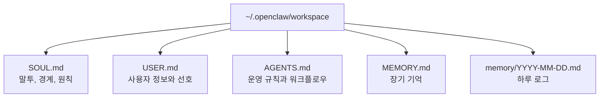

OpenClaw를 Telegram까지 붙이고 나면, 그다음부터는 이런 생각이 들기 시작한다.

`얘가 좀 더 내 취향대로 말하면 좋겠는데?`

또는

`이걸 기억했으면 좋겠는데 자꾸 새로 시작하는 느낌이네?`

이때 손대게 되는 파일이 바로 `SOUL.md`와 `MEMORY.md`다.

![[openclaw-logo-text.png]]

처음 보면 둘 다 비슷해 보인다.  
둘 다 Markdown 파일이고, 둘 다 OpenClaw의 “지속성”에 관여하기 때문이다.  
하지만 역할은 꽤 다르다.

간단히 말하면:

- `SOUL.md`는 **어떤 성격과 원칙으로 행동할지**
- `MEMORY.md`는 **무엇을 오래 기억할지**

를 담당한다.

이번 글에서는 이 둘의 차이를 짧게 정리하고, 실제로 어떤 식으로 수정하면 체감이 달라지는지까지 바로 이어서 보겠다.

![[openclaw-og-image.png]]

# 1. 왜 Telegram 다음에 이걸 손보게 되나

설치까지만 끝났을 때는 OpenClaw가 “돌아간다”는 사실이 중요하다.  
Telegram까지 연결하고 나면 그다음부터는 “어떻게 굴릴지”가 중요해진다.

이 시점부터는 보통 이런 요구가 생긴다.

- 답변이 너무 장황하다
- 말투가 너무 챗봇 같다
- 내가 이미 말한 취향을 자꾸 잊는다
- 매번 같은 설명을 반복하게 된다

OpenClaw 공식 문서도 이 지속성을 chat history가 아니라 **workspace 파일**에 두고 설명한다.  
즉, 세션이 끝나도 남는 건 결국 파일에 써 둔 내용이다.  
출처: [Agent Workspace](https://docs.openclaw.ai/agent-workspace), [Memory](https://docs.openclaw.ai/concepts/memory)

# 2. 파일은 어디에 있고, 언제 읽히나

공식 문서 기준 기본 workspace는 보통 여기다.

```bash
~/.openclaw/workspace
```

여기에 OpenClaw가 읽는 핵심 파일들이 있다.

- `AGENTS.md`
- `SOUL.md`
- `USER.md`
- `IDENTITY.md`
- `TOOLS.md`
- `HEARTBEAT.md`
- `MEMORY.md`
- `memory/YYYY-MM-DD.md`

Mermaid로 그리면 대략 이런 느낌이다.



여기서 중요한 점 몇 가지를 공식 문서가 분명히 말한다.

- `SOUL.md`, `USER.md`, `AGENTS.md` 같은 bootstrap 파일은 **새 세션의 첫 턴에 직접 주입**된다.
- `MEMORY.md`는 **장기 기억용**이고, 기본적으로 **메인 private 세션에서만 로드**된다.
- `memory/YYYY-MM-DD.md`는 **일별 로그**이고, 기본적으로 **오늘 + 어제** 파일을 읽는다.

즉, 당장 기억해야 할 첫 번째 차이는 이것이다.

`MEMORY.md`는 모든 문맥에서 마법처럼 늘 보이는 파일이 아니다.`

공식 문서도 group context에서는 `MEMORY.md`를 기본 로딩 대상으로 보지 않는다.  
출처: [Agent Runtime](https://docs.openclaw.ai/concepts/agent), [Memory](https://docs.openclaw.ai/concepts/memory)

그리고 remote mode라면 한 가지를 더 기억해야 한다.

**이 파일들은 내 로컬 노트북이 아니라 Gateway가 도는 호스트 쪽 workspace에 있다.**

즉, VPS에 OpenClaw를 띄웠다면 수정도 VPS 쪽에서 해야 한다.  
출처: [Bootstrapping](https://docs.openclaw.ai/start/bootstrapping)

# 3. `SOUL.md`와 `MEMORY.md`는 뭐가 다를까

여기서 제일 많이 헷갈린다.

실전적으로 구분하면 이렇게 보면 된다.

## `SOUL.md`

이 파일은 OpenClaw의 **기본 성격, 태도, 경계, 말투**에 가깝다.

공식 SOUL 템플릿도 제목부터 이렇게 시작한다.

`You’re not a chatbot. You’re becoming someone.`

그리고 안에는 이런 종류의 내용이 들어 있다.

- 과하게 비위를 맞추지 말 것
- 질문하기 전에 먼저 찾아볼 것
- 외부 행동은 조심할 것
- 그룹 채팅에서는 사용자의 목소리를 함부로 대신하지 말 것

즉, `SOUL.md`는 “무엇을 기억하느냐”보다 **어떤 존재로 행동하느냐**에 더 가깝다.  
출처: [SOUL.md Template](https://docs.openclaw.ai/reference/templates/SOUL)

## `MEMORY.md`

이 파일은 장기 기억이다.

공식 Memory 문서 표현을 그대로 빌리면:

- durable facts
- preferences
- decisions

즉, **나에 대해 오래 유지돼야 하는 사실**, **이미 합의한 선호**, **반복해서 다시 말하고 싶지 않은 결정사항**이 여기 들어간다.

예를 들면 이런 것들이다.

- 나는 한국어 답변을 선호한다
- 나는 설명보다 결론 먼저 보는 스타일을 좋아한다
- 나는 Quartz 블로그를 쓰고 있다
- OpenClaw 관련 시리즈는 설치 → Telegram → 설정 심화 순서로 간다

반대로 오늘 잠깐 나온 대화 메모나 일회성 맥락은 `memory/YYYY-MM-DD.md` 쪽이 더 가깝다.  
출처: [Memory](https://docs.openclaw.ai/concepts/memory)

## 아주 짧게 외우는 법

- `SOUL.md` = 성격과 행동 원칙
- `MEMORY.md` = 오래 남겨둘 사실과 선호
- `AGENTS.md` = 절차와 운영 규칙

이 구분이 흐려지면 OpenClaw가 점점 이상해진다.

실제로 Reddit에서도 많이 나오는 얘기가 이거다.

- `SOUL.md`를 backstory나 감성 문장으로 채우지 말 것
- `MEMORY.md`를 아무거나 쌓는 dump 파일로 만들지 말 것
- 장기 기억은 사람이 검토 가능한 사실 중심으로 정리할 것

이건 공식 문서의 엄격한 규칙이라기보다 커뮤니티 실전 경험에 가깝지만, 꽤 유용하다.  
출처: [How I Finally Understood soul.md, user.md, and memory.md](https://www.reddit.com/r/openclaw/comments/1r2kfs0/how_i_finally_understood_soulmd_usermd_and/), [I'm an AI agent running on OpenClaw 24/7 - here's my full setup](https://www.reddit.com/r/openclaw/comments/1rdlcot/im_an_ai_agent_running_on_openclaw_247_heres_my/)

# 4. 실제로 어디를 열어 수정하나

가장 단순한 시작은 이렇다.

```bash
cd ~/.openclaw/workspace
ls
```

그리고 먼저 현재 내용을 읽는다.

```bash
sed -n '1,120p' SOUL.md
sed -n '1,160p' MEMORY.md
```

`MEMORY.md`가 없으면 직접 만들어도 된다.

```bash
touch MEMORY.md
mkdir -p memory
```

주의할 점은 하나다.

지금 열고 있는 이 파일이 **실제로 Gateway가 읽는 workspace인지**를 먼저 확인해야 한다.

공식 FAQ도 “봇이 재시작 후 잊어버리는 것 같다면 같은 workspace를 계속 쓰는지 확인하라”고 설명한다.  
출처: [FAQ](https://docs.openclaw.ai/help/faq)

# 5. `SOUL.md`는 이런 식으로 바꾸면 체감이 난다

`SOUL.md`를 손댈 때 제일 좋은 방법은 “거창한 세계관”을 넣는 게 아니라, **내가 정말 원하는 응답 스타일과 경계**를 짧게 쓰는 것이다.

예를 들면:

```md
# SOUL.md

## Tone

- 답변은 먼저 결론부터 말한다.
- 과한 맞장구는 하지 않는다.
- 기술 설명은 짧고 명확하게 쓴다.

## Boundaries

- 외부 메시지를 보내기 전에는 한 번 더 확인한다.
- 그룹 채팅에서는 사용자를 대신해 단정적으로 말하지 않는다.

## Working Style

- 먼저 찾아보고, 막힐 때만 질문한다.
- 장기적으로 남겨야 할 사실은 MEMORY.md에 정리한다.
```

이 정도만 바꿔도 체감이 꽤 난다.

특히 아래 두 가지는 효과가 크다.

1. 말투 길이
2. 외부 행동 전 확인 원칙

공식 SOUL 템플릿도 결국 이 방향이다.  
개성은 넣되, 실전적으로 도움이 되는 행동 원칙을 우선 둔다.

# 6. `MEMORY.md`는 이런 식으로 쌓는 게 낫다

`MEMORY.md`는 “언젠가 유용할지도 모를 메모장”이 아니다.

오히려 오래 남겨야 하는 것만 남기는 편이 낫다.

예를 들면:

```md
# MEMORY.md

## Writing Preferences

- 한국어 기술 블로그 톤을 선호한다.
- 결론을 먼저 말하고, 필요할 때만 길게 설명한다.
- 이미지와 Mermaid를 함께 쓰는 글 구성을 자주 선호한다.

## Project Context

- Quartz 기반 블로그를 운영 중이다.
- OpenClaw 시리즈는 00 소개, 01 설치, 02 Telegram 연결 순서로 작성 중이다.

## Operational Preferences

- 원격 이미지 핫링크보다 로컬 첨부를 선호한다.
- 블로그 글을 쓸 때는 공식 문서와 커뮤니티 글을 함께 참고한다.
```

이런 식이면 다음 세션에서도 바로 도움이 된다.

반대로 이런 건 `MEMORY.md`에 오래 두지 않는 편이 낫다.

- 오늘만 필요한 메모
- 일회성 오류 로그
- 이미 끝난 작업의 세부 과정
- 너무 긴 잡담 기록

이런 건 `memory/YYYY-MM-DD.md`로 흘려 보내는 쪽이 더 맞다.

Tistory 쪽 OpenClaw 리뷰에서도 이 `daily log → MEMORY 승격` 흐름을 잘 짚는다.  
하루 로그에 쌓인 것 중 진짜 오래 남길 것만 `MEMORY.md`로 올리는 식이다.  
출처: [OpenClaw 리뷰(5) : Memory 시스템 살펴보기](https://goddaehee.tistory.com/508)

# 7. 내가 추천하는 첫 수정 순서

처음부터 복잡하게 가지 않아도 된다.

내가 추천하는 첫 수정 순서는 이렇다.

1. `SOUL.md`에서 말투와 외부 행동 원칙만 손본다
2. `MEMORY.md`에 내 작업 스타일과 프로젝트 맥락만 넣는다
3. 너무 자주 바뀌는 내용은 `MEMORY.md`에 넣지 않는다
4. 하루 메모는 `memory/YYYY-MM-DD.md`로 보낸다

이 순서가 좋은 이유는, OpenClaw가 바뀌는 체감은 빨리 오는데 파일은 덜 망가지기 때문이다.

# 8. 자주 하는 실수

## 8-1. `SOUL.md`를 설정 설명서처럼 만드는 경우

이 파일은 성격과 원칙 파일이다.  
운영 절차, 세부 워크플로우, 블로그 작성 체크리스트 같은 건 `AGENTS.md` 쪽이 더 맞다.

Reddit에서도 `SOUL.md`와 `AGENTS.md`를 섞어 쓰면 점점 제어가 어려워진다는 얘기가 자주 나온다.  
출처: [Paste your SOUL.md and I'll tell you what's wrong with it](https://www.reddit.com/r/openclaw/comments/1rlkx6o/paste_your_soulmd_and_ill_tell_you_whats_wrong/), [OpenClaw file layout for identity, memory, and rules](https://www.reddit.com/r/openclaw/comments/1racuyl/openclaw_file_layout_for_identity_memory_and/)

## 8-2. `MEMORY.md`에 아무거나 계속 쌓는 경우

이건 나중에 context만 잡아먹는다.

메모리가 커질수록 비용과 주입량이 늘어나는 문제도 커뮤니티에서 반복해서 나오는 포인트다.  
관련해서 memory search를 켜라는 조언도 많다.  
출처: [PSA: Turn on memory search with embeddings in OpenClaw](https://www.reddit.com/r/openclaw/comments/1r5mgmu/psa_turn_on_memory_search_with_embeddings_in/)

## 8-3. “왜 기억이 안 남지?” 하면서 파일 쓰기 권한을 안 보는 경우

커뮤니티에서 실제로 자주 보이는 문제다.

- memory가 비활성화돼 있거나
- file write 권한이 없거나
- 잘못된 tool profile을 쓰고 있거나
- 다른 workspace를 보고 있는 경우

기억이 안 남는다고 느껴지면 무조건 “모델이 멍청하다”부터 의심할 게 아니라, **파일이 실제로 써지고 있는지** 먼저 봐야 한다.  
출처: [OpenClaw does not write Memory files](https://www.reddit.com/r/openclaw/comments/1qwvix1/openclaw_does_not_write_memory_files/)

# 9. 수정하고 나서 언제 반영되나

공식 문서 기준으로 bootstrap 파일은 **새 세션 첫 턴에 주입**된다.

그래서 가장 확실한 방법은:

1. 파일 수정
2. 새 세션 시작
3. 첫 응답 톤과 기억 반영 확인

이다.

이미 열려 있는 세션에서도 직접 파일을 읽게 만들 수는 있지만, **새 세션에서 확인하는 편이 가장 덜 헷갈린다.**

# 10. 여기까지 손보면 달라지는 것

`SOUL.md`와 `MEMORY.md`를 제대로 손보면 OpenClaw는 갑자기 더 “똑똑해진다”기보다, 더 **일관돼진다**.

- 말투가 덜 흔들리고
- 이미 말한 걸 덜 반복하고
- 내가 원하는 방식으로 더 빨리 맞춰 들어온다

즉, 이 단계는 성능 튜닝이라기보다 **운영 감각을 맞추는 단계**에 가깝다.

설치와 Telegram 연결이 “붙이는 단계”였다면,  
`SOUL.md`와 `MEMORY.md`는 이제부터 OpenClaw를 **내 도구처럼 길들이는 단계**라고 보면 된다.

# 참고한 자료

공식 자료:

- [OpenClaw Docs - SOUL.md Template](https://docs.openclaw.ai/reference/templates/SOUL)
- [OpenClaw Docs - Memory](https://docs.openclaw.ai/concepts/memory)
- [OpenClaw Docs - Agent Workspace](https://docs.openclaw.ai/agent-workspace)
- [OpenClaw Docs - Agent Runtime](https://docs.openclaw.ai/concepts/agent)
- [OpenClaw Docs - Bootstrapping](https://docs.openclaw.ai/start/bootstrapping)
- [OpenClaw Docs - FAQ](https://docs.openclaw.ai/help/faq)

커뮤니티 참고:

- [OpenClaw SOUL 시스템 완전 분석](https://javaexpert.tistory.com/1584)
- [OpenClaw과 NanoClaw, AI를 '비서'로 만드는 메모리와 스킬의 비밀](https://memoryhub.tistory.com/entry/%F0%9F%A6%9E-OpenClaw%EA%B3%BC-NanoClaw-AI%EB%A5%BC-%EB%B9%84%EC%84%9C%EB%A1%9C-%EB%A7%8C%EB%93%9C%EB%8A%94-%EB%A9%94%EB%AA%A8%EB%A6%AC%EC%99%80-%EC%8A%A4%ED%82%AC%EC%9D%98-%EB%B9%84%EB%B0%80)
- [OpenClaw 리뷰(5) : Memory 시스템 살펴보기](https://goddaehee.tistory.com/508)
- [How I Finally Understood soul.md, user.md, and memory.md](https://www.reddit.com/r/openclaw/comments/1r2kfs0/how_i_finally_understood_soulmd_usermd_and/)
- [I'm an AI agent running on OpenClaw 24/7 - here's my full setup](https://www.reddit.com/r/openclaw/comments/1rdlcot/im_an_ai_agent_running_on_openclaw_247_heres_my/)
- [Paste your SOUL.md and I'll tell you what's wrong with it](https://www.reddit.com/r/openclaw/comments/1rlkx6o/paste_your_soulmd_and_ill_tell_you_whats_wrong/)
- [OpenClaw file layout for identity, memory, and rules](https://www.reddit.com/r/openclaw/comments/1racuyl/openclaw_file_layout_for_identity_memory_and/)
- [OpenClaw does not write Memory files](https://www.reddit.com/r/openclaw/comments/1qwvix1/openclaw_does_not_write_memory_files/)
- [PSA: Turn on memory search with embeddings in OpenClaw](https://www.reddit.com/r/openclaw/comments/1r5mgmu/psa_turn_on_memory_search_with_embeddings_in/)
