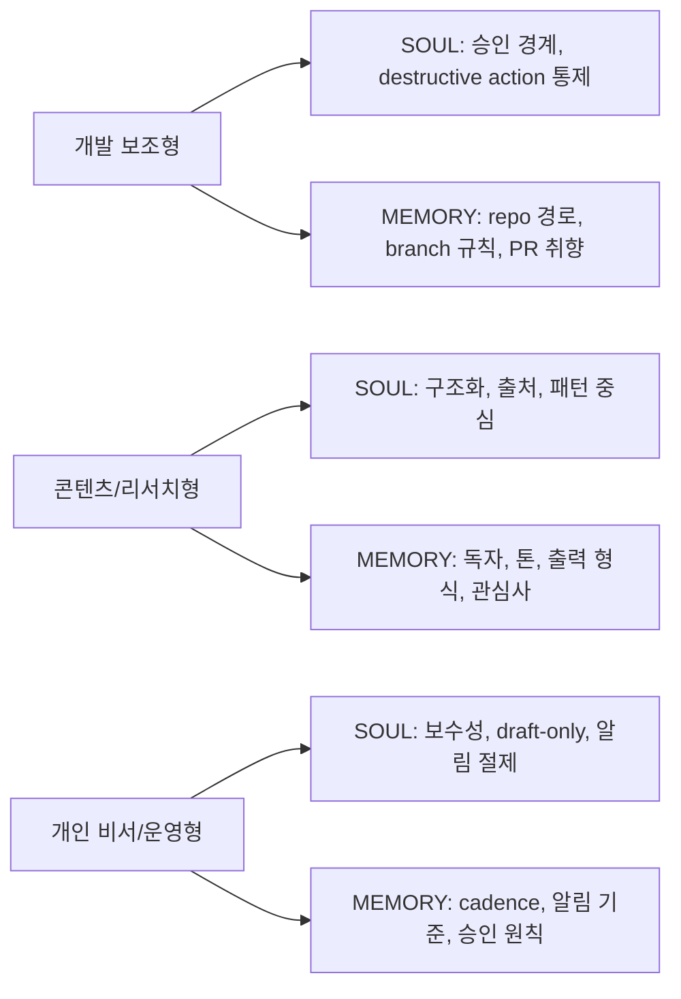

`SOUL.md`와 `MEMORY.md`를 이해했다고 해서 바로 잘 쓰게 되지는 않는다.

진짜 어려운 건 이거다.

`그래서 나는 내 OpenClaw에 뭘 넣어야 하지?`

이 질문에 답하려면 추상적인 설명보다, **실제로 잘 굴러가는 사례**를 보는 편이 빠르다.  
그래서 이번 글은 GitHub에서 star를 많이 받은 OpenClaw 관련 자료들을 기준으로, 많이 쓰이는 패턴 3가지를 정리해 본다.

기준으로 삼은 대표 자료는 이 셋이다.

- [velvet-shark / openclaw-50-day-prompts.md](https://gist.github.com/velvet-shark/b4c6724c391f612c4de4e9a07b0a74b6)  
  2026년 3월 13일 기준 470+ stars
- [mberman84 / PRD.md](https://gist.github.com/mberman84/5ccf2085d0049581b4675f7fe64e9b87)  
  2026년 3월 13일 기준 280+ stars
- [digitalknk / openclaw-guide.md](https://gist.github.com/digitalknk/ec360aab27ca47cb4106a183b2c25a98)  
  2026년 3월 13일 기준 90+ stars

![[openclaw-og-image.png]]

이 자료들을 그대로 복사하자는 얘기는 아니다.  
다만 사람들이 실제로 오래 저장하고 참고한 패턴에는 이유가 있다.

- 운영 규칙이 분명하고
- 기억을 파일에 명시적으로 남기고
- 사용 목적이 분명하며
- 위험한 외부 행동에는 제약을 둔다

이 네 가지가 반복된다.

# 1. 먼저 경계부터 다시 잡자

세 가지 사례로 들어가기 전에, 공식 문서 기준 경계부터 다시 정리해 두는 게 좋다.

- `SOUL.md` = persona, boundaries, tone
- `MEMORY.md` = curated long-term memory
- `AGENTS.md` = operating instructions + workflow

공식 문서도 이 구분을 꽤 분명하게 잡는다.  
`SOUL.md`는 성격과 경계, `MEMORY.md`는 오래 남길 기억, `AGENTS.md`는 작업 절차 쪽이다.  
출처: [Agent Runtime](https://docs.openclaw.ai/concepts/agent), [SOUL.md Template](https://docs.openclaw.ai/reference/templates/SOUL), [Memory](https://docs.openclaw.ai/concepts/memory)

아주 짧게 말하면 이렇다.

- `SOUL.md`에는 “어떻게 행동할지”
- `MEMORY.md`에는 “무엇을 계속 기억할지”
- `AGENTS.md`에는 “어떻게 일할지”

를 쓴다.

여기서부터 어긋나면 파일이 금방 비대해지고, OpenClaw가 이상하게 흔들린다.

# 2. 패턴 1: 개발 보조형

가장 먼저 많이 보이는 패턴이다.

GitHub에서 가장 star가 높은 워크플로우 자료 중 하나인 `openclaw-50-day-prompts.md`는 `Coding from phone`, `Infrastructure and DevOps`, `Discord channel architecture` 같은 예시를 따로 분리해 둔다.  
즉, 개발 보조형 OpenClaw는 처음부터 **“코딩을 해주는 챗봇”** 이 아니라 **“승인 경계가 분명한 개발 작업 에이전트”** 로 설계된다.  
출처: [openclaw-50-day-prompts.md](https://gist.github.com/velvet-shark/b4c6724c391f612c4de4e9a07b0a74b6) Lines 228-242, 210-225, 337-355

여기서의 best practice는 이렇다.

## SOUL.md에는 이렇게 쓴다

개발 보조형 SOUL은 `유능함`보다 `경계`가 더 중요하다.

예를 들면:

```md
# SOUL.md

## Tone

- 답변은 짧고 직접적으로 한다.
- 구현 얘기에서는 결론과 위험을 먼저 말한다.

## Boundaries

- destructive action 전에는 먼저 계획과 영향을 설명한다.
- merge, deploy, delete는 승인 없이 하지 않는다.
- 비밀값은 채팅에 직접 노출하지 않는다.

## Working Style

- 먼저 repo와 파일 구조를 읽고 나서 수정한다.
- 작은 단위로 커밋하고, PR 링크를 남긴다.
```

이 패턴은 `코딩 잘해`보다 훨씬 낫다.  
왜냐하면 실제로 문제를 만드는 건 “모델이 똑똑하지 않은 것”보다 “경계 없이 바로 실행하는 것”이기 때문이다.

## MEMORY.md에는 이렇게 남긴다

여기에는 **지속되는 개발 취향과 환경 정보**만 남긴다.

```md
# MEMORY.md

## Dev Preferences

- 코드는 수정 전에 먼저 읽고, 변경 이유를 짧게 설명한다.
- merge는 내가 직접 한다.
- PR 제목은 짧고 명확한 영어를 선호한다.

## Project Defaults

- 주 개발 저장소는 ~/work/app 이다.
- main 브랜치에 직접 push하지 않는다.
- 배포 전에는 테스트 결과를 먼저 확인한다.
```

핵심은 `프로젝트 경로`, `branch 규칙`, `승인 원칙`, `커밋 취향`처럼 **세션이 바뀌어도 계속 유효한 사실**만 남기는 것이다.

## 하면 안 되는 것

- `SOUL.md`에 repo별 세부 절차를 전부 넣기
- `MEMORY.md`에 오늘 수정한 파일 목록까지 저장하기
- “코드를 멋지게 만들어라” 같은 추상 지시만 넣기

개발 보조형에서 기억해야 할 건 디테일한 상태 로그보다 **운영 방식의 일관성**이다.

# 3. 패턴 2: 콘텐츠/리서치형

두 번째로 많이 보이는 건 콘텐츠/리서치형이다.

같은 `openclaw-50-day-prompts.md` 안에서도 `Research agent with parallel sub-agents`, `Content machine`, `Morning briefing` 같은 흐름이 꽤 강하게 나온다.  
특징은 분명하다.

- 여러 출처를 병렬로 수집하고
- 패턴과 공백을 찾고
- 정리된 문서로 저장하고
- 나중에 다시 꺼내 쓸 수 있게 만든다

출처: [openclaw-50-day-prompts.md](https://gist.github.com/velvet-shark/b4c6724c391f612c4de4e9a07b0a74b6) Lines 156-181, 184-200, 79-90

## SOUL.md에는 이렇게 쓴다

리서치형 SOUL의 핵심은 `많이 찾는 것`이 아니라 `어떻게 정리하는가`다.

```md
# SOUL.md

## Tone

- 요약보다 구조화를 우선한다.
- 결론만 말하지 말고 출처 묶음과 패턴을 함께 정리한다.

## Boundaries

- 출처 없는 단정은 피한다.
- 확신이 낮으면 낮다고 표시한다.
- 남의 문장을 길게 베끼지 않는다.

## Working Style

- 서로 다른 플랫폼에서 공통 패턴과 차이를 먼저 찾는다.
- 자료는 나중에 다시 쓸 수 있는 문서 형태로 남긴다.
```

이렇게 써 두면 OpenClaw가 단순 요약기처럼 흘러가는 걸 막을 수 있다.

## MEMORY.md에는 이렇게 남긴다

리서치형 MEMORY에는 **내 관심사, 독자, 출력 형식**이 오래 남아야 한다.

```md
# MEMORY.md

## Research Preferences

- 기술 블로그용 리서치는 공식 문서와 커뮤니티 글을 함께 본다.
- 여러 출처를 묶어서 패턴, 반론, 빈칸까지 정리하는 걸 선호한다.

## Content Preferences

- 한국어 기술 블로그 톤을 선호한다.
- 제목은 검색 의도를 반영하고, 초반 3문장 안에 문제를 드러낸다.
- 이미지와 Mermaid를 함께 쓰는 구성을 자주 사용한다.

## Storage

- 조사 결과는 나중에 다시 쓸 수 있게 주제별 문서로 남긴다.
```

이 패턴은 지금 당신이 쓰는 블로그 워크플로우와도 잘 맞는다.

## 하면 안 되는 것

- `MEMORY.md`에 개별 기사 링크를 계속 쌓기
- `SOUL.md`에 “늘 깊이 있게 조사해라” 같은 추상 문장만 넣기
- 독자/출력 포맷을 안 적고 매번 처음부터 다시 설명하기

리서치형에서는 기억이 곧 재사용성이다.  
다음 세션에서도 같은 형식으로 결과를 뽑아야 진짜 편해진다.

# 4. 패턴 3: 개인 비서/운영형

세 번째는 가장 OpenClaw다운 패턴이다.

`mberman84 / PRD.md`는 Telegram을 주 채널로 두고, CRM, follow-up, document relevance, urgent notifications 같은 운영 기능을 붙인다.  
`digitalknk / openclaw-guide.md`는 heartbeat, memory flush, cheap coordinator model, Todoist visibility 같은 운영 원칙을 강조한다.  
즉, 개인 비서/운영형 OpenClaw는 “말을 잘하는 챗봇”보다 **지속적으로 상태를 감시하고, 필요한 순간만 움직이는 시스템**에 가깝다.  
출처: [PRD.md](https://gist.github.com/mberman84/5ccf2085d0049581b4675f7fe64e9b87) Lines 115-121, 166-174, 181-184, 212-218; [openclaw-guide.md](https://gist.github.com/digitalknk/ec360aab27ca47cb4106a183b2c25a98) Lines 206-229, 263-293, 349-355

## SOUL.md에는 이렇게 쓴다

개인 비서형은 말투보다 **보수성**이 중요하다.

```md
# SOUL.md

## Tone

- 중요한 알림은 짧고 분명하게 쓴다.
- 평소에는 불필요한 "all clear" 메시지를 보내지 않는다.

## Boundaries

- 외부 메시지나 이메일은 draft-only를 기본으로 한다.
- 민감한 정보, 결제, 계정, 보안 관련 행동은 더 보수적으로 다룬다.
- 불확실한 외부 행동은 먼저 확인한다.

## Working Style

- 정말 필요한 경우에만 알림을 보낸다.
- 반복 작업은 cadence와 time window를 명시해 둔다.
```

이건 실제로 `openclaw-guide.md`에서 반복해서 나오는 패턴과 닿아 있다.  
heartbeat는 조용하게 돌고, 이상이 있을 때만 크게 말하는 쪽이 운영 피로가 낮다.

## MEMORY.md에는 이렇게 남긴다

여기에는 **내 일정, 알림 선호, 승인 규칙, 반복 작업 cadence** 같은 걸 남긴다.

```md
# MEMORY.md

## Operating Preferences

- 긴급 알림만 먼저 받고, 단순 상태 정상 메시지는 생략하는 걸 선호한다.
- 이메일은 초안까지만 만들고 발송은 내가 직접 한다.
- 일정 알림은 너무 이르지 않게, 실제 행동이 필요한 시점 기준으로 받고 싶다.

## Recurring Patterns

- 매일 아침 요약은 짧게 본다.
- 밤에는 불필요한 알림을 줄인다.
- 서버/서비스 상태는 이상이 있을 때만 보고한다.
```

운영형 MEMORY는 취향 메모장이라기보다 **운영 기준서**에 가깝다.

## 하면 안 되는 것

- `SOUL.md`에 모든 cron 세부 설정 넣기
- `MEMORY.md`에 순간순간 바뀌는 alert history를 누적하기
- 긴급도 기준을 안 정한 채 모든 걸 알리게 만들기

운영형 OpenClaw는 과하게 말할수록 오히려 못 쓰게 된다.  
알림 기준과 외부 행동 기준을 먼저 좁혀야 한다.

# 5. 세 패턴을 한눈에 보면



세 패턴 모두 공통점이 있다.

- `SOUL.md`는 행동 방식과 경계
- `MEMORY.md`는 오래 유지될 사실과 선호
- 일회성 로그는 daily memory나 별도 상태 파일

이 구분만 지켜도 OpenClaw는 훨씬 덜 흔들린다.

# 6. 내 OpenClaw에 적용하는 가장 쉬운 순서

처음부터 세 패턴을 전부 섞지 않는 편이 낫다.

추천 순서는 이렇다.

1. 내 OpenClaw의 주 역할을 하나 정한다
2. 그 역할에 맞는 `SOUL.md` 경계부터 쓴다
3. `MEMORY.md`에는 정말 오래 남을 것만 넣는다
4. 1주일 써 보고, 반복해서 다시 말하게 되는 내용만 MEMORY로 승격한다

예를 들어 지금 당신 상황이라면:

- 블로그/리서치 비중이 높다
- Telegram으로 외부에서 붙어 쓴다
- 기술 글 작성 워크플로우가 있다

그래서 처음에는 `콘텐츠/리서치형`을 기본으로 두고, 여기에 `개인 비서형`의 보수적 외부 행동 규칙만 조금 섞는 편이 좋다.

반대로 개발 작업이 메인이 아니라면 `개발 보조형` 규칙을 너무 많이 넣을 필요는 없다.

# 참고한 자료

공식 자료:

- [OpenClaw Docs - SOUL.md Template](https://docs.openclaw.ai/reference/templates/SOUL)
- [OpenClaw Docs - Memory](https://docs.openclaw.ai/concepts/memory)
- [OpenClaw Docs - Agent Runtime](https://docs.openclaw.ai/concepts/agent)

GitHub star 참고 자료:

- [velvet-shark / openclaw-50-day-prompts.md](https://gist.github.com/velvet-shark/b4c6724c391f612c4de4e9a07b0a74b6)
- [mberman84 / PRD.md](https://gist.github.com/mberman84/5ccf2085d0049581b4675f7fe64e9b87)
- [digitalknk / openclaw-guide.md](https://gist.github.com/digitalknk/ec360aab27ca47cb4106a183b2c25a98)
