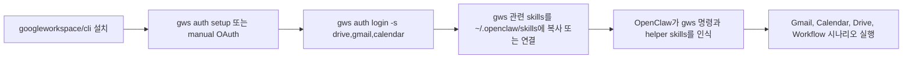

`SOUL.md`, `MEMORY.md`까지 만졌다면 이제 OpenClaw에 손발을 붙일 차례다.

그때 가장 먼저 붙여 볼 만한 축 중 하나가 `googleworkspace/cli`다.  
이 프로젝트는 Gmail, Calendar, Drive 같은 Google Workspace API를 하나의 CLI로 묶고, 그 위에 OpenClaw가 읽기 쉬운 스킬과 레시피까지 얹어 둔 형태에 가깝다.

즉, 이번 글은 단순히 `CLI 하나 설치하기`가 아니라,

- OpenClaw가 메일함을 요약하고
- 다음 회의 정보를 정리하고
- Drive 문서를 찾고 공유하고
- 메일과 문서를 엮어 후속 작업까지 이어 가는

그 출발점을 정리하는 글이다.

![[openclaw-logo-text.png]]

![[googleworkspace-cli-demo.gif]]

# 1. 왜 굳이 `googleworkspace/cli`를 붙이게 되나

OpenClaw에 외부 도구를 붙이기 시작하면 금방 부딪히는 벽이 있다.  
Gmail은 Gmail대로, Calendar는 Calendar대로, Drive는 Drive대로 다루는 방식이 제각각이라는 점이다.

직접 붙이려면 보통 이런 문제가 생긴다.

- OAuth 설정이 서비스마다 번거롭고
- 요청 형식이 조금씩 다르고
- 응답을 다시 LLM이 쓰기 좋은 형태로 정리해야 하고
- 메일, 일정, 문서를 한 흐름으로 엮는 순간 프롬프트가 금방 복잡해진다

`googleworkspace/cli`는 바로 그 중간 단계를 많이 줄여 준다. `gws drive files list`, `gws gmail +triage`, `gws workflow +meeting-prep`, `recipe-save-email-attachments`처럼 OpenClaw가 바로 써먹기 좋은 단위까지 이미 잘게 나눠 둔 덕분이다.

공식 README도 이 프로젝트를 "Google Workspace 전체를 하나의 CLI로 다루고, AI agent skills까지 함께 제공하는 도구"로 설명한다. 게다가 OpenClaw에 어떻게 연결하는지도 README 안에 따로 적혀 있다.  
출처: [googleworkspace/cli README](https://github.com/googleworkspace/cli), [Skills Index](https://github.com/googleworkspace/cli/blob/main/docs/skills.md)

# 2. 예전에 보이던 MCP는 어디 갔을까

혹시 예전 자료를 본 사람이라면 `MCP로 붙이는 거 아니었나?`라는 생각이 들 수 있다.

실제로 이 저장소에는 `gws mcp`가 있었다. 공식 changelog를 보면 `0.3.0`에서 `gws mcp` 서브커맨드를 추가했고, 이어서 MCP tool schema를 다듬는 수정도 여러 번 들어갔다. 그런데 `0.8.0`에서 `mcp` 명령이 제거됐다.  
출처: [googleworkspace/cli CHANGELOG 0.3.0](https://github.com/googleworkspace/cli/blob/main/CHANGELOG.md), [googleworkspace/cli CHANGELOG 0.8.0](https://github.com/googleworkspace/cli/blob/main/CHANGELOG.md)

그래서 지금 저장소를 보면 중심축이 살짝 바뀌어 있다.

- 예전에는 `MCP 서버`로 붙이는 흐름이 한 축이었고
- 지금은 `CLI + structured JSON + agent skills + extension` 조합이 더 전면에 나와 있다

이 차이는 생각보다 단순하다.

- `MCP`는 MCP 호환 클라이언트에 도구 서버를 물리는 방식에 가깝다
- `CLI`는 터미널에서 직접 실행할 수 있고, OpenClaw 같은 에이전트가 스킬과 레시피를 통해 필요한 명령만 호출하기 쉽다

특히 현재 README는 Google Discovery Service를 읽어 명령을 동적으로 만들고, 결과를 structured JSON으로 내보내며, OpenClaw skills와 Gemini CLI extension으로 연결하는 쪽을 더 강하게 밀고 있다.  
출처: [googleworkspace/cli README](https://github.com/googleworkspace/cli)

그래서 지금 OpenClaw에 붙이려면 "MCP 서버를 여는 방식"보다 "CLI를 설치하고 필요한 skills를 연결하는 방식"으로 이해하는 편이 현재 공식 흐름에 더 가깝다.

# 3. 설치와 인증

설치 자체는 생각보다 단순하다. 공식 저장소 기준으로 가장 흔한 방법은 아래 한 줄이다.

```bash
npm install -g @googleworkspace/cli
```

전제 조건은 `Node.js 18+`다. npm 설치가 부담스럽다면 GitHub Releases의 pre-built binary를 써도 된다.  
출처: [googleworkspace/cli README - Installation](https://github.com/googleworkspace/cli#installation)

인증은 상황에 따라 두 갈래로 나뉜다.

## `gcloud`가 이미 깔려 있으면

이 경우가 제일 편하다.

```bash
gws auth setup
gws auth login
```

다만 여기서 한 가지는 꼭 기억해 두는 편이 좋다. README는 테스트 모드의 OAuth 앱에서 `recommended` preset이 너무 많은 scope를 포함하면 실패할 수 있다고 경고한다. 처음부터 너무 넓게 잡기보다, 진짜 필요한 서비스만 좁혀서 로그인하는 편이 덜 막힌다.

예를 들면 이렇게 시작하는 쪽이 무난하다.

```bash
gws auth login -s drive,gmail,calendar
```

## `gcloud`가 없으면

이때는 Google Cloud Console에서 직접 OAuth client를 만든 뒤 로그인하면 된다.

흐름만 짧게 적으면 이렇다.

1. Google Cloud Console에서 OAuth consent screen 설정
2. 앱 타입은 `External`
3. 내 계정을 `Test users`에 추가
4. `Desktop app` OAuth client 생성
5. 받은 JSON을 `~/.config/gws/client_secret.json`에 저장
6. `gws auth login` 실행

실제로 많이 막히는 건 `Desktop app` 대신 다른 타입으로 클라이언트를 만들었거나, `Test users`에 자기 계정을 넣지 않은 경우다. README도 이 경우 `Access blocked` 같은 오류가 날 수 있다고 분명히 안내한다.  
출처: [googleworkspace/cli README - Authentication](https://github.com/googleworkspace/cli#authentication)

# 4. OpenClaw에는 이런 식으로 붙이면 된다

이제 인증만 끝나면 OpenClaw 쪽은 의외로 단순하다.

공식 README는 저장소의 `skills/gws-*` 디렉터리를 OpenClaw 스킬 디렉터리에 연결하거나 복사하는 방식을 안내한다.

예시는 이렇게 나와 있다.

```bash
ln -s $(pwd)/skills/gws-* ~/.openclaw/skills/
```

또는 필요한 것만 골라서 복사해도 된다.

```bash
cp -r skills/gws-drive skills/gws-gmail ~/.openclaw/skills/
```

개인적으로는 처음부터 전부 넣기보다, 자주 쓸 것만 먼저 가져오는 편이 더 낫다.

```bash
cp -r \
  skills/gws-shared \
  skills/gws-drive \
  skills/gws-gmail \
  skills/gws-calendar \
  skills/gws-workflow \
  skills/gws-gmail-triage \
  skills/gws-workflow-meeting-prep \
  skills/recipe-save-email-attachments \
  ~/.openclaw/skills/
```

이 정도만 있어도 메일 요약, 다음 회의 준비, 첨부파일 Drive 정리, 공유 링크 발송 같은 흐름은 거의 바로 써먹을 수 있다.

그리고 README 기준으로 `gws-shared`에는 `gws` 바이너리가 PATH에 없을 때 npm 설치를 도와주는 install block도 들어 있다. 그래서 OpenClaw 쪽 스킬을 먼저 가져와도 연결이 아주 어색하지는 않다.  
출처: [googleworkspace/cli README - AI Agent Skills / OpenClaw setup](https://github.com/googleworkspace/cli#ai-agent-skills)

## 연결 흐름은 이렇게 보면 된다



# 5. 바로 써먹는 활용 시나리오

이제부터는 단순 설치보다 중요한 파트다.

공식 스킬 인덱스를 보면 `gws-gmail-triage`, `gws-workflow-meeting-prep`, `gws-workflow-weekly-digest`, `recipe-save-email-attachments`, `recipe-email-drive-link`, `recipe-find-free-time` 같은 시나리오성 스킬이 이미 잡혀 있다.  
출처: [Skills Index](https://github.com/googleworkspace/cli/blob/main/docs/skills.md)

## 5-1. Gmail: 읽지 않은 메일 요약과 triage

가장 먼저 체감되는 건 여기다.

`gws-gmail-triage`는 읽지 않은 메일 목록을 `sender`, `subject`, `date` 기준으로 정리해 준다.

공식 예시는 이렇다.

```bash
gws gmail +triage
gws gmail +triage --max 5 --query 'from:boss'
gws gmail +triage --labels
```

이걸 OpenClaw 쪽에서는 이렇게 말하면 된다.

```text
읽지 않은 메일 10개를 요약하고, 오늘 안에 답장해야 할 것만 따로 뽑아줘.
```

또는

```text
대표님 메일만 따로 보고, 답장을 바로 보내기 전에 초안만 작성해줘.
```

이 지점이 좋은 이유는 메일 내용을 전부 사람이 직접 뒤지는 시간을 줄여 준다는 데 있다. Reddit 쪽에서도 AI 메일 보조를 쓰려는 사람들은 대체로 "요약", "우선순위 정리", "draft only" 패턴을 가장 먼저 원한다. 다만 자동 발송까지 바로 넘기기보다 초안만 만들게 하는 편이 여전히 안전하다.  
출처: [r/ClaudeAI - Gmail/Calendar access discussion](https://www.reddit.com/r/ClaudeAI/comments/1k4pt2v/i_built_an_open_source_google_calendar_gmail/), [gws-gmail-triage skill](https://github.com/googleworkspace/cli/blob/main/skills/gws-gmail-triage/SKILL.md)

## 5-2. Calendar: 다음 회의 준비와 일정 충돌 확인

`gws-workflow-meeting-prep`는 다음 미팅 하나를 기준으로 참석자와 설명, 관련 정보를 묶어 보여 주는 흐름이다.

공식 사용 예시는 단순하다.

```bash
gws workflow +meeting-prep
gws workflow +meeting-prep --calendar Work
```

이걸 OpenClaw에 물을 때는 이렇게 바꾸면 된다.

```text
다음 회의 하나만 기준으로 참석자, 설명, 준비할 포인트를 정리해줘.
```

또는 일정 조율이 필요하면 `recipe-find-free-time` 계열이 더 직접적이다.

```bash
gws calendar freebusy query --json '{"timeMin":"2024-03-18T08:00:00Z","timeMax":"2024-03-18T18:00:00Z","items":[{"id":"user1@company.com"},{"id":"user2@company.com"}]}'
gws calendar +insert --summary 'Meeting' --attendees user1@company.com,user2@company.com --start '2024-03-18T14:00:00' --duration 30
```

이 시나리오는 결국 "내가 달력 앱을 열고 빈 시간 찾고, 다시 초대장 보내는" 반복 작업을 줄이는 데 강하다.

OpenClaw에게는 아래처럼 시키면 좋다.

```text
이번 주 안에 A와 B가 모두 비는 30분을 찾고, 후보 시간만 먼저 제안해줘.
```

```text
다음 회의 전에 관련 문서가 있으면 Drive에서 같이 찾아서 준비 메모를 만들어줘.
```

출처: [gws-workflow-meeting-prep skill](https://github.com/googleworkspace/cli/blob/main/skills/gws-workflow-meeting-prep/SKILL.md), [recipe-find-free-time skill](https://github.com/googleworkspace/cli/blob/main/skills/recipe-find-free-time/SKILL.md)

## 5-3. Drive: 첨부파일 정리와 공유 링크 전달

업무에서 생각보다 자주 반복되는 게 이 흐름이다.

- 메일에 첨부파일이 왔다
- 저장 위치가 애매하다
- Drive에 올린 뒤 팀이나 외부인에게 다시 보내야 한다

공식 레시피 중 `recipe-save-email-attachments`는 이 흐름을 거의 그대로 담고 있다.

```bash
gws gmail users messages list --params '{"userId": "me", "q": "has:attachment from:client@example.com"}' --format table
gws gmail users messages get --params '{"userId": "me", "id": "MESSAGE_ID"}'
gws gmail users messages attachments get --params '{"userId": "me", "messageId": "MESSAGE_ID", "id": "ATTACHMENT_ID"}'
gws drive +upload --file ./attachment.pdf --parent FOLDER_ID
```

그리고 `recipe-email-drive-link`는 그다음 단계까지 이어진다.

```bash
gws drive files list --params '{"q": "name = '\''Quarterly Report'\''"}'
gws drive permissions create --params '{"fileId": "FILE_ID"}' --json '{"role": "reader", "type": "user", "emailAddress": "client@example.com"}'
gws gmail +send --to client@example.com --subject 'Quarterly Report' --body 'Hi, please find the report here: https://docs.google.com/document/d/FILE_ID'
```

OpenClaw 입장에서는 아래처럼 자연어 한 줄로 묶을 수 있다.

```text
클라이언트가 보낸 첨부파일 메일을 찾아서 Drive의 제안서 폴더에 정리하고, 공유 링크를 보낼 메일 초안까지 만들어줘.
```

이게 단순해 보여도 체감이 큰 이유는 `메일`, `파일`, `공유`, `후속 커뮤니케이션`이 한 흐름으로 이어지기 때문이다.  
출처: [recipe-save-email-attachments skill](https://github.com/googleworkspace/cli/blob/main/skills/recipe-save-email-attachments/SKILL.md), [recipe-email-drive-link skill](https://github.com/googleworkspace/cli/blob/main/skills/recipe-email-drive-link/SKILL.md)

# 6. 업무 자동화처럼 쓰려면 이렇게 묶으면 된다

여기서부터는 글의 3번 성격, 즉 `업무 자동화 사례 중심` 파트다.

사실 `googleworkspace/cli`의 재미는 단일 명령보다 조합에서 나온다.

예를 들면 아래와 같은 흐름을 생각할 수 있다.

## 시나리오 A. 아침 업무 정리

1. 읽지 않은 메일 요약
2. 오늘 회의 확인
3. 긴급 메일만 따로 표시
4. 회의 전에 봐야 할 문서가 있으면 Drive에서 찾기

공식 스킬 기준으로 보면 `gws gmail +triage`, `gws workflow +meeting-prep`, `gws workflow +weekly-digest` 같은 조합이다.

OpenClaw 프롬프트는 이 정도면 충분하다.

```text
오늘 아침 업무 브리핑을 만들어줘. 읽지 않은 메일, 오늘 회의, 회의 전에 읽어야 할 문서를 같이 정리해줘.
```

## 시나리오 B. 메일에서 액션 뽑기

1. 중요한 메일만 필터링
2. 회신이 필요한 것과 일정 조율이 필요한 것을 분리
3. 일정 조율 건은 free/busy 확인
4. 회신은 초안만 생성

이 패턴은 Reddit과 튜토리얼 글들에서도 반복해서 보이는 활용 방식이다. 결국 사람들은 "모든 걸 자동화"보다 "애매하게 손이 많이 가는 중간 단계"를 줄이고 싶어 한다.  
출처: [OpenClaw skill page on Termo](https://termo.ai/skill/openclaw-google-workspace-cli), [OpenClaw AI online tutorial](https://openclaw-ai.online/en/tutorials/cli/googleworkspace)

## 시나리오 C. Drive 문서 기반 후속 커뮤니케이션

1. Drive에서 문서를 찾고 권한을 확인
2. 공유 링크를 만들고
3. 메일 초안을 만들고
4. 필요하면 캘린더 일정까지 이어 붙인다

여기서는 아예 `문서를 찾아서 메일 보내고, 미팅 일정 후보도 같이 제안해줘` 식의 한 덩어리 요청이 잘 먹힌다.

# 7. 실제로 쓸 때 좋은 프롬프트 예시

아래는 이번 글 기준으로 바로 복붙해 볼 만한 예시들이다.

```text
읽지 않은 메일 15개를 요약하고, 답장이 필요한 것만 중요도 순으로 정리해줘.
```

```text
다음 회의 하나를 기준으로 참석자와 설명을 정리하고, Drive에 관련 문서가 있으면 같이 찾아줘.
```

```text
클라이언트 메일 첨부파일을 Drive의 프로젝트 폴더에 저장하는 절차를 먼저 보여주고, 실제 실행 전에 확인을 받아줘.
```

```text
이번 주 일정과 읽지 않은 메일 수를 한 번에 요약해서 주간 시작 브리핑처럼 만들어줘.
```

이런 프롬프트가 잘 먹히는 이유는 `gws` 쪽에 이미 Gmail, Calendar, Drive, Workflow를 위한 작은 도구 단위가 정리돼 있기 때문이다.

# 8. 자주 막히는 지점

짧게 정리하면 네 가지다.

## 1) `gws auth setup`이 안 된다

이 명령은 `gcloud`가 있을 때 가장 편하다. 없으면 manual OAuth로 바로 넘어가는 편이 빠르다.

## 2) OAuth는 됐는데 권한이 부족하다

처음 로그인 때 scope를 너무 좁게 주면 일부 명령이 막힐 수 있다. 반대로 너무 넓게 주면 테스트 모드 앱에서 실패할 수 있다. 그래서 처음에는 `drive,gmail,calendar`처럼 필요한 범위만 여는 편이 낫다.

## 3) OpenClaw가 스킬을 못 읽는다

스킬을 너무 많이 한꺼번에 넣기보다, `gws-shared`, `gws-gmail`, `gws-calendar`, `gws-drive`, `gws-workflow`부터 시작하는 편이 안정적이다.

## 4) 자동 발송이나 권한 변경이 불안하다

이건 불안한 게 맞다.  
처음에는 아래 원칙으로 쓰는 편이 안전하다.

- 메일은 초안 작성까지만
- 일정은 후보 제안까지만
- 공유 권한 변경은 실행 전 확인 받기
- 삭제/이동 같은 작업은 `--dry-run` 또는 확인 후 실행

공식 `gws-shared` 문서도 write/delete 계열은 사용자 확인과 `--dry-run` 우선을 권한다.  
출처: [gws-shared skill](https://github.com/googleworkspace/cli/blob/main/skills/gws-shared/SKILL.md)

# 9. 이번 글에서 추천하는 시작 순서

지금 시점에서 가장 현실적인 순서는 이렇다.

1. `@googleworkspace/cli` 설치
2. `gws auth login -s drive,gmail,calendar`까지 완료
3. OpenClaw에 `gws-shared`, `gws-gmail`, `gws-calendar`, `gws-drive`, `gws-workflow`만 먼저 연결
4. 가장 먼저 `메일 요약`, `다음 회의 준비`, `첨부파일 Drive 정리` 세 가지만 써 보기
5. 잘 맞으면 그다음에 recipe와 persona 계열을 늘리기

처음부터 거대한 사무 자동화 비서를 만들려고 하면 오히려 금방 꼬인다.  
반대로, 메일 하나 요약하고 회의 하나 준비시키는 데서 시작하면 OpenClaw가 어디까지 믿을 만한지 감이 빨리 잡힌다.

# 참고 자료

공식 자료:

- [googleworkspace/cli GitHub README](https://github.com/googleworkspace/cli)
- [googleworkspace/cli Skills Index](https://github.com/googleworkspace/cli/blob/main/docs/skills.md)
- [gws-gmail-triage](https://github.com/googleworkspace/cli/blob/main/skills/gws-gmail-triage/SKILL.md)
- [gws-workflow-meeting-prep](https://github.com/googleworkspace/cli/blob/main/skills/gws-workflow-meeting-prep/SKILL.md)
- [recipe-save-email-attachments](https://github.com/googleworkspace/cli/blob/main/skills/recipe-save-email-attachments/SKILL.md)
- [recipe-email-drive-link](https://github.com/googleworkspace/cli/blob/main/skills/recipe-email-drive-link/SKILL.md)
- [recipe-find-free-time](https://github.com/googleworkspace/cli/blob/main/skills/recipe-find-free-time/SKILL.md)

활용 참고:

- [OpenClaw AI online - Google Workspace CLI tutorial](https://openclaw-ai.online/en/tutorials/cli/googleworkspace)
- [OpenClawAI blog - Integrate Google Workspace CLI with OpenClaw](https://openclawai.io/blog/integrate-google-workspace-cli-with-openclaw)
- [Termo skill page - OpenClaw + Google Workspace CLI](https://termo.ai/skill/openclaw-google-workspace-cli)
- [r/ClaudeAI - open source Google Calendar / Gmail / Drive tool discussion](https://www.reddit.com/r/ClaudeAI/comments/1k4pt2v/i_built_an_open_source_google_calendar_gmail/)
