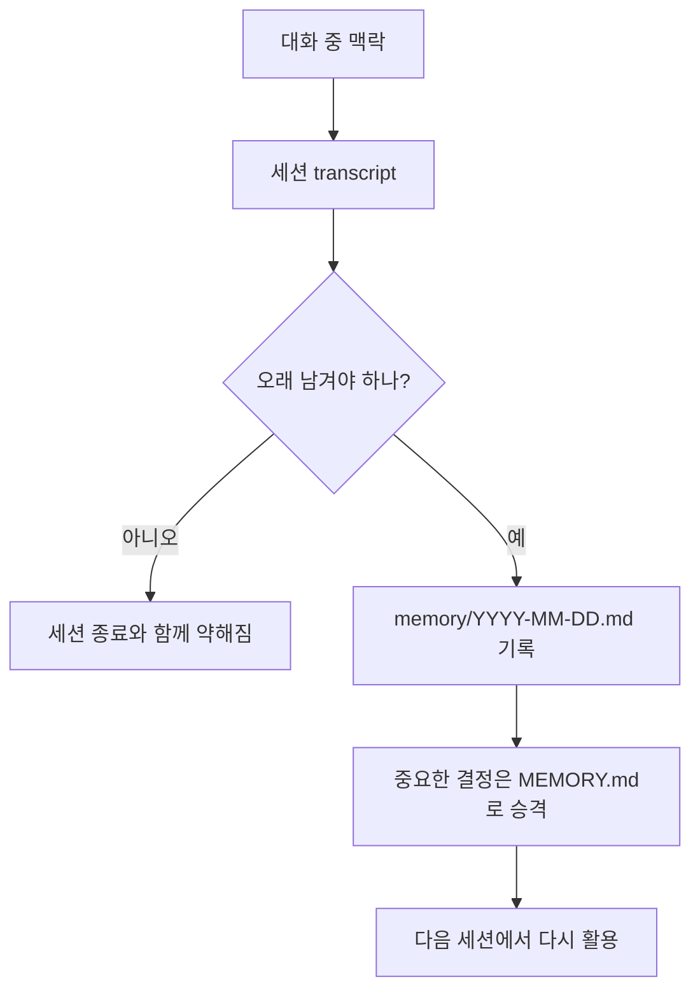

OpenClaw를 며칠만 진지하게 써 보면 한 번쯤 이런 순간이 온다.

`분명 아까 얘기했던 건데, 왜 새 세션에선 다시 처음부터 설명해야 하지?`

이때 바로 `OpenClaw 기억력이 별로인가 보다`라고 생각하기 쉽다.  
그런데 공식 문서를 기준으로 보면, 이건 기억력이 나빠서라기보다 **세션과 파일의 역할이 다르기 때문**인 경우가 많다.

OpenClaw에서 오래 남는 것은 채팅창 자체가 아니라 **workspace에 남긴 파일**이다.  
공식 Memory 문서도 source of truth를 plain Markdown 파일이라고 분명히 설명한다.

![[openclaw-logo-text.png]]

이번 글에서는 아래 흐름만 딱 정리해 보겠다.

- 왜 세션이 바뀌면 맥락이 끊겨 보이는지
- `MEMORY.md`와 `memory/YYYY-MM-DD.md`를 어떻게 나눠 써야 하는지
- 실제 운영에서는 어떤 기록 규칙을 잡아두면 좋은지
- 블로그나 개인 비서형 OpenClaw에서 바로 써먹는 운영 패턴은 무엇인지

# 1. 왜 `기억이 끊긴다`는 느낌이 생길까

OpenClaw는 대화 내용을 무한히 머릿속에 들고 가는 구조가 아니다.  
기본적으로는 **세션 단위 대화 맥락** 위에서 움직이고, 오래 남겨야 할 것은 **workspace 파일**에 적어 두는 구조에 가깝다.

공식 문서를 아주 짧게 요약하면 이렇다.

- 세션은 지금 대화하고 있는 작업 맥락이다.
- `MEMORY.md`와 `memory/YYYY-MM-DD.md`는 디스크에 남는 기억이다.
- 모델은 디스크에 써 둔 것만 다음 세션에서 안정적으로 다시 활용할 수 있다.

즉, 같은 날 같은 사람과 이야기하더라도 아래 두 상황은 다르다.

1. 아직 같은 세션 안에 있어서 직전 대화가 그대로 남아 있는 경우
2. 새 세션으로 넘어가서 다시 bootstrap 파일과 memory 파일을 읽고 시작하는 경우

두 번째 상황에서는 이전 대화가 파일로 정리돼 있지 않으면 체감상 `잊어버린 것처럼` 보일 수밖에 없다.

출처: [OpenClaw Docs - Memory](https://docs.openclaw.ai/concepts/memory), [OpenClaw Docs - Session](https://docs.openclaw.ai/concepts/session)

# 2. OpenClaw에서 진짜 오래 남는 것은 파일이다

이 부분이 핵심이다.

공식 Memory 문서는 OpenClaw memory를 이렇게 설명한다.

- memory는 agent workspace 안의 plain Markdown
- files are the source of truth
- model only remembers what gets written to disk

이 표현은 생각보다 중요하다.  
즉, OpenClaw 운영에서 `기억`은 추상적인 능력이 아니라 **파일 운영 습관**에 더 가깝다.



이 구조를 받아들이고 나면 운영 방식도 달라진다.

- 중요한 결정을 했으면 파일에 적는다
- 당일 작업 맥락은 daily log에 남긴다
- 반복해서 참조할 규칙은 `MEMORY.md`로 올린다
- `기억하겠지`라고 기대하지 않는다

개인적으로는 이 지점이 OpenClaw를 `채팅형 AI`에서 `운영 가능한 에이전트`로 바꾸는 분기점이라고 본다.

# 3. `MEMORY.md`와 `memory/YYYY-MM-DD.md`는 어떻게 다를까

이전 글에서도 `SOUL.md`와 `MEMORY.md` 차이를 다뤘지만, 실제 운영에서는 `MEMORY.md`와 **daily log**의 구분이 더 중요해진다.

공식 기본 구조는 두 층이다.

- `memory/YYYY-MM-DD.md`
  - 하루 로그
  - 오늘 + 어제를 세션 시작 시 읽는다
- `MEMORY.md`
  - 큐레이션된 장기 기억
  - 메인 private 세션에서만 로드한다

여기서 실무적으로 정리하면 이렇게 보면 된다.

## `memory/YYYY-MM-DD.md`

이 파일은 **오늘 무슨 일이 있었는지**를 적는 작업 일지에 가깝다.

예를 들면 이런 내용이 맞다.

- 오늘 세션 기억 끊김 문제를 확인했다
- 어떤 운영 파일을 새로 만들었다
- 블로그 추천 루틴 cron을 등록했다
- 특정 주제를 오늘 승인받고 작성 착수했다

즉, 흐르는 작업 맥락을 잃지 않기 위한 **운영 로그**다.

## `MEMORY.md`

이 파일은 매일 흔들리면 안 되는 것을 남기는 곳이다.

예를 들면 이런 내용이 맞다.

- 사용자가 선호하는 말투와 보고 형식
- 블로그 작성 컨벤션
- 역할 분리 원칙
- 자주 반복되는 의사결정 규칙

즉, 세션이 바뀌어도 다시 설명하고 싶지 않은 **지속 규칙**을 담는 곳이다.

공식 문서가 `MEMORY.md`를 curated long-term memory라고 부르는 이유도 이 때문이다.

출처: [OpenClaw Docs - Memory](https://docs.openclaw.ai/concepts/memory)

# 4. 왜 daily log가 특히 중요해지나

실제로 운영하다 보면 `MEMORY.md`만으로는 부족한 순간이 많다.

이유는 단순하다.

`MEMORY.md`는 너무 자주 바뀌는 내용을 넣기엔 적합하지 않기 때문이다.

예를 들어 오늘 하루 동안만 중요한 정보가 있다.

- 어떤 문제가 방금 확인됐는지
- 어떤 문서를 새로 만들었는지
- 지금 무엇이 진행 중인지
- 다음 액션이 무엇인지

이걸 전부 `MEMORY.md`에 넣으면 금방 비대해진다.  
반대로 아무 데도 적지 않으면 새 세션에서 흐름이 툭 끊긴다.

그래서 daily log가 중간층으로 딱 맞다.

```md
# 2026-03-19

## 오늘 작업
- 세션 전환 시 맥락 끊김 문제 확인
- BLOG-PIPELINE.md 생성
- 오전 9시 주제 추천 cron 등록

## 결정사항
- 장기 규칙은 MEMORY.md에, 당일 진행상황은 daily log에 남긴다.

## 다음 할 일
- 승인된 주제로 초안 작성
- STATUS 문서와 일지를 함께 갱신
```

이 패턴의 장점은 세 가지다.

1. 오늘 맥락을 복구하기 쉽다
2. `MEMORY.md`를 덜 오염시킨다
3. 장기 가치가 생긴 것만 나중에 선별해서 승격할 수 있다

# 5. 세션이 길어질수록 `파일 우선`이 더 중요하다

OpenClaw 공식 문서에는 세션이 auto-compaction에 가까워질 때 durable memory를 먼저 기록하라고 유도하는 memory flush 설명도 있다.  
이건 결국 같은 메시지를 말한다.

**세션 맥락은 압축되거나 사라질 수 있으니, 오래 갈 내용은 미리 파일에 적어 두라**는 뜻이다.

이 포인트를 이해하면 운영 원칙이 더 분명해진다.

- `대화가 길어졌으니 모델이 알아서 기억하겠지`라고 기대하지 않는다
- 중요한 합의가 생기면 바로 기록한다
- 나중에 블로그나 문서로 다시 써야 할 재료는 그날 로그에 남긴다

공식 문서의 pre-compaction memory flush도 사실상 이 실전 원칙을 시스템 차원에서 한 번 더 밀어 주는 장치라고 볼 수 있다.

출처: [OpenClaw Docs - Memory](https://docs.openclaw.ai/concepts/memory), [OpenClaw Docs - Session management + compaction](https://docs.openclaw.ai/reference/session-management-compaction)

# 6. 운영 메모리를 설계할 때 내가 추천하는 최소 규칙

복잡하게 가지 않아도 된다.  
처음에는 아래 네 줄만 지켜도 체감이 많이 달라진다.

## 규칙 1. 오늘 일은 오늘 파일에 남긴다

작업이 발생한 날의 `memory/YYYY-MM-DD.md`에

- 오늘 한 일
- 결정사항
- 진행중
- 다음 할 일

네 블록 정도만 유지해도 복구력이 올라간다.

## 규칙 2. 장기적으로 반복될 것만 `MEMORY.md`로 올린다

하루짜리 이슈, 일회성 로그, 임시 링크는 넣지 않는다.

반대로 아래는 올릴 가치가 높다.

- 고정 말투
- 승인 원칙
- 역할 분리
- 블로그 구조 컨벤션
- 반복 업무 루틴

## 규칙 3. STATUS 문서가 있는 팀/역할은 별도로 관리한다

블로그 담당, 디자인 담당, 운영 담당처럼 역할이 나뉘어 있다면  
각 폴더의 `STATUS.md`에 진행 상태를 남기는 편이 좋다.

이렇게 하면

- 장기 규칙은 `MEMORY.md`
- 당일 흐름은 `memory/YYYY-MM-DD.md`
- 역할별 현재 상태는 `STATUS.md`

로 층이 나뉘어, 나중에 찾아보기가 훨씬 쉬워진다.

## 규칙 4. `기억해 둘게요` 대신 실제로 쓴다

이건 당연해 보여도 가장 자주 놓친다.

OpenClaw 운영에서 `mental note`는 거의 무효에 가깝다.  
남길 가치가 있으면 바로 파일에 쓰는 게 맞다.

# 7. 블로그 운영형 OpenClaw에서는 이렇게 응용하면 좋다

블로그를 운영하는 입장에서는 이 파일 기반 메모리 구조가 특히 잘 맞는다.

예를 들어:

- `MEMORY.md`
  - 블로그 카테고리 구조
  - 제목/slug/navOrder 컨벤션
  - 이미지 사용 원칙
- `memory/YYYY-MM-DD.md`
  - 오늘 승인된 주제
  - 오늘 만든 파이프라인 문서
  - 오늘 반영한 상태 변화
- `agents/blog-employee/STATUS.md`
  - 현재 어떤 글이 배정됐는지
  - 초안 작성 상태가 어떤지

이렇게 나누면 새 세션으로 넘어가더라도

- 장기 규칙은 안 흔들리고
- 오늘 작업은 복구 가능하고
- 역할별 상태도 따로 추적된다

즉, `글을 잘 쓰는 것`보다 먼저 `글을 이어서 쓸 수 있는 운영 구조`가 생긴다.

# 8. 이런 신호가 보이면 파일 운영을 손봐야 한다

아래 증상이 반복되면 거의 확실하다.

- 같은 설명을 자꾸 다시 하게 된다
- 다음 세션에서 방금 한 결정을 못 이어받는다
- 운영 규칙이 대화 속에만 있고 파일엔 없다
- 팀/역할별 현재 상태가 섞여 있다

이럴 때는 모델 교체보다 먼저 아래를 보는 편이 낫다.

1. 오늘 일지가 있는가
2. `MEMORY.md`에 장기 규칙이 정리돼 있는가
3. 역할별 `STATUS.md`가 분리돼 있는가
4. 중요한 결정을 실제로 파일에 썼는가

대부분은 여기서 원인이 드러난다.

# 9. 핵심만 다시 정리하면

OpenClaw에서 세션 기억이 끊겨 보이는 건 이상한 일이 아니다.  
원래 구조가 **세션은 휘발성 맥락**, **파일은 지속 기억**으로 나뉘어 있기 때문이다.

그래서 실전 운영에서는 이렇게 가는 편이 가장 안정적이다.

- 오늘 작업과 진행상황은 `memory/YYYY-MM-DD.md`
- 오래 유지할 규칙과 선호는 `MEMORY.md`
- 역할별 현재 상태는 각 폴더의 `STATUS.md`
- 중요한 건 말로만 두지 말고 바로 파일에 기록

설치 초반에는 OpenClaw가 얼마나 잘 대답하는지가 더 눈에 들어온다.  
하지만 조금만 오래 운영해 보면 결국 중요한 건 답변 한 번의 품질보다 **맥락을 끊기지 않게 이어 가는 운영 구조**다.

세션은 바뀔 수 있다.  
파일은 남는다.

OpenClaw를 오래 쓸수록, 이 차이가 점점 더 크게 느껴질 것이다.

# 참고 자료

공식 자료:

- [OpenClaw Docs - Memory](https://docs.openclaw.ai/concepts/memory)
- [OpenClaw Docs - Agent workspace](https://docs.openclaw.ai/concepts/agent-workspace)
- [OpenClaw Docs - Session](https://docs.openclaw.ai/concepts/session)
- [OpenClaw Docs - Bootstrapping](https://docs.openclaw.ai/start/bootstrapping)
- [OpenClaw Docs - Session management + compaction](https://docs.openclaw.ai/reference/session-management-compaction)

함께 보면 좋은 글:

- [[SOUL.md와 MEMORY.md로 OpenClaw 말투와 기억 다듬기]]
- [[SOUL.md와 MEMORY.md 베스트 프랙티스 3가지 - 개발, 리서치, 개인 비서형]]
- [[OpenClaw에 googleworkspace/cli 붙이기 - 설치, 인증, 활용까지 한 번에 정리하기]]
