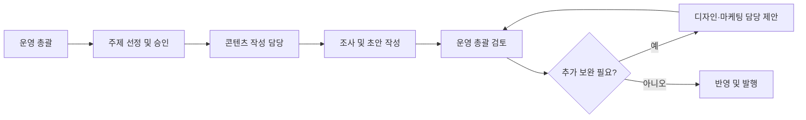

OpenClaw를 조금만 오래 써 보면 이런 생각이 든다.

`하나의 에이전트에게 다 맡기면 편하긴 한데, 조사도 하고 초안도 쓰고 검토도 하고 구조까지 잡게 하려니 점점 산만해진다.`

처음에는 한 명의 똑똑한 비서처럼 쓰는 방식이 가장 자연스럽다.  
그런데 운영이 길어질수록 병목은 정확도보다 **역할 충돌**에서 더 자주 생긴다.

- 지금 해야 할 일이 조사인지
- 바로 작성해도 되는지
- 검토와 반영은 누가 맡는지
- SEO나 디자인 개선은 언제 끼워 넣을지

이 구분이 흐리면, 에이전트가 못해서가 아니라 **운영 구조가 엉켜서** 일이 늦어진다.

그래서 이번 글에서는 OpenClaw를 실제로 쓸 때 서브에이전트를 어떻게 역할별로 나눠야 하는지, 그리고 왜 이 방식이 개인 운영에서도 생각보다 잘 먹히는지 정리해 보겠다.

![[openclaw-logo-text.png]]

# 1. 왜 한 명의 만능 에이전트만으로는 금방 막힐까

입문 단계에서는 한 세션 안에서 다 해결해도 된다.

- 아이디어를 정리하고
- 관련 자료를 찾고
- 초안을 쓰고
- 마지막에 표현을 다듬는 방식이다.

문제는 이 흐름이 짧을 때만 편하다는 점이다.  
블로그 운영이나 개인 비서형 자동화를 조금만 굴려 보면, 한 세션이 여러 역할을 동시에 떠안기 시작한다.

예를 들어 블로그 한 편만 써도 실제로는 아래 일이 섞여 있다.

1. 지금 어떤 주제를 먼저 다뤄야 하는지 판단
2. 공식 문서와 사례를 확인하는 조사
3. 글 구조를 잡고 초안을 쓰는 작성
4. 기존 시리즈와 허브 연결을 맞추는 편집
5. 검색 의도, 시각 자료, 가독성을 보는 개선

이걸 전부 하나의 흐름으로 뭉개면 매번 같은 문제가 생긴다.

- 조사하다가 글이 길어진다
- 초안을 쓰다가 방향이 바뀐다
- 검토가 빠진 채 반영된다
- 누가 무슨 결정을 했는지 기록이 흐려진다

즉, OpenClaw를 오래 쓰려면 모델 성능보다 먼저 **일의 역할을 분리하는 운영 감각**이 필요해진다.

# 2. 역할 분리는 사람 수를 늘리려는 게 아니라 책임을 나누려는 것이다

서브에이전트 운영을 말하면 팀 규모가 커야 할 것처럼 들릴 수 있다.  
하지만 실제 핵심은 인원 추가가 아니라 **책임 구간 분리**다.

혼자 운영하더라도 아래 세 축은 나눠 두는 편이 좋다.

- **운영 총괄**: 우선순위 판단, 승인 기준, 최종 검토, 반영
- **콘텐츠 작성 담당**: 조사, 자료 비교, 초안 작성
- **디자인·마케팅 담당**: SEO 보완, 제목/설명 개선, 구조와 시각 자료 제안

이 구조의 장점은 단순하다.

## 판단과 실행이 덜 섞인다

무엇을 쓸지 정하는 사람과 실제로 쓰는 역할을 분리하면, 초안의 속도와 우선순위 판단이 서로 덜 꼬인다.

## 품질 점검 지점이 생긴다

최종 검토 역할이 따로 있으면, 초안 품질이 그때그때 사람 컨디션에 따라 흔들리는 일이 줄어든다.

## 기록이 쉬워진다

누가 어떤 단계까지 했는지를 `STATUS.md`나 daily log에 남기기 쉬워진다.

이건 꼭 여러 명이 있어서가 아니다.  
한 명이 OpenClaw를 운영하더라도 **역할을 분리해 놓으면 시스템이 팀처럼 움직이기 시작한다.**

# 3. 실제 운영에서는 어떤 조직도로 굴리면 자연스러울까

실제 운영을 일반화해서 설명하면, 아래처럼 보는 게 가장 무난하다.

## 1) 운영 총괄

이 역할은 모든 일을 직접 많이 하는 사람이라기보다, **무엇을 먼저 하고 어디까지 반영할지 결정하는 사람**에 가깝다.

주로 맡는 일은 이렇다.

- 오늘 우선 주제 추천
- 승인 여부 판단
- 글의 방향과 톤 정리
- 초안 검토 후 수정/반영 결정
- 시리즈 전체 흐름 관리

블로그 운영에서 가장 중요한 건 사실 작성 속도보다 **어떤 글을 지금 내야 하는지**를 맞추는 일이다.  
그래서 총괄 역할은 손이 느려도 되지만 판단이 흔들리면 안 된다.

## 2) 콘텐츠 작성 담당

이 역할은 실무 생산성을 책임진다.  
예를 들면 `김사원`처럼 이해하기 쉬운 사례형 인물로 떠올리면 된다.

주요 역할은 아래와 같다.

- 공식 문서/참고 자료 조사
- 주제별 핵심 포인트 정리
- 초안 작성
- 시리즈 문맥에 맞는 내부 링크 초안 제안
- 필요 시 표, 체크리스트, Mermaid 같은 시각 자료 구성

운영 총괄이 계속 직접 초안까지 다 쓰기 시작하면, 방향 잡기와 반영 판단까지 같이 무너지는 경우가 많다.  
그래서 글 작성 실무는 가능한 한 이 축으로 보내 두는 편이 안정적이다.

## 3) 디자인·마케팅 담당

이 역할은 항상 붙는 필수 인력은 아니다.  
필요할 때만 투입하는 보조 축에 가깝다.

예를 들면 아래 상황에서 유효하다.

- 제목이 검색형으로 충분히 잡혔는지 애매할 때
- 설명 문구가 약할 때
- 시각 자료가 부족할 때
- 허브 페이지 연결이나 CTA가 아쉬울 때

즉, 이 역할은 글을 처음부터 쓰는 사람이 아니라 **완성도를 한 단계 올리는 개선 담당**으로 두는 편이 좋다.

# 4. 블로그 운영에서 이 구조가 특히 잘 먹히는 이유

OpenClaw 서브에이전트 운영은 코드 작업에서도 유용하지만, 개인적으로는 블로그 쪽에서 더 체감이 컸다.

왜냐하면 블로그는 겉으로 보기보다 단계가 많기 때문이다.

- 주제 선정
- 검색 의도 점검
- 자료 조사
- 초안 작성
- 시리즈 연결
- 메타 설명 정리
- 이미지/도식 추가
- 최종 발행

이걸 한 번에 몰아 하면 늘 어딘가가 빠진다.  
반대로 역할을 나누면 아래처럼 흐름이 단순해진다.

- 총괄: 오늘 어떤 글을 밀지 결정
- 작성 담당: 초안을 빠르게 생산
- 개선 담당: 검색성과 완성도 점검
- 총괄: 마지막 반영과 발행

이 구조는 팀이 커서 필요한 게 아니라, **반복 작업의 병목을 줄이기 위해 필요한 구조**다.

# 5. 실제 사례형으로 바꾸면 이렇게 설명할 수 있다

가령 한 운영자가 OpenClaw로 기술 블로그를 굴린다고 해 보자.

- 운영 총괄은 매일 오전에 다음 주제를 먼저 정한다.
- 작성 담당은 그 주제에 대해 공식 문서와 기존 시리즈를 확인하고 초안을 만든다.
- 개선 담당은 제목, 설명, 내부 링크, 시각 자료 보완 포인트를 제안한다.
- 마지막 반영은 다시 총괄이 한다.

이렇게만 굴려도 결과가 꽤 달라진다.

## 이전 방식

- 아이디어가 떠오를 때마다 바로 글 쓰기 시작
- 조사와 작성이 섞여 중간에 방향 이탈
- 허브 연결이나 메타 설명이 자주 비어 있음
- 다음 글 추천 기준이 사람 기분에 좌우됨

## 역할 분리 후 방식

- 먼저 오늘 쓸 주제를 추천받음
- 승인 후에만 작성 단계로 전환
- 작성 담당이 초안을 전담
- 필요 시 개선 담당이 후반 품질을 보강
- 총괄이 마지막 반영과 발행 판단

겉보기에는 절차가 늘어난 것 같지만, 실제로는 재작업이 줄어들어서 오히려 더 빨라진다.

# 6. 앞으로 계획은 어떻게 잡아두면 좋을까

역할 분리 구조를 한 번 만들었다고 끝은 아니다.  
오히려 그 다음부터가 중요하다.

실무적으로는 아래 네 가지를 다음 단계 계획으로 두는 편이 좋다.

## 1) 주제 추천 루틴 고정

매일 같은 시간에 `다음 글 후보`를 먼저 추천받는 루틴을 고정하면, 작성이 즉흥적으로 흔들리지 않는다.

핵심은 `무엇을 쓸까`를 초안 작성 전에 끝내는 것이다.

## 2) 상태 기록 체계 정리

- 오늘의 진행상황은 `memory/YYYY-MM-DD.md`
- 역할별 현재 상태는 `STATUS.md`
- 장기 운영 원칙은 `MEMORY.md`

이렇게 층을 나눠 기록하면 새 세션이 열려도 흐름을 복구하기 쉬워진다.

## 3) 작성 담당 역할 고도화

처음에는 단순 조사와 초안 작성만 맡겨도 된다.  
하지만 익숙해지면 아래까지 넓혀 볼 수 있다.

- 제목 후보 2~3개 동시 제안
- 참고 링크 요약본 포함
- 허브 페이지 연결 문구 초안 제안
- 이미지 또는 Mermaid 삽입 지점까지 선제안

즉, 작성 담당을 단순 타이핑 요원이 아니라 **콘텐츠 생산 오퍼레이터**로 키우는 방향이다.

## 4) 개선 담당은 선택적으로 투입

모든 글에 SEO나 디자인 개선 담당을 붙일 필요는 없다.  
대신 아래 상황에서만 선별 투입하는 편이 효율적이다.

- 검색 유입이 중요한 글
- 시리즈 허브의 중심 글
- 설명 구조가 복잡한 글
- 스크린샷이나 구조도가 중요한 글

이렇게 해야 개선 담당이 병목이 아니라 증폭 장치로 작동한다.

# 7. 운영하면서 주의할 점도 있다

역할 분리가 항상 좋은 것만은 아니다.  
잘못 굴리면 오히려 절차만 많아질 수 있다.

특히 단일 에이전트 방식과 비교하면, 서브에이전트 구조에는 분명한 비용과 단점도 있다.

## 1) 토큰 소모가 더 커질 수 있다

가장 먼저 체감되는 건 토큰 사용량이다.

서브에이전트를 나누면 보통 아래 비용이 함께 늘어난다.

- 역할별로 같은 배경 설명을 다시 주는 비용
- 초안, 검토, 보완 과정을 여러 번 주고받는 비용
- 상태 공유와 기록 정리에 들어가는 추가 문맥 비용

단일 에이전트는 한 세션 안에서 한 번에 밀어붙일 수 있어서, 짧은 작업에서는 오히려 더 저렴하고 빠를 때가 많다.

즉, 작업 규모가 작거나 판단이 단순한데도 무조건 역할을 쪼개면 **품질 이득보다 토큰 비용이 더 크게 느껴질 수 있다.**

## 2) 속도가 빨라지지 않고 오히려 느려질 때가 있다

서브에이전트 운영은 병렬화가 잘 맞는 작업에서는 강하지만, 모든 작업이 그런 것은 아니다.

예를 들어 아래 상황에서는 단일 에이전트가 더 낫다.

- 짧은 공지문 수정
- 메타 설명 한두 줄 다듬기
- 이미 방향이 확정된 단순 후처리
- 조사 없이 바로 쓸 수 있는 짧은 글

이런 일까지 역할을 나누면 전달, 확인, 검토 절차만 늘어나서 실제 체감 속도는 더 느려질 수 있다.

## 3) 책임이 분리되는 만큼 맥락도 끊길 수 있다

역할을 분리하면 장점은 분명하지만, 반대로 맥락 전달이 조금만 부정확해도 결과물이 어긋날 수 있다.

예를 들면 이런 식이다.

- 총괄은 A를 원했는데 작성 담당은 B 방향으로 이해함
- 작성 담당은 핵심을 잘 정리했지만 개선 담당이 다른 검색 의도로 손봄
- 최종 반영 단계에서 왜 이런 구조가 나왔는지 추적이 어려워짐

즉, 역할 분리는 자동으로 품질을 보장하지 않는다.  
중간 전달이 부실하면 단일 에이전트보다 오히려 더 산만해질 수 있다.

## 4) 관리 포인트가 늘어난다

단일 에이전트 방식은 실패해도 대체로 한 자리에서 다시 보면 된다.  
하지만 서브에이전트 구조는 관리해야 할 지점이 더 많다.

- 누가 어떤 단계까지 했는지
- 어느 초안이 최신인지
- 승인 대기인지, 수정 대기인지
- 기록이 `STATUS.md`, daily log, 본문에 일관되게 반영됐는지

운영 기록이 약하면 역할 분리 구조는 금방 복잡해진다.  
그래서 서브에이전트 운영은 작성 능력만이 아니라 **상태 관리 능력**까지 함께 요구한다.

## 5) 품질 편차가 생길 수 있다

역할별 결과물을 합치는 과정에서 문체, 기준, 깊이가 서로 어긋날 수 있다.

- 초안은 자세한데 검토는 너무 압축적일 수 있고
- SEO 관점에서는 좋아졌지만 본문 톤이 깨질 수 있고
- 구조는 좋아졌지만 실제 사용 경험 밀도가 약해질 수 있다

이 문제는 특히 블로그에서 자주 보인다.  
그래서 최종 검토 단계 없이 서브에이전트 결과만 이어 붙이면 글이 조각난 느낌이 나기 쉽다.

## 역할 이름보다 역할 책임이 중요하다

내부에서 어떤 이름으로 부르든, 외부 글에서는 일반화된 사례형 표현으로 설명하는 편이 자연스럽다.  
독자는 내부 호칭보다 `누가 무엇을 맡는 구조인지`를 더 궁금해한다.

## 승인 기준을 먼저 정해야 한다

추천만 하고 바로 쓰는지, 승인 후에만 쓰는지 기준이 흐리면 총괄과 작성 담당이 계속 충돌한다.

## 기록이 빠지면 다시 1인 난전으로 돌아간다

역할을 나눴더라도 상태 기록이 없으면 결국 누가 어디까지 했는지 매번 다시 파악해야 한다.  
이 순간부터 팀 운영 효과가 급격히 사라진다.

## 그래서 언제 단일 에이전트가 더 낫나

정리하면 아래 조건에서는 굳이 서브에이전트로 나누지 않는 편이 낫다.

- 작업이 짧고 명확할 때
- 조사 범위가 좁을 때
- 결과물 형식이 단순할 때
- 승인과 반영을 한 번에 끝낼 수 있을 때

반대로 여러 단계가 섞이고, 조사·초안·검토·개선이 분리될수록 서브에이전트 구조가 빛난다.

핵심은 `항상 서브에이전트가 더 좋다`가 아니라, **작업 크기와 복잡도에 맞게 운영 단위를 고르는 것**이다.

# 8. 핵심만 정리하면

OpenClaw 서브에이전트 운영은 거창한 조직놀이가 아니다.  
실제로는 **우선순위 판단, 작성 실무, 개선 제안, 최종 반영**을 분리해서 병목을 줄이는 운영 방식에 가깝다.

특히 블로그처럼 반복 생산이 중요한 작업에서는 아래 구조가 잘 맞는다.

- 운영 총괄: 주제 선정, 승인, 최종 검토와 반영
- 콘텐츠 작성 담당: 조사, 자료 비교, 초안 작성
- 디자인·마케팅 담당: SEO와 시각 자료 중심의 선택적 개선

여기에 주제 추천 루틴, 상태 기록, 허브 연결까지 붙이면 OpenClaw는 단순 채팅 상대가 아니라 **작은 운영 팀처럼 일하는 시스템**으로 바뀐다.

결국 중요한 건 서브에이전트를 몇 개 두느냐가 아니다.  
각 역할이 어느 단계에서 들어오고, 누가 최종 판단을 하는지 명확히 나누는 것이다.

그 선만 잘 그어도 OpenClaw 운영은 훨씬 덜 산만하고, 훨씬 오래 간다.

## 참고 자료

공식 자료:

- [OpenClaw Docs - Sub-agents](https://docs.openclaw.ai/capabilities/sub-agents)
- [OpenClaw Docs - Session](https://docs.openclaw.ai/concepts/session)
- [OpenClaw Docs - Memory](https://docs.openclaw.ai/concepts/memory)
- [OpenClaw Docs - Agent workspace](https://docs.openclaw.ai/concepts/agent-workspace)

함께 보면 좋은 글:

- [[OpenClaw 세션 기억이 자꾸 끊길 때 - 파일 기반 운영 메모리로 이어 붙이는 방법]]
- [[SOUL.md와 MEMORY.md로 OpenClaw 말투와 기억 다듬기]]
- [[SOUL.md와 MEMORY.md 베스트 프랙티스 3가지 - 개발, 리서치, 개인 비서형]]
