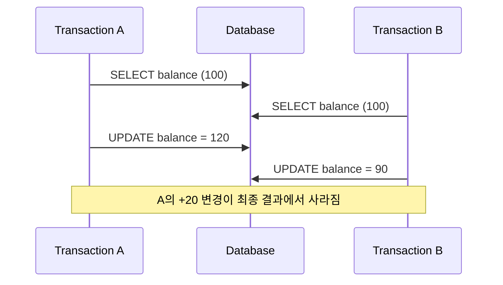
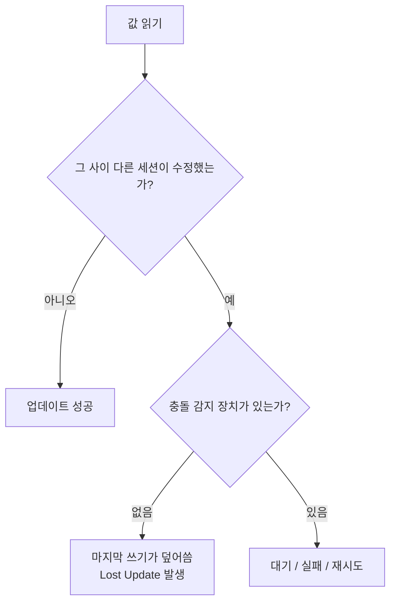

앞선 글에서 `MySQL`, `Aurora MySQL`, `PostgreSQL`의 구조 차이와 트랜잭션, `MVCC`, 락 감각이 어떻게 다른지 비교했다.  
그런데 여기까지 보고 나면 한 가지 의문이 남는다.

`트랜잭션이 있으면 동시에 수정해도 안전한 것 아닌가?`

실무에서는 꼭 그렇지 않다.  
두 사용자가 같은 데이터를 읽고 각자 수정한 뒤 저장하면, 뒤에 저장한 쪽이 앞선 변경을 덮어써 버리는 일이 생길 수 있다. 이때 먼저 반영된 변경사항이 결과에서 사라지는데, 이를 `Lost Update`라고 부른다.

이번 글에서는 아래 흐름으로 정리해 보겠다.

- `Lost Update`가 정확히 무엇인가
- 왜 트랜잭션이 있어도 발생할 수 있는가
- `Read Committed`, `Repeatable Read`, `MVCC`와는 어떤 관계가 있는가
- `MySQL`, `Aurora MySQL`, `PostgreSQL`에서는 어떻게 이해해야 하는가
- 실무에서는 어떤 방식으로 막는 것이 자연스러운가

![[lost-update-timeline.svg]]

## 먼저 한 줄로 요약하면

`Lost Update`는 **두 트랜잭션이 같은 값을 읽고 각자 계산한 뒤 저장할 때, 나중에 저장한 값이 먼저 저장한 변경을 덮어써 앞선 변경이 사라지는 현상**이다.

즉,

- 트랜잭션이 있다고 자동으로 막히는 것은 아니고
- `SELECT`와 `UPDATE`를 어떻게 조합했는지
- 읽은 뒤 계산하는 동안 다른 세션이 끼어들 수 있는지
- 충돌을 락이나 버전 검사로 잡았는지

에 따라 발생 여부가 달라진다.

## 1. Lost Update는 어떻게 생기나

가장 흔한 예시는 잔액, 재고, 카운터 같은 값이다.

예를 들어 현재 `balance = 100`인 계좌가 있다고 하자.

- 트랜잭션 A는 `+20`을 하려고 한다.
- 트랜잭션 B는 `-10`을 하려고 한다.

문제는 둘 다 먼저 `100`을 읽고, 각자 계산한 결과만 저장할 때 생긴다.



겉으로 보면 둘 다 정상적으로 커밋한 것처럼 보인다.  
하지만 최종 결과는 `110`이 아니라 `90`이 된다. A가 만든 `120`이 B의 쓰기에 덮여 사라졌기 때문이다.

이 문제의 핵심은 **둘 다 같은 과거 상태를 기준으로 계산했다**는 점이다.

## 2. 트랜잭션이 있어도 왜 자동으로 막히지 않나

`트랜잭션`은 여러 작업을 하나의 논리 단위로 묶어 주지만, 그 자체가 모든 동시성 충돌을 자동 해결해 주는 것은 아니다.

예를 들어 아래 흐름을 보자.

```sql
-- 트랜잭션 A
START TRANSACTION;
SELECT balance FROM account WHERE id = 1;
-- 애플리케이션에서 +20 계산
UPDATE account SET balance = 120 WHERE id = 1;
COMMIT;

-- 트랜잭션 B
START TRANSACTION;
SELECT balance FROM account WHERE id = 1;
-- 애플리케이션에서 -10 계산
UPDATE account SET balance = 90 WHERE id = 1;
COMMIT;
```

이 코드는 문법상 이상이 없다.  
문제는 `SELECT` 시점과 `UPDATE` 시점 사이에 다른 세션이 값을 바꿔도, 애플리케이션이 그 사실을 모른 채 예전 값 기준으로 덮어쓸 수 있다는 점이다.

즉, `Lost Update`는 보통 아래 조건이 겹칠 때 발생한다.

- 먼저 읽고
- 애플리케이션에서 계산한 뒤
- 계산 결과를 통째로 다시 써 넣고
- 그 사이 변경 여부를 검사하지 않을 때

여기서 중요한 포인트는 **읽기와 쓰기 사이의 간격**이다.  
이 간격이 존재하는 한, 트랜잭션이 있어도 충돌 가능성은 남는다.

## 3. MVCC가 있으면 안전한 것 아닌가

여기서 많이 헷갈리는 부분이 `MVCC`다.

`MVCC`는 기본적으로 읽기와 쓰기의 충돌을 줄이고, 어떤 시점의 일관된 스냅샷을 읽게 해 주는 메커니즘에 가깝다.  
즉, **읽기를 편하게 해 주는 장치**이지, 애플리케이션이 낡은 값을 기준으로 덮어쓰는 문제를 항상 자동으로 막아 주는 장치는 아니다.

정리하면 이렇다.

- `MVCC`는 동시에 읽고 쓰는 상황에서 읽기 일관성을 제공한다.
- 하지만 내가 읽은 값이 최신인지, 그 사이 누가 바꿨는지는 별도 문제다.
- 따라서 `Lost Update`는 `MVCC`가 있어도 애플리케이션 패턴에 따라 여전히 생길 수 있다.

특히 `SELECT` 후 애플리케이션에서 계산하고, 계산 결과를 고정값으로 `UPDATE`하는 방식은 위험하다.

## 4. 격리 수준과 Lost Update의 관계

격리 수준이 높아지면 무조건 `Lost Update`가 사라진다고 생각하기 쉽지만, 실제로는 제품별 구현과 SQL 패턴에 따라 체감이 다르다.

### `Read Committed`

가장 최근 커밋 데이터를 읽는 데 초점이 있다.  
다른 트랜잭션이 먼저 값을 바꾸고 커밋했더라도, 내가 이미 읽은 값을 기준으로 덮어쓰는 코드를 짜면 여전히 위험할 수 있다.

### `Repeatable Read`

같은 트랜잭션 안에서 같은 `SELECT`가 같은 결과를 보게 해 주는 데 초점이 있다.  
하지만 이것도 **무조건 Lost Update 방지**를 뜻하지는 않는다. 읽기 스냅샷이 안정적이라는 것과, 쓰기 충돌을 막는 것은 다른 문제이기 때문이다.

### `Serializable`

가장 강한 의미의 격리 수준으로, 제품에 따라 충돌을 더 적극적으로 감지하거나 재시도를 요구할 수 있다.  
다만 성능 비용과 실패 처리 복잡도가 커질 수 있어, 실무에서는 항상 기본 선택지가 되지는 않는다.

즉, 격리 수준만 올리는 것으로 끝내기보다 **어떤 SQL 패턴으로 값을 변경하는지**를 함께 봐야 한다.

## 5. 가장 먼저 기억할 실무 기준: 읽고 계산해서 통째로 쓰는 패턴이 위험하다

아래처럼 애플리케이션이 값을 읽고, 계산하고, 계산 결과 전체를 다시 저장하는 방식이 전형적으로 위험하다.

```sql
SELECT stock FROM product WHERE id = 1;
-- 애플리케이션에서 stock - 1 계산
UPDATE product SET stock = 9 WHERE id = 1;
```

이 방식은 내가 읽은 `stock`이 여전히 유효한 값인지 확인하지 않는다.  
그 사이 다른 트랜잭션이 이미 `stock`을 바꿨더라도, 마지막 쓰기가 그냥 덮어써 버릴 수 있다.

반면 아래처럼 **DB 안에서 직접 계산하는 방식**은 훨씬 안전하다.

```sql
UPDATE product
SET stock = stock - 1
WHERE id = 1;
```

이 패턴은 적어도 "읽은 값을 애플리케이션이 오래 들고 있다가 다시 저장하는 문제"를 줄여 준다.  
물론 이것만으로 모든 경쟁 조건이 끝나는 것은 아니지만, `Lost Update`의 대표적인 원인을 크게 줄이는 첫 단계다.

![[lost-update-timeline.svg]]

## 6. MySQL에서는 어떻게 봐야 하나

`MySQL InnoDB`에서는 `MVCC`, `Repeatable Read`, `record lock`, `gap lock`, `next-key lock`을 함께 이해해야 한다.  
하지만 `Lost Update` 관점에서 제일 먼저 봐야 할 것은 거창한 락 이론보다 **실제 갱신 SQL 패턴**이다.

### 위험한 패턴

- `SELECT`로 현재 값 읽기
- 애플리케이션에서 계산
- `UPDATE column = 계산결과`로 덮어쓰기

### 비교적 안전한 패턴

- `UPDATE ... SET column = column + 1`
- `SELECT ... FOR UPDATE`로 먼저 잠금 후 계산
- 버전 칼럼이나 조건절을 사용한 낙관적 잠금

예를 들어 잔액을 계산해야 한다면 다음처럼 행을 먼저 잠그는 방식을 생각할 수 있다.

```sql
START TRANSACTION;
SELECT balance FROM account WHERE id = 1 FOR UPDATE;
-- 애플리케이션에서 계산
UPDATE account SET balance = 120 WHERE id = 1;
COMMIT;
```

이 방식은 같은 행을 수정하려는 다른 트랜잭션을 대기시키므로, 같은 값을 동시에 읽고 제각각 덮어쓰는 문제를 줄이는 데 유리하다.

## 7. Aurora MySQL은 MySQL처럼 보되, 운영 감각은 따로 봐야 한다

`Aurora MySQL-compatible`은 SQL 레벨에서는 MySQL과 상당히 비슷하게 느껴진다.  
따라서 `Lost Update`를 이해하는 기본 사고방식도 거의 같다.

- `SELECT ... FOR UPDATE`를 언제 써야 하는지
- 애플리케이션에서 값을 읽고 계산한 뒤 덮어쓰는 패턴이 왜 위험한지
- 가능하면 DB 내부 계산식 업데이트로 바꾸는 것이 왜 좋은지

이런 점은 Aurora에서도 그대로 중요하다.

다만 운영 관점에서는 별도로 볼 필요가 있다.

- 문제 원인 분석은 Aurora 메트릭과 이벤트를 함께 봐야 하고
- 리더/라이터 분리 환경에서는 어떤 읽기가 어디서 수행되는지도 의식해야 하며
- MySQL 호환이라고 해도 커뮤니티 MySQL과 완전히 동일하다고 가정하면 안 된다.

즉, `Lost Update` 자체는 MySQL처럼 이해하되, 운영 문맥은 Aurora 서비스 특성까지 포함해 봐야 한다.

## 8. PostgreSQL에서는 무엇이 다르게 느껴지나

`PostgreSQL`도 `MVCC`를 사용하지만, 기본 격리 수준은 `Read Committed`이며 동시성 제어를 바라보는 감각이 MySQL과 조금 다르다.

특히 PostgreSQL을 쓸 때는 아래 관점이 중요하다.

- `UPDATE ... SET column = column + 1` 같은 원자적 갱신을 우선 고려할 것
- 필요한 경우 `SELECT ... FOR UPDATE`로 행 잠금을 명시할 것
- 더 강한 보호가 필요하면 `Serializable` 또는 낙관적 잠금을 검토할 것

PostgreSQL은 직렬화 수준에서 충돌을 감지하고 트랜잭션 실패로 되돌리는 방식이 비교적 분명하게 드러나는 편이다.  
즉, 어떤 상황에서는 조용히 덮어쓰게 놔두기보다 **충돌을 에러로 드러내고 재시도하게 만드는 전략**이 더 자연스럽다.

이 차이 때문에 PostgreSQL에서는 `Lost Update`를 단순 락 문제로만 보지 않고, **충돌을 어떻게 표면화할 것인지**까지 함께 설계하는 경우가 많다.



## 9. 실무에서 많이 쓰는 방지 방법 4가지

### 1) DB 내부에서 직접 계산하는 원자적 업데이트

가장 먼저 검토할 방법이다.

```sql
UPDATE counter
SET value = value + 1
WHERE id = 1;
```

애플리케이션이 예전 값을 들고 있다가 다시 저장하는 패턴보다 훨씬 안전하다.

### 2) `SELECT ... FOR UPDATE` 같은 비관적 잠금

먼저 읽은 뒤 추가 검증이나 복잡한 계산이 꼭 필요하다면 유용하다.

- 장점: 충돌을 강하게 제어하기 쉽다.
- 단점: 대기 시간이 늘고, 동시성이 낮아질 수 있다.

### 3) 버전 칼럼을 둔 낙관적 잠금

예를 들어 `version` 칼럼을 두고 다음처럼 갱신한다.

```sql
UPDATE document
SET content = 'new', version = version + 1
WHERE id = 1 AND version = 3;
```

영향받은 행 수가 `0`이면, 중간에 누군가 먼저 바꾼 것이다.  
이 경우 애플리케이션은 충돌로 판단하고 다시 읽거나 재시도하면 된다.

### 4) 더 강한 격리 수준과 재시도 정책

정말 충돌을 엄격히 다뤄야 하는 구간이라면 `Serializable`을 고려할 수 있다.  
다만 이 방식은 성능과 실패 처리 복잡도를 함께 가져오므로, 항상 기본값으로 두기보다 필요한 구간에 선택적으로 쓰는 편이 낫다.

## 10. 어떤 상황에서 무엇을 고르는 것이 자연스러운가

| 상황                                           | 권장 접근                                           |
| ---------------------------------------------- | --------------------------------------------------- |
| 단순 카운터 증가/감소                          | `UPDATE ... SET value = value + 1` 같은 원자적 갱신 |
| 읽은 값 기반으로 복잡한 검증 후 수정           | `SELECT ... FOR UPDATE` 검토                        |
| 사용자 편집 충돌을 감지하고 싶음               | 버전 칼럼 기반 낙관적 잠금                          |
| 정합성이 매우 중요하고 충돌을 엄격히 막아야 함 | 더 높은 격리 수준 + 재시도 전략                     |

중요한 것은 데이터베이스를 바꾸기 전에, **애플리케이션이 어떤 방식으로 값을 읽고 쓰고 있는지**부터 보는 것이다.  
실제로는 DB 제품 차이보다도, 읽기-계산-쓰기 패턴이 `Lost Update`를 만들거나 없애는 경우가 더 많다.

## 11. 이번 시리즈 흐름 안에서 보면

지금까지 시리즈 흐름을 다시 보면 다음처럼 이어진다.

- [[왜 DB를 알아야 할까 - MySQL InnoDB, 트랜잭션, MVCC, Lock 쉽게 이해하기]]
- [[Repeatable Read란 무엇인가 - MySQL에서 같은 SELECT가 같은 결과를 보는 이유]]
- [[Next-Key Lock이란 무엇인가 - MySQL이 행 하나가 아니라 범위까지 잠그는 이유]]
- [[Gap Lock이란 무엇인가 - MySQL이 아직 없는 값까지 잠그는 이유]]
- [[MySQL, Aurora MySQL, PostgreSQL은 무엇이 다를까 - 탄생 배경부터 구조와 선택 기준까지]]

앞선 글들이 `MVCC`, `Repeatable Read`, 락 범위를 이해하는 데 초점이 있었다면, 이번 글은 그 위에서 실무 사고를 한 단계 더 밀어붙인 셈이다.  
즉, **읽기가 일관적이라는 것과 쓰기 충돌이 안전하다는 것은 다르다**는 점을 분리해서 보는 단계다.

## 마무리

`Lost Update`는 겉으로 보기에는 단순한 덮어쓰기 문제지만, 실제로는 트랜잭션을 얼마나 정확히 이해하고 있는지 드러내는 대표적인 현상이다.

핵심만 다시 정리하면 이렇다.

- 트랜잭션이 있다고 `Lost Update`가 자동으로 막히는 것은 아니다.
- `MVCC`는 읽기 일관성을 도와주지만, 낡은 값 기반 덮어쓰기를 항상 막아 주지는 않는다.
- 가장 먼저 점검할 것은 DB 종류보다 **읽고 계산해서 통째로 다시 쓰는 애플리케이션 패턴**이다.
- 실무에서는 원자적 업데이트, 비관적 잠금, 낙관적 잠금, 재시도 전략을 상황에 맞게 골라야 한다.

결국 중요한 질문은 이것이다.

`내 트랜잭션은 단순히 묶여 있기만 한가, 아니면 실제 충돌까지 안전하게 다루고 있는가?`

이 질문에 답할 수 있어야 `Lost Update`를 진짜 이해했다고 볼 수 있다.

## 함께 읽기
- 시리즈 전체 보기: [[index]]
- 이전 글: [[Dirty Read, Non-Repeatable Read, Phantom Read 차이 - 트랜잭션 격리 수준을 읽기 이상 현상으로 이해하기]]
- 다음 글: [[Gap Lock이란 무엇인가 - MySQL이 아직 없는 값까지 잠그는 이유]]
- 입문글 다시 보기: [[왜 DB를 알아야 할까 - MySQL InnoDB, 트랜잭션, MVCC, Lock 쉽게 이해하기]]

## 참고 자료

- [MySQL 8.4 Reference Manual - InnoDB Locking Reads](https://dev.mysql.com/doc/refman/8.4/en/innodb-locking-reads.html)
- [MySQL 8.4 Reference Manual - Transaction Isolation Levels](https://dev.mysql.com/doc/refman/8.4/en/innodb-transaction-isolation-levels.html)
- [Amazon Aurora User Guide - Comparison between Aurora MySQL and MySQL](https://docs.aws.amazon.com/AmazonRDS/latest/AuroraUserGuide/AuroraMySQL.Compare-80-v3.html)
- [PostgreSQL Documentation - Transaction Isolation](https://www.postgresql.org/docs/current/transaction-iso.html)
- [PostgreSQL Documentation - Explicit Locking](https://www.postgresql.org/docs/current/explicit-locking.html)
