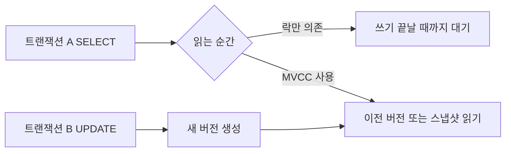
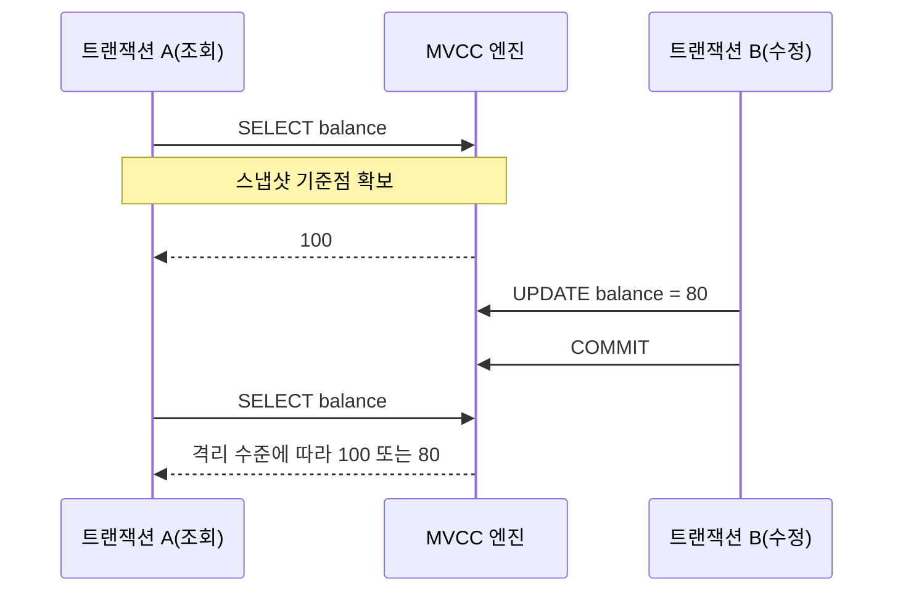

앞선 글에서 [[01-왜 DB를 알아야 할까 - MySQL InnoDB, 트랜잭션, MVCC, Lock 쉽게 이해하기]]와 [[02-MySQL, Aurora MySQL, PostgreSQL은 무엇이 다를까 - 탄생 배경부터 구조와 선택 기준까지]]를 먼저 정리했다.

이제 그 흐름에서 가장 먼저 잡아야 할 핵심 개념이 있다.

`도대체 MVCC가 뭔데, 락을 덜 걸어도 읽기가 되는 걸까?`

트랜잭션을 처음 배우면 보통 이렇게 생각하기 쉽다.

- 누군가 쓰는 중이면 읽기도 막혀야 할 것 같고
- 읽는 사람이 많으면 쓰는 쪽이 불편해질 것 같고
- 일관성을 지키려면 결국 다 잠가야 할 것 같다

그런데 실제 `MySQL InnoDB`나 `PostgreSQL`은 그렇게만 동작하지 않는다. 많은 경우 일반 `SELECT`는 락으로 줄 세우지 않고도 동시성을 꽤 잘 처리한다. 이때 핵심이 바로 `MVCC(Multi-Version Concurrency Control)`다.

이번 글에서는 아래 흐름으로 정리해 보겠다.

- MVCC가 왜 필요한가
- 버전과 Undo 개념은 무엇인가
- Consistent Read는 어떻게 동작하는가
- Read Committed와 Repeatable Read는 체감이 어떻게 다른가
- MVCC와 락은 어떤 관계인가
- MySQL과 PostgreSQL은 구현이 어떻게 다른가

## 먼저 한 줄로 요약하면

`MVCC는 데이터를 한 덩어리의 현재값으로만 보지 않고, 시점별 버전을 활용해 읽기와 쓰기가 덜 부딪히게 만드는 방식이다.`

그래서 실무에서는 아래 감각으로 이해하면 좋다.

- 읽기를 할 때마다 항상 쓰기와 정면충돌하지 않게 도와주고
- 대신 엔진 내부는 이전 버전 관리 비용을 감당하며
- 그래도 쓰기 충돌 자체를 없애는 것은 아니므로 락은 여전히 필요하다

## 1. MVCC가 왜 필요한가

DB가 어려워지는 순간은 대부분 `동시에 여러 요청이 같은 데이터를 만질 때`다.

예를 들어 주문 테이블을 생각해 보자.

- 사용자 A는 주문 상태를 조회하고 있다.
- 사용자 B는 같은 주문 상태를 `paid`에서 `shipped`로 바꾸고 있다.

이때 읽는 쪽까지 모두 락으로 막아버리면 어떤 일이 생길까?

- 조회가 많은 서비스일수록 응답이 쉽게 밀리고
- 단순 조회 화면도 쓰기 트랜잭션 때문에 대기하게 되고
- 전체 처리량이 급격히 떨어질 수 있다

즉, 일관성을 지키기 위해 무조건 읽기까지 강하게 막는 방식은 성능상 불리하다.

여기서 MVCC가 필요한 이유가 나온다.

`쓰기 중이어도 읽는 쪽은 가능한 한 '볼 수 있는 버전'을 읽게 하자.`

이 발상이 있어야 조회가 많은 시스템이 상대적으로 부드럽게 동작한다.

핵심은 단순하다.

- 락만으로 풀면 읽기와 쓰기가 자주 부딪힌다.
- MVCC를 쓰면 읽기는 적절한 버전을 읽고 지나갈 수 있다.
- 그래서 `락을 아예 없앤다`가 아니라 `읽기를 락 의존에서 조금 떼어낸다`에 가깝다.

## 2. 버전과 Undo 개념은 무엇인가

MVCC를 이해할 때 가장 먼저 잡아야 하는 단어가 `버전(version)`이다.

어떤 행이 한 번 수정될 때마다 DB는 머릿속으로 이렇게 본다.

- 지금 최신 값이 하나 있고
- 필요하면 과거 값을 다시 복원해서 읽을 수 있어야 한다

예를 들어 재고가 10에서 7로 바뀌었다고 해보자.

- 최신 값은 7이다
- 하지만 어떤 트랜잭션은 아직 10을 봐야 할 수 있다

그럼 엔진은 과거 값을 꺼내 보여줄 수 있어야 한다.

### MySQL InnoDB에서는 보통 Undo 쪽으로 이해하면 쉽다

`InnoDB`는 변경 이전 정보를 `undo log`를 통해 관리하고, 읽는 시점의 스냅샷에 맞춰 필요한 이전 버전을 재구성한다.

입문자 기준에서는 이렇게 이해하면 충분하다.

- 현재 레코드에는 최신 값이 있다
- 예전 값은 undo 정보를 통해 따라 올라갈 수 있다
- 그래서 읽는 쪽은 지금 최신값 대신 예전 버전을 볼 수 있다

### PostgreSQL은 새 버전을 더 직접적으로 남기는 쪽에 가깝다

PostgreSQL은 수정 시 새 튜플 버전을 만들고, 예전 튜플은 나중에 `VACUUM`이 정리한다.

즉, 큰 방향은 비슷하다.

- 둘 다 다중 버전을 활용한다
- 다만 `이전 버전을 어디에 두고 어떻게 정리하느냐`가 다르다

이 차이는 뒤에서 다시 비교하겠다.

## 3. Consistent Read는 왜 읽기를 편하게 만드는가

MVCC를 실무에서 체감하게 만드는 대표 개념이 `Consistent Read`다.

MySQL 문서 표현을 빌리면, InnoDB는 일반 `SELECT`에서 어떤 시점의 데이터베이스 스냅샷을 보여준다. 즉, 나보다 늦게 커밋된 변경이나 아직 커밋되지 않은 변경을 섞어서 보지 않도록 한다.

쉽게 말하면 이렇다.

- 내 트랜잭션은 읽기 기준 시점을 하나 잡고
- 그 시점에 맞는 데이터만 본다
- 그래서 도중에 남이 커밋해도, 내 일반 조회는 흔들리지 않을 수 있다

여기서 중요한 포인트는 `일관성`이지 `항상 최신값`이 아니라는 점이다.

이 차이를 놓치면 아래 같은 오해가 생긴다.

- 내가 방금 조회했으니 지금 상태도 분명 이 값이겠지
- 같은 트랜잭션이니 현재 DB와도 같겠지

하지만 MVCC의 목표는 `내가 보는 세계를 일관되게 만드는 것`이지 `항상 가장 최신 세계를 강제로 보여주는 것`은 아니다.

## 4. Read Committed와 Repeatable Read는 체감이 어떻게 다른가

같은 MVCC라도 격리 수준에 따라 읽기 경험이 달라진다.

가장 실무적으로 자주 비교하는 것이 `Read Committed`와 `Repeatable Read`다.

### Read Committed

`Read Committed`에서는 일반적으로 `SELECT를 실행할 때마다 더 최신의 커밋된 스냅샷`을 본다고 이해하면 쉽다.

즉, 같은 트랜잭션 안에서도 두 번 읽으면 결과가 달라질 수 있다.

- 첫 번째 조회에서는 재고가 10
- 다른 트랜잭션이 커밋
- 두 번째 조회에서는 재고가 7

그래서 체감은 이렇다.

- 조회할 때마다 현재에 더 가깝다
- 대신 같은 트랜잭션 안에서도 결과가 흔들릴 수 있다

### Repeatable Read

`Repeatable Read`에서는 보통 `트랜잭션 안의 첫 consistent read 시점 스냅샷`을 계속 유지한다.

그래서 같은 트랜잭션의 일반 `SELECT`는 여러 번 읽어도 같은 결과를 보여주기 쉽다.

- 첫 번째 조회에서 재고 10
- 다른 트랜잭션이 7로 수정 후 커밋
- 내 일반 `SELECT`는 계속 10으로 보일 수 있음

그래서 체감은 이렇다.

- 읽기 결과가 덜 흔들린다
- 대신 최신값을 보고 있다고 착각하면 위험하다

### 둘을 나란히 놓고 보면

| 구분 | Read Committed | Repeatable Read |
| --- | --- | --- |
| 일반 SELECT 기준 | 조회할 때마다 새 스냅샷에 가까움 | 첫 읽기 시점 스냅샷 유지 경향 |
| 같은 트랜잭션 내 재조회 | 값이 달라질 수 있음 | 값이 같게 보일 수 있음 |
| 체감 장점 | 최신 커밋 데이터에 더 가까움 | 읽기 일관성이 좋음 |
| 체감 주의점 | 결과가 중간에 흔들릴 수 있음 | 최신값을 봤다고 착각하기 쉬움 |

입문자 입장에서는 이렇게 외우면 편하다.

- `Read Committed`: 읽을 때마다 최신 커밋본에 가까움
- `Repeatable Read`: 처음 본 세계를 계속 유지하려 함

## 5. MVCC가 있어도 락은 왜 여전히 필요한가

여기서 자주 나오는 오해가 하나 있다.

`MVCC가 있으면 락이 필요 없는 것 아닌가?`

아니다. MVCC는 주로 `읽기-쓰기 충돌`을 완화해 주는 장치지, `쓰기-쓰기 충돌`까지 자동으로 해결하는 만능 장치는 아니다.

예를 들어 좌석 1개를 동시에 예약한다고 해보자.

- 두 트랜잭션이 같은 좌석을 읽는다
- 둘 다 아직 예약 가능하다고 본다
- 둘 다 동시에 수정하려고 한다

이때는 결국 누가 먼저 바꿀지, 누가 기다릴지, 누가 실패할지를 정해야 한다. 여기서 락이 필요하다.

즉, 관계를 이렇게 보면 된다.

- `MVCC`: 읽기를 덜 막아주는 장치
- `락`: 충돌하는 쓰기 순서를 강제하는 장치

### 일반 SELECT와 locking read는 다르다

특히 MySQL에서는 이 차이를 꼭 구분해야 한다.

- 일반 `SELECT`는 보통 consistent nonlocking read
- `SELECT ... FOR UPDATE`, `SELECT ... FOR SHARE`, `UPDATE`, `DELETE`는 현재 레코드와 락 기준 동작

그래서 같은 트랜잭션 안에서도 이런 일이 생긴다.

1. 일반 `SELECT`로는 예전 스냅샷을 본다
2. `FOR UPDATE`를 하는 순간 현재 레코드와 락 기준으로 본다
3. 그래서 방금 본 값과 다른 세계가 나타난다

이 부분이 [[04-Repeatable Read란 무엇인가 - MySQL에서 같은 SELECT가 같은 결과를 보는 이유]]에서 특히 많이 헷갈리는 지점이다.

## 6. MySQL과 PostgreSQL의 차이는 어디서 체감될까

둘 다 MVCC를 사용하지만 구현 방식은 꽤 다르다.

### MySQL InnoDB

MySQL InnoDB는 보통 아래 흐름으로 이해하면 쉽다.

- 최신 레코드를 기준으로 저장하고
- 과거 버전은 undo 정보로 따라 올라가며
- 오래된 undo는 purge가 정리한다

체감 포인트는 이렇다.

- `consistent read`, `undo log`, `read view`라는 표현이 자주 나온다
- 일반 `SELECT`와 locking read의 차이를 이해하는 것이 중요하다
- 기본 격리 수준이 `Repeatable Read`라서 스냅샷 읽기 체감이 강하다

### PostgreSQL

PostgreSQL은 수정 시 새 튜플 버전을 만들고, 이전 튜플은 dead tuple이 되며 나중에 `VACUUM`이나 `autovacuum`이 정리한다.

체감 포인트는 이렇다.

- `old version을 테이블 쪽에 더 직접적으로 남긴다`는 감각이 있다
- 읽기와 쓰기가 덜 충돌하는 대신 dead tuple 관리가 운영 포인트가 된다
- 문서에서도 `reading never blocks writing and writing never blocks reading`에 가까운 장점을 강하게 설명한다

### 비교를 아주 단순화하면

| 항목 | MySQL InnoDB | PostgreSQL |
| --- | --- | --- |
| 이전 버전 관리 감각 | undo 기반으로 재구성 | 새 튜플 생성 + old tuple 잔존 |
| 오래된 버전 정리 | purge | vacuum / autovacuum |
| 입문자가 자주 듣는 키워드 | undo log, read view, consistent read | tuple version, dead tuple, vacuum |
| 기본 격리 수준 | Repeatable Read | Read Committed |

물론 내부 구현을 엄밀하게 파고들면 더 복잡하지만, 입문 단계에서는 이 정도 축만 잡아도 큰 흐름은 잘 보인다.

## 7. 그래서 왜 '락을 덜 걸어도 읽기'가 가능한가

이제 처음 질문으로 돌아가 보자.

`왜 락을 덜 걸어도 읽기가 되는가?`

답은 결국 이것이다.

`읽는 쪽이 꼭 최신 레코드 하나만 보지 않아도 되기 때문이다.`

엔진은 시점에 맞는 버전을 보여주면 된다.

- 누군가 갱신 중이어도
- 또는 이미 갱신해서 커밋했어도
- 내 트랜잭션 기준으로 적절한 버전을 만들 수 있으면
- 읽는 쪽은 그 버전을 보고 계속 진행할 수 있다

그래서 조회 성능과 동시성이 좋아진다.

하지만 동시에 반드시 같이 기억해야 할 것도 있다.

- 최신값 확인이 필요하면 일반 `SELECT`만으로 부족할 수 있다
- 쓰기 경쟁은 여전히 락이 해결한다
- MVCC는 공짜가 아니고, 버전 관리와 정리 비용이 있다

즉, `락이 사라진 세계`가 아니라 `읽기와 쓰기의 충돌을 좀 더 영리하게 분리한 세계`라고 보는 편이 정확하다.

## 8. 실무에서 특히 조심할 포인트

### 1) 조회 결과를 최신값으로 단정하지 않기

MVCC 기반 일반 조회는 `일관된 값`일 수는 있어도 `현재 최신값`은 아닐 수 있다.

재고, 쿠폰, 좌석, 상태 전이처럼 경쟁이 있는 영역에서는 더 조심해야 한다.

### 2) 일반 SELECT와 잠금 읽기를 섞을 때 의도 분명히 하기

둘은 같은 읽기가 아니다.

코드 리뷰에서도 아래를 구분해서 보는 것이 좋다.

- 이 조회는 스냅샷 확인용인가
- 지금 현재 상태를 잠그며 확인하려는 것인가

### 3) 긴 트랜잭션 피하기

트랜잭션이 길어질수록 오래된 스냅샷을 붙잡게 되고, 엔진이 버전 정리 비용을 더 오래 떠안게 된다.

운영 관점에서도 좋은 패턴이 아니다.

### 4) DB마다 MVCC 구현이 다르다는 점 기억하기

`MVCC 지원`이라는 말만 보고 MySQL과 PostgreSQL이 완전히 같은 식으로 동작한다고 생각하면 곤란하다.

- MySQL은 undo와 consistent read 설명이 중요하고
- PostgreSQL은 dead tuple, vacuum 관점이 중요하다

같은 개념어라도 운영 포인트는 달라진다.

## 정리

이번 글의 핵심만 다시 묶으면 아래와 같다.

1. `MVCC`는 다중 버전을 활용해 읽기와 쓰기의 충돌을 줄이는 방식이다.
2. 그래서 일반 조회는 쓰기 트랜잭션 때문에 매번 락 대기를 하지 않아도 된다.
3. MySQL InnoDB는 주로 `undo`와 `consistent read`로 이해하면 쉽다.
4. `Read Committed`는 조회마다 새 스냅샷에 가깝고, `Repeatable Read`는 첫 읽기 스냅샷을 유지하는 감각이 강하다.
5. MVCC가 있어도 쓰기 충돌과 최신 상태 제어에는 락이 여전히 필요하다.
6. PostgreSQL도 MVCC를 쓰지만 dead tuple과 vacuum 같은 운영 포인트가 다르다.

결국 MVCC를 이해하면 `왜 어떤 SELECT는 안 막히는지`, `왜 같은 트랜잭션 안에서 과거를 보는 것처럼 느껴지는지`, `왜 락 글을 읽다가 갑자기 undo와 vacuum 이야기가 나오는지`가 한 줄로 연결된다.

다음에 락 관련 현상을 볼 때도 `이건 MVCC가 담당하는 읽기 문제인지`, `아니면 락이 담당하는 쓰기 충돌 문제인지`를 먼저 나눠 보면 훨씬 덜 헷갈린다.

## 함께 읽기
- 시리즈 전체 보기: [[index]]
- 이전 글: [[02-MySQL, Aurora MySQL, PostgreSQL은 무엇이 다를까 - 탄생 배경부터 구조와 선택 기준까지]]
- 다음 글: [[04-Repeatable Read란 무엇인가 - MySQL에서 같은 SELECT가 같은 결과를 보는 이유]]
- 입문글 다시 보기: [[01-왜 DB를 알아야 할까 - MySQL InnoDB, 트랜잭션, MVCC, Lock 쉽게 이해하기]]

## 참고 자료

- [MySQL 8.4 Reference Manual - Consistent Nonlocking Reads](https://dev.mysql.com/doc/refman/8.4/en/innodb-consistent-read.html)
- [MySQL 8.4 Reference Manual - InnoDB Multi-Versioning](https://dev.mysql.com/doc/refman/8.4/en/innodb-multi-versioning.html)
- [PostgreSQL Documentation - Introduction to MVCC](https://www.postgresql.org/docs/current/mvcc-intro.html)
- [제대로 배워보자 MySQL - MVCC](https://velog.io/@lolu1032/%EC%9E%85%EC%82%AC-%ED%9B%84-%EC%A0%9C%EB%8C%80%EB%A1%9C-%EB%B0%B0%EC%9A%B0%EB%8A%94-MySQL-MVCC)
- [데이터가 있었는데요, 아니 없어요 - 컬리 기술 블로그](https://helloworld.kurly.com/blog/commit-mvcc-set-autocommit/)
- [PostgreSQL의 Dead Tuple과 Vacuum](https://sonim1.com/ko/blog/postgresql-deadtuple-and-autovacuum/)
- [과연 MySQL의 REPEATBLE READ에서는 PHANTOM READ 현상이 일어나지 않을까?](https://parkmuhyeun.github.io/woowacourse/2023-11-28-Repeatable-Read/)
