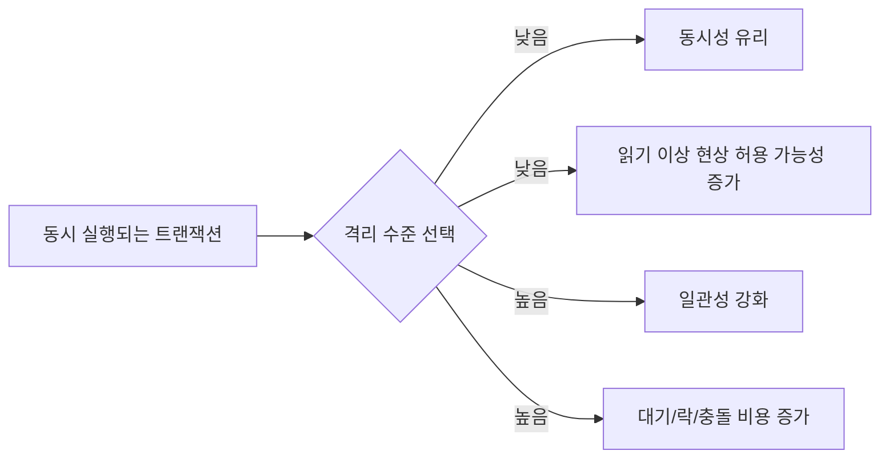
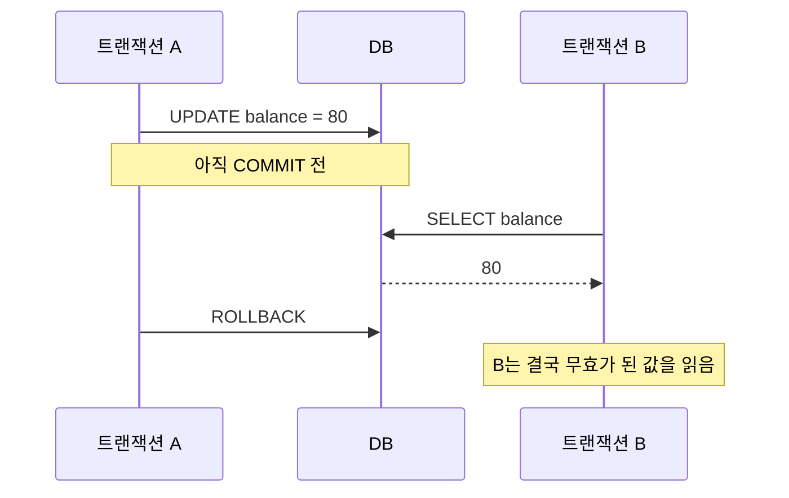
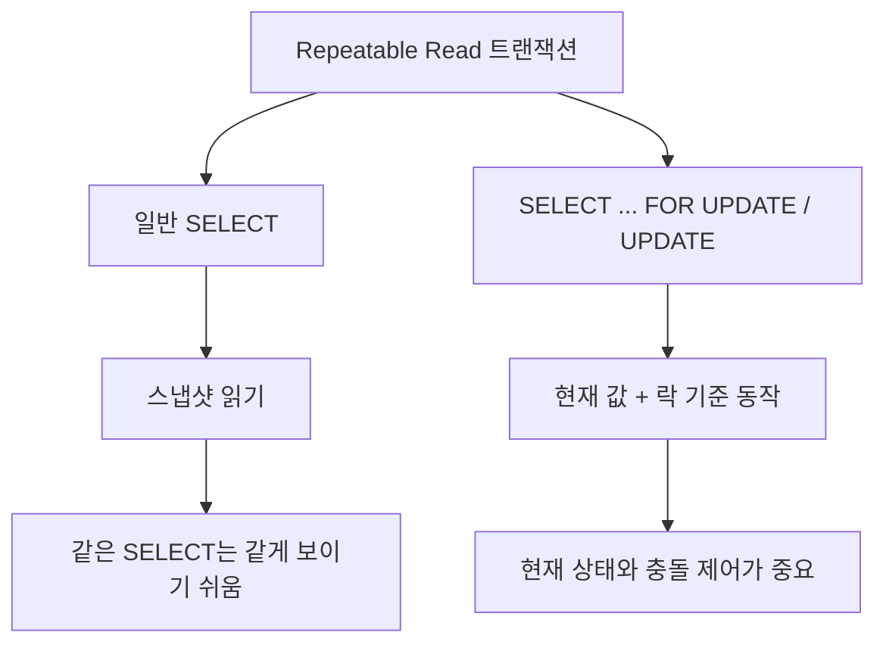

앞선 글에서 [[03-MVCC란 무엇인가 - 왜 락을 덜 걸어도 읽기가 되는가]], [[04-Repeatable Read란 무엇인가 - MySQL에서 같은 SELECT가 같은 결과를 보는 이유]], [[05-Dirty Read, Non-Repeatable Read, Phantom Read 차이 - 트랜잭션 격리 수준을 읽기 이상 현상으로 이해하기]]를 따로 떼어 정리했다.

그런데 실제로 공부하다 보면 결국 다시 한 질문으로 모인다.

`그래서 Isolation Level은 왜 필요하고, 4단계는 정확히 어떻게 다른가?`

이 질문이 중요한 이유는 단순 암기 문제가 아니기 때문이다.

- 읽기 일관성을 얼마나 강하게 보장할지
- 동시성을 얼마나 양보할지
- MVCC만으로 충분한지, 락이 더 필요한지
- MySQL과 PostgreSQL에서 같은 이름이 정말 같은 의미인지

이 판단이 결국 실무의 트랜잭션 설계로 이어진다.

이번 글에서는 `Read Uncommitted`, `Read Committed`, `Repeatable Read`, `Serializable`을 한 번에 정리해 보겠다. 특히 아래 흐름을 중심으로 묶어보려고 한다.

- Isolation Level이 왜 필요한가
- Dirty Read / Non-Repeatable Read / Phantom Read와 어떻게 연결되는가
- MySQL과 PostgreSQL은 왜 체감이 다른가
- 실무에서는 어떤 수준을 많이 쓰는가
- MVCC와 락은 각각 어디까지 해결하는가

![[isolation-level-comparison-overview.svg]]

## 먼저 한 줄로 요약하면

`Isolation Level은 동시에 실행되는 트랜잭션이 서로의 변경을 어디까지 보게 할지 정하는 규칙이다.`

조금 더 실무적으로 풀면 이렇다.

- 격리 수준이 낮을수록 동시성은 좋아지기 쉽다.
- 대신 읽기 결과가 흔들리거나, 아직 읽으면 안 되는 값을 볼 수 있다.
- 격리 수준이 높을수록 일관성은 강해진다.
- 대신 더 많은 대기, 더 많은 충돌 처리, 더 큰 비용을 감수해야 한다.

즉, `무조건 높은 게 좋다`가 아니라 `문제 성격에 맞게 고르는 것`이 핵심이다.

# 1. Isolation Level이 왜 필요한가

트랜잭션이 어려워지는 순간은 거의 항상 `동시에 같은 데이터를 건드릴 때`다.

예를 들어 주문 상태를 생각해 보자.

- 트랜잭션 A는 주문을 조회한다.
- 트랜잭션 B는 같은 주문 상태를 변경한다.
- 트랜잭션 A는 같은 주문을 다시 읽는다.

이때 DB가 아무 규칙 없이 동작하면 아래 같은 문제가 생길 수 있다.

- 아직 커밋도 안 된 값을 읽어버릴 수 있다.
- 같은 트랜잭션 안에서 방금 읽은 값이 다시 읽을 때 달라질 수 있다.
- 같은 조건으로 조회했는데 없던 행이 갑자기 나타날 수 있다.

이런 문제를 전부 막기 위해 모든 읽기와 쓰기를 하나씩 줄 세워 처리하면 일관성은 좋아지겠지만, 성능과 동시성이 급격히 나빠진다.

결국 DB는 이렇게 균형을 잡아야 한다.

- `정합성`을 얼마나 강하게 보장할 것인가
- `동시 처리량`을 얼마나 확보할 것인가

Isolation Level은 바로 이 균형점을 정하는 장치다.

# 2. 읽기 이상 현상 3가지를 먼저 잡고 가야 한다

Isolation Level을 이해할 때 가장 좋은 출발점은 `Dirty Read`, `Non-Repeatable Read`, `Phantom Read`다.

이미 이전 글에서 자세히 다뤘지만, 이번 글에서는 격리 수준과 연결해 다시 아주 짧게 정리해 보겠다.

## 2-1. Dirty Read

다른 트랜잭션이 아직 `COMMIT`하지 않은 값을 읽는 문제다.

- A가 값을 100에서 80으로 바꿨지만 아직 커밋하지 않음
- B가 80을 읽음
- A가 `ROLLBACK`
- B는 실제로는 존재하지 않았던 값을 읽은 셈

즉, `미확정 값`을 읽었는가가 핵심이다.

## 2-2. Non-Repeatable Read

같은 트랜잭션 안에서 `같은 행(row)`을 다시 읽었더니 값이 달라지는 문제다.

- A가 주문 상태를 읽음 → `paid`
- B가 같은 행을 `shipped`로 바꾸고 커밋
- A가 다시 읽음 → `shipped`

즉, `같은 행의 값 변화`가 핵심이다.

## 2-3. Phantom Read

같은 트랜잭션 안에서 `같은 조건(condition)`으로 다시 조회했더니 결과 집합이 달라지는 문제다.

- A가 `stock >= 10` 조건으로 상품 2개를 조회
- B가 새 상품을 추가하고 커밋
- A가 다시 같은 조건으로 조회 → 3개

즉, `같은 WHERE 조건의 결과 집합 변화`가 핵심이다.

![[dirty-nonrepeatable-phantom-overview.svg]]

# 3. Isolation Level 4단계를 한 번에 보기

가장 먼저 많이 보는 표를 다시 가져오면 보통 아래처럼 정리된다.

| 격리 수준 | Dirty Read | Non-Repeatable Read | Phantom Read |
| --- | --- | --- | --- |
| Read Uncommitted | 가능 | 가능 | 가능 |
| Read Committed | 방지 | 가능 | 가능 |
| Repeatable Read | 방지 | 방지 | 표준상 가능 |
| Serializable | 방지 | 방지 | 방지 |

이 표는 입문용으로 매우 유용하다.

다만 실무에서는 반드시 한 줄을 더 붙여야 한다.

`실제 동작은 DB 구현체마다 다르다.`

특히 아래 두 가지가 중요하다.

- `MySQL InnoDB`는 `MVCC + gap lock + next-key lock`의 영향까지 같이 봐야 한다.
- `PostgreSQL`은 `Read Uncommitted`를 사실상 `Read Committed`처럼 다루고, `Repeatable Read`도 표준보다 더 강한 보장을 제공한다.

즉, 표는 출발점이고, 제품별 구현 차이는 실전 해석이다.

# 4. Read Uncommitted: 가장 느슨하지만 거의 쓰지 않는 수준

`Read Uncommitted`는 이름 그대로 커밋되지 않은 변경도 읽을 수 있는 수준이다.

이 수준의 가장 큰 특징은 단순하다.

- Dirty Read 가능
- Non-Repeatable Read 가능
- Phantom Read 가능

즉, 읽기 일관성을 거의 포기하고 동시성 쪽으로 크게 기운 상태다.

실무에서 거의 쓰지 않는 이유도 명확하다.

- 롤백될 수 있는 값을 읽는 순간 비즈니스 판단이 무너질 수 있다.
- 통계성 집계처럼 아주 예외적인 케이스가 아니라면 위험 부담이 너무 크다.

그리고 PostgreSQL은 공식 문서에서 `Read Uncommitted`를 요청해도 실제로는 `Read Committed`처럼 동작한다고 설명한다. 즉, MVCC 아키텍처 위에서는 미커밋 데이터를 읽게 하는 모델이 자연스럽지 않다고 보는 편이 맞다.

# 5. Read Committed: 가장 널리 쓰이는 기본 감각

`Read Committed`는 `커밋된 데이터만 읽는다`는 이름 그대로 이해하면 된다.

가장 중요한 포인트는 이거다.

- Dirty Read는 막는다.
- 하지만 같은 트랜잭션 안에서도 `SELECT`를 다시 실행하면 더 최신의 커밋 데이터를 볼 수 있다.

즉, 조회할 때마다 `새 스냅샷`에 가까운 세계를 보는 감각이다.

## 5-1. 어떤 문제가 남나

- Non-Repeatable Read 가능
- Phantom Read 가능

예를 들어 같은 트랜잭션 안에서도 아래가 가능하다.

1. 첫 번째 조회에서 재고 10 확인
2. 다른 트랜잭션이 재고를 7로 바꾸고 커밋
3. 두 번째 조회에서 재고 7 확인

이건 잘못이 아니라 `Read Committed`의 성격 자체다.

## 5-2. 왜 많이 쓰나

실무에서 `Read Committed`가 널리 쓰이는 이유는 균형이 좋기 때문이다.

- Dirty Read 같은 심각한 문제는 막고
- 지나치게 오래된 스냅샷에 매달리지 않으며
- 동시성과 성능 면에서도 비교적 부담이 덜하다

PostgreSQL의 기본 격리 수준도 `Read Committed`다. Oracle 계열도 비슷한 감각으로 많이 설명된다. 그래서 많은 팀이 `기본값으로 두고, 꼭 필요한 곳만 더 강하게` 가져가는 전략을 선호한다.

## 5-3. PostgreSQL에서는 어떻게 느껴지나

PostgreSQL 문서 기준으로 `Read Committed`는 `각 쿼리 시작 시점`의 커밋된 스냅샷을 본다.

즉,

- 한 쿼리 안에서는 일관된 스냅샷을 보지만
- 같은 트랜잭션 안의 다음 쿼리는 다른 결과를 볼 수 있다

이 설명은 입문자가 `쿼리 단위 스냅샷`으로 기억하면 가장 덜 헷갈린다.

# 6. Repeatable Read: 같은 트랜잭션 안에서 읽기 일관성을 더 강하게

`Repeatable Read`는 이름 그대로 `같은 읽기를 반복했을 때 결과가 유지되도록` 하는 수준이다.

핵심은 아래 한 줄이다.

`같은 트랜잭션 안의 일반 SELECT가 같은 스냅샷을 계속 보게 하려는 성격이 강하다.`

## 6-1. 어떤 문제가 막히나

- Dirty Read 방지
- Non-Repeatable Read 방지
- Phantom Read는 표준상 가능

그래서 입문자 기준으로는 이렇게 기억하면 된다.

- `Read Committed`: 읽을 때마다 더 최신 커밋본에 가까움
- `Repeatable Read`: 처음 본 세계를 계속 유지하려 함

## 6-2. 그런데 왜 MySQL에서 더 헷갈릴까

MySQL InnoDB의 기본 격리 수준이 `Repeatable Read`라서다.

그리고 MySQL은 여기서 `MVCC`와 `gap lock`, `next-key lock`이 함께 작동한다. 그래서 교과서식 표보다 실제 체감이 더 복잡하다.

특히 이전 글에서도 봤듯이 MySQL에서는 아래 차이를 꼭 구분해야 한다.

- 일반 `SELECT`: 보통 consistent nonlocking read
- `SELECT ... FOR UPDATE`, `UPDATE`, `DELETE`: 현재 레코드와 락 기준 동작

즉, 같은 트랜잭션 안에서도 `어떤 종류의 읽기냐`에 따라 보이는 세계가 달라질 수 있다.

## 6-3. Phantom Read는 정말 생기나

여기가 가장 자주 헷갈리는 지점이다.

표준 설명으로는 `Repeatable Read`에서 `Phantom Read`가 가능하다고 배운다. 하지만 PostgreSQL 공식 문서는 `PostgreSQL의 Repeatable Read는 phantom read를 허용하지 않는다`고 명시한다. 즉, 표준이 요구하는 최소 보장보다 더 강한 구현이다.

MySQL InnoDB는 또 다르다.

- 일반 스냅샷 읽기에서는 팬텀이 잘 드러나지 않을 수 있고
- 잠금 읽기, 범위 조건, gap/next-key lock 여부에 따라 체감이 달라진다

그래서 `Repeatable Read면 무조건 팬텀이 난다` 또는 `MySQL Repeatable Read는 팬텀이 절대 없다`처럼 단정하면 곤란하다.

더 정확한 표현은 아래에 가깝다.

- 표준 개념상 `Repeatable Read`는 phantom을 완전히 금지하진 않는다.
- PostgreSQL은 구현상 phantom까지 막는다.
- MySQL은 MVCC와 range lock 메커니즘 때문에 쿼리 패턴별로 체감이 다르다.

# 7. Serializable: 가장 강하지만 비용도 가장 큰 수준

`Serializable`은 가장 강한 격리 수준이다.

공식 문서식으로 표현하면,

`동시에 실행된 트랜잭션들의 결과가, 마치 어떤 순서로 하나씩 직렬 실행된 것과 같은 결과가 되도록 보장하는 수준`이다.

즉,

- Dirty Read 방지
- Non-Repeatable Read 방지
- Phantom Read 방지
- 더 나아가 직렬화 이상 현상까지 제어

이 수준이 주는 장점은 명확하다.

- 논리적으로 가장 안전한 쪽에 가깝다.
- 복잡한 조건의 읽기와 쓰기를 더 엄격하게 보호할 수 있다.

하지만 비용도 분명하다.

- 더 많은 대기
- 더 많은 충돌
- 재시도 비용 증가
- 처리량 저하 가능성

그래서 모든 업무에 `Serializable`을 거는 식은 대개 과하다.

실무에서는 아래처럼 좁게 쓰는 편이 많다.

- 금융 정산
- 강한 정합성이 꼭 필요한 배치
- 복잡한 범위 검증과 삽입이 결합된 특수 로직

# 8. MySQL과 PostgreSQL은 왜 같은 이름인데 다르게 느껴질까

이쯤 오면 사실 핵심은 격리 수준 이름보다 `구현`이다.

## 8-1. MySQL InnoDB

MySQL InnoDB는 아래 키워드로 이해하는 편이 좋다.

- 기본 격리 수준: `Repeatable Read`
- 일반 `SELECT`: consistent read
- 과거 버전 관리: `undo log`
- 범위 삽입 제어: `gap lock`, `next-key lock`

즉, MySQL은 `MVCC만 보면 반쪽 이해`가 되기 쉽다. 읽기 일관성은 MVCC로 설명되지만, 실제 충돌 제어와 팬텀 방지는 락 계열 메커니즘까지 같이 봐야 하기 때문이다.

## 8-2. PostgreSQL

PostgreSQL은 아래 키워드가 더 중요하다.

- 기본 격리 수준: `Read Committed`
- `Read Uncommitted`는 사실상 `Read Committed`
- `Repeatable Read`가 phantom read를 허용하지 않음
- `Serializable`은 직렬화 이상 현상까지 다룸

그리고 PostgreSQL은 MVCC 설명에서 `tuple version`, `vacuum`, `autovacuum` 관점이 강하다. 즉, 같은 MVCC라도 내부 구현과 운영 포인트가 다르다.

## 8-3. 한 표로 다시 보면

| 항목 | MySQL InnoDB | PostgreSQL |
| --- | --- | --- |
| 기본 격리 수준 | Repeatable Read | Read Committed |
| Read Uncommitted | 지원 | 요청 가능하지만 내부적으로 Read Committed처럼 동작 |
| Repeatable Read 체감 | MVCC + locking read + gap/next-key lock까지 함께 봐야 함 | 팬텀 읽기까지 허용하지 않는 더 강한 구현 |
| 실무 설명 포인트 | consistent read, undo, read view, gap lock | query snapshot, tuple version, vacuum, serialization anomaly |

# 9. MVCC와 락은 각각 무엇을 해결하나

Isolation Level 이야기를 하다 보면 `MVCC가 있으면 락이 필요 없는 것 아닌가`라는 오해가 자주 나온다.

아니다. 둘은 역할이 다르다.

## 9-1. MVCC

MVCC는 주로 `읽기-쓰기 충돌을 줄이는 장치`다.

- 읽는 쪽이 항상 최신 레코드 하나만 보지 않게 만들고
- 시점에 맞는 버전을 읽게 해서
- 일반 조회가 쓰기와 정면충돌하지 않게 도와준다

즉, `읽기를 덜 막아주는 기술`에 가깝다.

## 9-2. 락

락은 주로 `쓰기-쓰기 충돌과 현재 상태 제어`를 담당한다.

- 동시에 같은 행을 수정하려 할 때 순서를 강제하고
- 조건에 맞는 범위에 새 값이 들어오지 못하게 막고
- 현재 값을 기반으로 안전하게 갱신할 수 있게 한다

즉, `누가 먼저 바꾸고 누가 기다릴지 정하는 장치`에 가깝다.

결국 Isolation Level은 이 둘의 조합 위에서 체감된다.

- 읽기 일관성은 MVCC 영향을 받고
- 충돌 제어와 범위 제어는 락 영향을 받는다
- 그리고 제품마다 이 둘의 조합 방식이 다르다

# 10. 실무에서는 어떤 수준을 주로 쓸까

이 질문에는 정답 하나가 있는 것은 아니지만, 보통 아래 감각으로 정리하면 현실에 가깝다.

## 10-1. Read Committed

가장 범용적이다.

- PostgreSQL 기본값
- 조회와 수정이 섞여도 감각이 비교적 단순함
- 최신 커밋 데이터에 더 가깝게 움직임

대신 같은 트랜잭션 안에서도 재조회 결과가 달라질 수 있으므로, `조회 후 판단 후 수정` 패턴에서는 조심해야 한다.

## 10-2. Repeatable Read

MySQL 기본값이라서 이미 많이 접한다.

- 일반 `SELECT`의 일관성이 좋아서 읽기 흐름 이해에 유리함
- 하지만 최신 상태를 보고 있다고 착각하면 위험함
- 일반 조회와 locking read를 섞을 때 특히 주의가 필요함

즉, `읽기 안정감`은 좋지만 `현재 상태 확인`과는 다를 수 있다.

## 10-3. Serializable

정말 필요한 구간에서만 좁게 쓴다.

- 전체 서비스 기본값으로 두기엔 비용이 큼
- 대신 강한 정합성이 꼭 필요한 트랜잭션에는 유효함

## 10-4. Read Uncommitted

대부분의 서비스 로직에서는 사실상 제외해도 된다.

# 11. 격리 수준보다 더 중요한 실무 체크포인트

Isolation Level 이름만 외우는 것보다 아래를 구분하는 편이 훨씬 중요하다.

## 11-1. 일반 SELECT인가, 잠금 읽기인가

같은 `읽기`처럼 보여도 다르다.

- 일반 `SELECT`는 스냅샷 읽기일 수 있고
- `FOR UPDATE`, `FOR SHARE`는 현재 값과 락 기준 동작일 수 있다

## 11-2. 단일 행 조회인가, 범위 조회인가

팬텀 문제는 대개 `범위 조건`에서 더 중요해진다.

- `WHERE id = 1`과
- `WHERE score >= 90`

은 락과 팬텀 관점에서 완전히 다른 문제가 된다.

## 11-3. 읽고 끝나는가, 읽고 수정하는가

조회만 하는 트랜잭션과, 조회 후 그 결과를 믿고 수정하는 트랜잭션은 위험도가 다르다.

후자는 보통 현재 상태 제어가 중요하므로 락 전략까지 함께 고민해야 한다.

## 11-4. 긴 트랜잭션은 피하고 있는가

트랜잭션이 길어질수록

- 오래된 스냅샷을 붙잡게 되고
- 버전 정리 비용이 커지고
- 락 대기와 경합이 길어질 수 있다

즉, 격리 수준보다 먼저 `트랜잭션을 짧게 유지하는 습관`이 더 큰 효과를 내는 경우가 많다.

# 12. 핵심만 다시 정리

마지막으로 이 글의 핵심만 짧게 묶으면 아래와 같다.

1. `Isolation Level`은 동시에 실행되는 트랜잭션이 서로의 변경을 어디까지 보게 할지 정하는 규칙이다.
2. `Dirty Read`, `Non-Repeatable Read`, `Phantom Read`를 기준으로 보면 4단계 차이가 가장 쉽게 보인다.
3. `Read Uncommitted`는 거의 쓰지 않고, `Read Committed`는 가장 범용적이며, `Repeatable Read`는 읽기 일관성을 더 강하게 가져가고, `Serializable`은 가장 강하지만 비용도 가장 크다.
4. 같은 이름의 격리 수준이라도 `MySQL`과 `PostgreSQL`은 실제 구현과 체감이 다르다.
5. `MVCC`는 읽기-쓰기 충돌 완화에 강하고, `락`은 쓰기 충돌과 현재 상태 제어에 필요하다.
6. 실무에서는 격리 수준 이름만 볼 것이 아니라 `plain SELECT인지`, `locking read인지`, `범위 조회인지`, `읽고 수정하는 패턴인지`까지 같이 봐야 한다.

# 마무리

Isolation Level은 면접 단골 개념이기도 하지만, 실제로는 `왜 내 조회 결과가 흔들렸는가`, `왜 같은 트랜잭션인데 두 세계가 보이는가`, `왜 어떤 INSERT는 막히고 어떤 SELECT는 안 막히는가`를 설명하는 실전 개념에 더 가깝다.

그래서 이 주제는 4단계 이름만 외워서는 오래 남지 않는다.

오히려 아래처럼 연결해서 이해하는 편이 훨씬 오래 간다.

- `Isolation Level`은 정책이고
- `MVCC`는 읽기 일관성을 돕는 구현 축이며
- `락`은 충돌 제어를 담당하는 구현 축이고
- `Dirty Read / Non-Repeatable Read / Phantom Read`는 그 차이를 관찰하는 창이다

이 흐름으로 보면 `Read Uncommitted`, `Read Committed`, `Repeatable Read`, `Serializable`도 각각 따로 떨어진 용어가 아니라, 같은 지도 위의 다른 좌표로 보이기 시작한다.

## 함께 읽기
- 시리즈 전체 보기: [[index]]
- 이전 글: [[08-Next-Key Lock이란 무엇인가 - MySQL이 행 하나가 아니라 범위까지 잠그는 이유]]
- 입문글 다시 보기: [[01-왜 DB를 알아야 할까 - MySQL InnoDB, 트랜잭션, MVCC, Lock 쉽게 이해하기]]

## 참고 자료

- [MySQL 8.4 Reference Manual - Transaction Isolation Levels](https://dev.mysql.com/doc/refman/8.4/en/innodb-transaction-isolation-levels.html)
- [MySQL 8.4 Reference Manual - Consistent Nonlocking Reads](https://dev.mysql.com/doc/refman/8.4/en/innodb-consistent-read.html)
- [PostgreSQL Documentation - Transaction Isolation](https://www.postgresql.org/docs/current/transaction-iso.html)
- [데이터베이스 트랜잭션 격리 수준과 격리 수준에 따른 문제점 - hudi.blog](https://hudi.blog/transaction-isolation-level/)
- [트랜잭션 격리 수준 실습 - Dirty Read, Non-Repeatable Read, Phantom Read 재현 - Velog](https://velog.io/@yonghyuk/%ED%8A%B8%EB%9E%9C%EC%9E%AD%EC%85%98-%EA%B2%A9%EB%A6%AC-%EC%88%98%EC%A4%80-%EC%8B%A4%EC%8A%B5-Dirty-Read-Non-Repeatable-Read-Phantom-Read-%EC%9E%AC%ED%98%84)
- [과연 MySQL의 REPEATBLE READ에서는 PHANTOM READ 현상이 일어나지 않을까? - parkmuhyeun.github.io](https://parkmuhyeun.github.io/woowacourse/2023-11-28-Repeatable-Read/)
- [Database] 트랜잭션의 격리수준 - Dirty Read / Non-Repeatable Read / Phantom Read - innovation123.tistory.com](https://innovation123.tistory.com/166)

## 확인 필요 사항

- PostgreSQL `Serializable`의 내부 구현(SSI)까지 이번 글에서 더 풀어쓸지 여부
- MySQL `Repeatable Read`에서 phantom read가 드러나는 패턴을 별도 실습 글로 분리할지 여부
- 본문 중 `실무에서 주로 Read Committed를 많이 쓴다`는 문장을 블로그 전체 시리즈 톤에 맞춰 더 보수적으로 완화할지 여부
